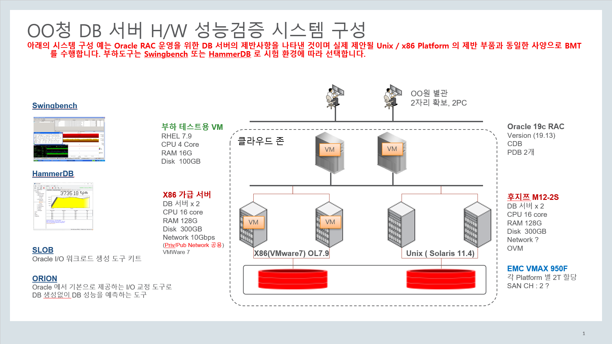
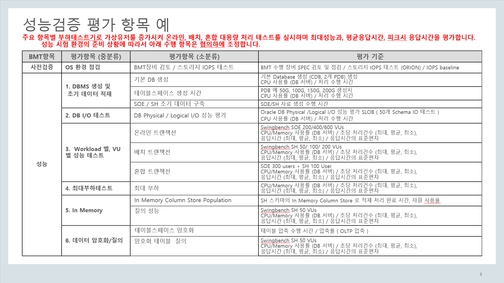
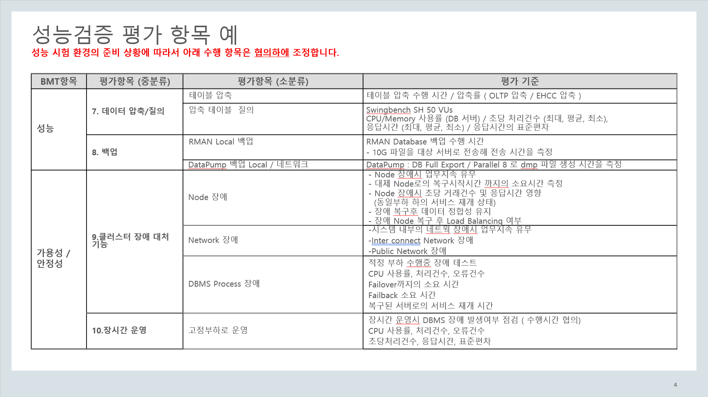

# Oracle DB 부하 테스트 방안 

# 목차 

### 가. 성능시험 환경 구성 
* [1. 장비 및 SW 환경](#ch-1-1)
* [2. 성능 모니터링 준비](#ch-1-2)
### 나. DB 부하 테스트 사전 검증 및 DB 생성
* [1. 부하테스트 시나리오](#ch-2-1)
* [2. 스토리지 IOPS 테스트](#ch-2-2)
* [3. 기본 DB 생성](#ch-2-3)
### 다. DB 부하 테스트 - 성능
* [1. TBS 생성 테스트 초기 데이터 적재](#ch-3-1)
* [2. DB I/O 테스트](#ch-3-2)
* [3.  Workload 별, VU 별 성능 테스트](#ch-3-3)
* [4. 최대부하테스트](#ch-3-4)
* [5. In Memory DB](#ch-3-5)
* [6. 데이터 암호화/질의](#ch-3-6)
* [7. 데이터 압축/질의](#ch-3-7)
* [8. 백업](#ch-3-8)
### 라. 가용성 / 안정성
* [1.클러스터 장애 대처 기능)](#ch-4-1)
* [2. DB Node의 AWR 자료 취득](#ch-4-2)
### 마. 부하테스트 결과 수집  
* [1.부하용 VM (리포트 겸용)](#ch-5-1)
* [2. DB Node의 AWR 자료 취득)](#ch-5-1)
### 바. 부하테스트 결과 보고 및 분석
* [1. 부하용 VM](#ch-6-1)
* [2. DB 노드](#ch-6-2)
### 사. Appendix
* [1. 환경변수](#ch-7-1)
* [2. SSH User Equivalence Configuration](#ch-7-2)
* [3. 일반 사용자로 sudo 사용 ( 패스워드없이 )](#ch-7-3)
* [4. Oracle Linux 7에서 로컬 yum repository 설정](#ch-7-4)
* [5. HammerDB 부하테스트](#ch-7-5)
* [6. ODA X82HA 의 Database Shape 별 성능 수치](#ch-7-6)

##############################################################################

# 가. 성능시험 환경 구성 


## 1. 장비 및 SW 환경 <a id="ch-1-1"></a>


### A. 부하용 vm ( RHEL 7.9 또는 OL 7.9 ) ( Report 용도 포함 )

#### 1) python3 & pip3 설치 

* SW 설치 
```
yum install python3 -y
pip3 install --upgrade pip 
```

* 환경변수
```bash
echo "alias python=python3" >> ~/.bash_profile
echo "alias pip=pip3" >> ~/.bash_profile
source ~/.bash_profile
```

#### 2) Swingbench 

* 필수 Software
   + [JDK 1.8 다운로드](https://www.oracle.com/java/technologies/downloads/#java8)

* [Swingbench 2.6](http://www.dominicgiles.com/swingbench.html)
   + [다운로드](https://github.com/domgiles/swingbench-public/releases/download/production/swingbenchlatest.zip)
   + 압축 파일 해제 ( 예: /home/oracle 위치에서 압축해제)

* 환경변수 설정 (option)
```bash
export SB_HOME=/home/oracle/swingbench
```

* 플랫폼별 수행 위치 (BMT를 위해 임의로 생성한 것임)
   + Unix Home
/home/oracle/swingbench/unix

   + X86 Home
/home/oracle/swingbench/x86

* 대량 부하시 Swingbench launcher 의 Memory 조정 가능
swingbench/launcher/launcher.xml

    <jvmargset id="base.jvm.args">
        <jvmarg line="-Xmx1024m"/>
        <jvmarg line="-Xms512m"/>
        <!--<jvmarg line="-Djava.util.logging.config.file=log.properties"/>-->
   </jvmargset>

#### 3) Visual-AWR ( Oracle Internal )
* 다운로드 
* Visual AWR 관련 python 패키지 설치 
```bash
[oracle@racnode1 ~]$ sudo pip install pandas lxml html5lib beautifulsoup4 cchardet PTable
[oracle@racnode1 ~]$ mkdir visual-awr; cd visual-awr
[oracle@racnode1 visual-awr]$ unzip ../visual-awr-4.0.zip
```

#### 4) dstat 
* 부하용 VM 에서 DB 서버로의 network 발생량 등 확인용 
```bash
[oracle@racnode1 ~]$ sudo yum install -y dstat
```

### B. DB 서버  ( Oracle 19.13 RAC ) 

#### 1) 장비별 OS
 * X86 (VMware 7) OL 7.9 (UEK)
 * Unix                Solaris 11.14
     - Unix 의 경우 Bare Metal 과 OVM Server for SPARC 모두 수행 
##### Oracle Database 구성 

#### 2) Autonomous Health Framework (AHF) Update  
AHF 는 RAC 의 경우 GI Home 에 설치되어 있으며 새 버젼 설치시 기존 정보 참고함 (root 권한 권장)


* 사전 설치 
```bash
sudo yum install -y perl-Digest-MD5 perl-Data-Dumper
```

* AHF 다운로드 : Oracle Automatic Health Framework (AHF) latest
  Autonomous Health Framework (AHF) - Including TFA and ORAchk/EXAchk (Doc ID 2550798.1)
  + [AHF 21.3 for Linux](https://updates.oracle.com/Orion/Services/download/AHF-LINUX_v21.3.0.zip?aru=24481521&patch_file=AHF-LINUX_v21.3.0.zip)
  + [AHF 21.3 for Solaris SPARC 64](https://updates.oracle.com/Orion/Services/download/AHF-SOLARIS.SPARC64_v21.3.0.zip?aru=24481520&patch_file=AHF-SOLARIS.SPARC64_v21.3.0.zip)
```bash
mkdir ora_ahf; cd ora_ahf
unzip ../AHF-LINUX_v21.3.0.zip
./ahf_setup [-ahf_loc install_dir] [-data_dir data_dir]
```

#### 3) OSWatcher 실행 
: AHF 내 포함되어 있음 
 
#### 4) orachk 실행 
: AHF 내 포함되어 있음 

BMT 수행/전후 실행 결과 

-------------------------------------------------------------------------------------------------------------------

## 2. 성능 모니터링 준비 <a id="ch-1-2"></a>

* 플랫폼 별 준비 ( Unix, X86 )

### A. 부하용 vm 성능 모니터링

```bash
dstat -t -cmgdrnlyp -N total  --output dstat_$(date +"%Y%m%d").txt 
또는 
nohup dstat -t -cmgdrnlyp -N total  --output dstat_$(date +"%Y%m%d").txt &
```

### B. DB서버용 성능 모니터링

#### 1) OSWatcher
AHF 내에 포함되어 있으며 root 계정으로 실행을 권장
```bash
cd /opt/oracle.ahf/tfa/ext/oswbb
nohup ./startOSWbb.sh 60 10 &
```
>참고 : 
>./startOSWbb.sh <ARG1> <ARG2> <ARG3> <ARG4>
>ARG1 = 스냅샷 간격(초).
>ARG2 = 저장할 아카이브 데이터의 시간.
>ARG3 = (선택 사항) 각 파일이 생성된 후 자동으로 압축하는 압축 유틸리티의 이름 (gzip 등)
>ARG4 = (선택 사항) 아카이브 디렉토리를 저장할 대체(기본값 아님) 위치.

* ./startOSWbb.sh
  : (디폴트) 30초 48시간 동안 데이터를 아카이브 파일에 저장 
* ./stopOSWbb.sh

#### 2) oratop
```bash
$ORACLE_HOME/suptools/oratop/oratop / as sysdba
```

#### 3) AWR info 및 스냅샷 주기 확인 
: AWR 주기를 변경할지 / 부하테스트 수행 전/후 Snapshot 생성할 지 결정 

##### 1. AWR repository 크기 확인 및 계산 
Default : Snapshot 주기 1시간, 보관 8일
```sql
@?/rdbms/admin/awrinfo.sql

AWR Interval (mins), Retention 일수, Num Instances, 평균 Active Sessions, Datafile 수
@?/rdbms/admin/utlsyxsz.sql
```

##### 2. AWR Snapshot 주기 확인 및 변경
```sql
set lines 100 
col snap_interval for a30
col retention for a50
SELECT DBID, SNAP_INTERVAL, RETENTION FROM DBA_HIST_WR_CONTROL;

set lines 100
SELECT SNAP_ID, DBID, INSTANCE_NUMBER, TO_CHAR(BEGIN_INTERVAL_TIME, 'YYYY/MM/DD HH24:MI'),
TO_CHAR(END_INTERVAL_TIME, 'YYYY/MM/DD HH24:MI') FROM DBA_HIST_SNAPSHOT
ORDER BY DBID, INSTANCE_NUMBER, SNAP_ID;
```

##### 3. AWR Snapshot 주기 30분, 보관은 15일로 설정
```sql
EXEC DBMS_WORKLOAD_REPOSITORY.MODIFY_SNAPSHOT_SETTINGS(RETENTION=>60*24*15,INTERVAL=>30);

SELECT DBID, SNAP_INTERVAL, RETENTION FROM DBA_HIST_WR_CONTROL;
```

##############################################################################

# 나. DB 부하 테스트 사전 검증 및 DB 생성

   플랫폼 별 준비 ( Unix, X86 )

## 1. 부하테스트 시나리오 <a id="ch-2-1"></a>

### A. 부하테스트 시나리오 1 



### B. 부하테스트 시나리오 2 



-------------------------------------------------------------------------------------------------------------------

## 2. HW 사전 검증 및 DB 생성 

### A. BMT 수행 장비 SPEC 검토 및 점검 
 
### B. 스토리지 IOPS 테스트 (ORION) / IOPS baseline <a id="ch-2-2"></a>
ORION 을 활용한 스토리지 IOPS 테스트

-------------------------------------------------------------------------------------------------------------------

## 3. 기본 DB 생성  <a id="ch-2-3"></a>
* CDB
* 2개 PDB 생성

##############################################################################

# 다. DB 부하 테스트 - 성능

## 1. TBS 생성 테스트 초기 데이터 적재 <a id="ch-3-1"></a>

### A. 테이블스페이스 생성

### B. SOE 초기 데이터 구축

각 Schema 생성 결과물도 저장 

```bash
# date; $SB_HOME/bin/oewizard -cl -u soe10  -p soe10    -cs //racnode-scan/orclpdb -dbap oracle -drop   -c oewizard.xml ; date
date; $SB_HOME/bin/oewizard -cl -scale   10 -ts SOE10   -u soe10   -p soe10  -tc 16  -nopart -df +DATA  -cs //racnode-scan/orclpdb -dbap oracle -create -c oewizard.xml ; date
```

### C. SH 초기 데이터 구축

```bash
# date; $SB_HOME/bin/shwizard -cl -u sh10    -p sh10     -cs //racnode-scan/orclpdb -dbap oracle -drop   -c shwizard.xml ; date
date; $SB_HOME/bin/shwizard -cl -scale   10 -ts SH10    -u sh10    -p sh10                    -df +DATA   -cs //racnode-scan/orclpdb -dbap oracle -create -c shwizard.xml ; date
```
>
>Option : 
>1. -scale, -tc, 
>2. -nopart / -part,  
>3. -create / -drop 
>4. -async_on / -async_off
>5. -bigfile / -normalfile
>6. -allindexes / -noindexes
>7. -rangepart , -hashpart, -compositepart
>8. -compress / -nocompress, -oltpcompress / -hcccompress
>9. -ts tablespace 
>ETC. -constraints, -debug, -generate, -idf, -its, -ro, -sp

### D. sbutil 사용법 로 invalid object / table 통계 확인

#### 1) Invalid Object 확인 
```bash
$SB_HOME/bin/sbutil -soe -u soe10 -p soe10 -cs //racnode-scan/orclpdb -val
$SB_HOME/bin/sbutil -sh  -u sh10  -p sh10  -cs //racnode-scan/orclpdb -val
```
#### 2) Table 통계정보 확인 
```bash
$SB_HOME/bin/sbutil -soe -u soe10 -p soe10 -cs //racnode-scan/orclpdb -tables
$SB_HOME/bin/sbutil -sh  -u sh10  -p sh10  -cs //racnode-scan/orclpdb -tables
```
#### 3) 통계정보 재생성 
```bash
$SB_HOME/bin/sbutil -soe -u soe10 -p soe10 -cs //racnode-scan/orclpdb -stats
$SB_HOME/bin/sbutil -sh -u sh10 -p sh10 -cs //racnode-scan/orclpdb -stats
```

-------------------------------------------------------------------------------------------------------------------

## 2. DB I/O 테스트 <a id="ch-3-2"></a>

### A. SLOB 로 DB 테스트 

-------------------------------------------------------------------------------------------------------------------

## 3.  Workload 별, VU 별 성능 테스트 <a id="ch-3-3"></a>

#### 1) Platform 별 결과 저장 디렉토리

Unix, X86 결과 파일은 따로 저장

* Unix Home
```bash
/home/oracle/swingbench/unix
```
* X86 Home
```bash
/home/oracle/swingbench/x86
```

### A. 온라인 트랜잭션	

#### 1) SOE 부하 수행 

##### charbench 수행

```bash
cd /home/oracle/swingbench/x86
date; $SB_HOME/bin/charbench -uc   50  -rt  00:05 -bs 00:01 -be 00:04 -ld  50  -min   0  -max   0 -stats full   -u soe10    -p soe10   -r ../x86/soe_scale10_50user_$(date +"%Y%m%d").xml    -c ../configs/SOE_Server_Side_V2.xml -f -dbap oracle -dbau "sys as sysdba" -cs //racnode-scan/orclpdb -cpuuser oracle -cpupass oracle -cpuloc racnode1 -v  users,tpm,tps,cpu ; date
```

### B. 배치 트랜잭션	

#### 1) SH 부하 수행 

##### 1) charbench 수행 
```bash
cd /home/oracle/swingbench/x86
date; $SB_HOME/bin/charbench -uc   50  -rt  00:05 -bs 00:01 -be 00:04 -ld  50  -min   0  -max   0 -stats full   -u sh10    -p sh10     -r ../x86/sh_scale010_050user_$(date +"%Y%m%d").xml   -c ../configs/Sales_History.xml -f -dbap oracle -dbau "sys as sysdba" -cs //racnode-scan/orclpdb -cpuuser oracle -cpupass oracle -cpuloc racnode1 -v  users,tpm,tps,cpu ; date
```
>Option : 
>1. -be / -bs 
>2. -co 
>3. -nr 
>4. -stats full / simple
>5. -v  trans|cpu|disk|dml|errs|tpm|tps|users|resp|vresp|tottx|trem
>6. -wc 

### C. 혼합 트랜잭션

#### 1) SOE / SH 혼합 수행 

##### 1) charbench 수행 

이전 테스트 확인해서 VU 수 조절해서 두개의 terminal 을 열어 각각 실행

* Terminal 1
```bash
cd /home/oracle/swingbench/x86
date; $SB_HOME/bin/charbench -uc   50  -rt  00:05 -bs 00:01 -be 00:04 -ld  50  -min   0  -max   0 -stats full   -u soe10    -p soe10   -r ../x86/soe_scale10_50user_$(date +"%Y%m%d").xml    -c ../configs/SOE_Server_Side_V2.xml -f -dbap oracle -dbau "sys as sysdba" -cs //racnode-scan/orclpdb -cpuuser oracle -cpupass oracle -cpuloc racnode1 -v  users,tpm,tps,cpu ; date
```
* Terminal 2
```bash
cd /home/oracle/swingbench/x86
date; $SB_HOME/bin/charbench -uc   50  -rt  00:05 -bs 00:01 -be 00:04 -ld  50  -min   0  -max   0 -stats full   -u sh10    -p sh10     -r ../x86/sh_scale010_050user_$(date +"%Y%m%d").xml   -c ../configs/Sales_History.xml -f -dbap oracle -dbau "sys as sysdba" -cs //racnode-scan/orclpdb -cpuuser oracle -cpupass oracle -cpuloc racnode1 -v  users,tpm,tps,cpu ; date
```

-------------------------------------------------------------------------------------------------------------------

## 4. 최대부하테스트 <a id="ch-3-4"></a>
이전 테스트 확인해서 VU 수 조절해서 실행

-------------------------------------------------------------------------------------------------------------------

## 5. In Memory DB	  <a id="ch-3-5"></a>

### A. In Memory Column Store Population 		

### B. 질의 성능		

-------------------------------------------------------------------------------------------------------------------

## 6. 데이터 암호화/질의   <a id="ch-3-6"></a>
SH10 테이블스페이스를 암호화테이블스페이스로 전화 

### A. 테이블스페이스 암호화  

#### 1) TDE 적용 절차

* 1. Wallet Root 구성
  - INIT.ORA / SQLNET.ORA
  - Keystore Type

* 2. keystore 생성

* 3. keystore 오픈
  - CDB
  - PDBs

* 4. Master key 생성
  - CDB
  - PDBs 

* 5. Autologin keystore 생성

* 6. 컬럼, 테이블스페이스, 데이타베이스 암호화 


#### 2) Wallet Root 구성

* 1. 운영 체제에 키 저장소 디렉터리를 만듭니다
* 2. 데이터베이스 매개변수를 사용하여 TDE를 관리하십시오. 매개변수 중 하나를 적용하려면 데이터베이스를 다시 시작
* 3. 컨테이너 데이터베이스에 대한 소프트웨어 키 저장소 ( Oracle Wallet )를 생성

```bash
mkdir -p ${ORACLE_BASE}/admin/${ORACLE_UNQNAME}/wallet/tde
ssh racnode2 "mkdir -p /u01/app/oracle/admin/orcl/wallet/tde"
sqlplus / as sysdba << EOF1
alter system set WALLET_ROOT="${ORACLE_BASE}/admin/${ORACLE_UNQNAME}/wallet" scope=spfile;
exit
EOF1
srvctl stop database -d orcl
srvctl start database -d orcl
sqlplus / as sysdba << EOF2
show parameter wallet
alter system set TDE_CONFIGURATION="KEYSTORE_CONFIGURATION=FILE" scope=both sid='*';
show parameter tde
exit
EOF2
```

#### 3) Keystore 생성 

운영 체제에 키 저장소 디렉터리를 생성 

```bash
sqlplus / as sysdba << EOF
administer key management
create keystore '${ORACLE_BASE}/admin/${ORACLE_UNQNAME}/wallet/tde' identified by welcome1;
set lines 300
column WRL_PARAMETER format a40
select WRL_TYPE, WRL_PARAMETER, STATUS, CON_ID from v\$encryption_wallet;
EOF
ll ${ORACLE_BASE}/admin/${ORACLE_UNQNAME}/wallet/tde
```

#### 4) CDB & PDB Keystore 를 Open
```bash
sqlplus / as sysdba << EOF
alter pluggable database all open;
administer key management set keystore open force keystore identified by welcome1 container = all;
set lines 300
column WRL_PARAMETER format a40
select WRL_TYPE, WRL_PARAMETER, STATUS, CON_ID from v\$encryption_wallet;
EOF
```

#### 5-1). CDB 용 Master Key 를 생성 
```bash
sqlplus / as sysdba << EOF
administer key management set key identified by welcome1 with backup;
set lines 300
column WRL_PARAMETER format a40
column NAME format a10
select WRL_TYPE, WRL_PARAMETER, STATUS, NAME
from v\$encryption_wallet a, v\$pdbs b
where a.con_id = b.con_id (+);
EOF
```

#### 5-2). PDB 용 Master Key 를 생성 
```bash
sqlplus / as sysdba << EOF
alter session set container = ORCLPDB;
administer key management set key identified by welcome1 with backup;
set lines 300
column WRL_PARAMETER format a40
column NAME format a10
select WRL_TYPE, WRL_PARAMETER, STATUS, NAME
from v\$encryption_wallet a, v\$pdbs b
where a.con_id = b.con_id (+);
EOF
```
#### 6). CDB 용 Autologin Keystore 생성
```bash
sqlplus / as sysdba << EOF
administer key management create auto_login keystore
from keystore '${ORACLE_BASE}/admin/${ORACLE_UNQNAME}/wallet/tde'
identified by welcome1;
EOF
ll ${ORACLE_BASE}/admin/${ORACLE_UNQNAME}/wallet/tde
```

#### 7). 새로운 암호화된 테이블스페이스를 생성 
```sql
sqlplus sys/oracle@orclpdb as sysdba
create tablespace TDE_SOE10 datafile '+DATA' size 100m autoextend on maxsize unlimited encryption using 'AES256' encrypt;
```

##### 암호화된 테이블스페이스에 soe 데이타생성 
```bash
date; $SB_HOME/bin/oewizard -cl -scale   10    -u tdesoe10   -p tdesoe10  -tc 16  -nopart  -cs //racnode-scan/orclpdb -dbap oracle -create -c oewizard.xml ; date
```

#### 8) 기존 테이블스페이스의 ONLINE 암호화
암호화 되지 않은 SOE10 테이블스페이스를 암호화 테이블스페이스로 변경
```sql
sqlplus / as sysdba << EOF
set lines 110 pages 9999
col algorithm       format a10
col encrypted       format a10
col file_name       format a45
col pdb_name        format a20
col online_status   format a15
col tablespace_name format a30

alter session set container = orclpdb;
select TABLESPACE_NAME, STATUS, ENCRYPTED from DBA_TABLESPACES where tablespace_name = 'SOE10';
alter tablespace SOE10 encryption online using 'AES256'  encrypt;
prompt 암호화 확인
select TABLESPACE_NAME, STATUS, ENCRYPTED from DBA_TABLESPACES where tablespace_name = 'SOE10';
prompt
prompt . Display all the encrypted tablespaces in the DB
select a.name pdb_name, b.name tablespace_name, c.ENCRYPTIONALG algorithm
  from v\$pdbs a, v\$tablespace b, v\$encrypted_tablespaces c
  where a.con_id = b.con_id
    and b.con_id = c.con_id
    and b.ts# = c.ts#;
exit;
EOF
```

### B. 암호화 테이블  질의  

A-7 또는 A-8 로 암호화 테이블스페이스에 있는 테이블 질의 

```bash
cd /home/oracle/swingbench/x86
date; $SB_HOME/bin/charbench -uc   50  -rt  00:05 -bs 00:01 -be 00:04 -ld  50  -min   0  -max   0 -stats full   -u tdesoe10    -p tdesoe10   -r soe_scale10_50user_tdesoe_$(date +"%Y%m%d").xml    -c ../configs/SOE_Server_Side_V2.xml -f -dbap oracle -dbau "sys as sysdba" -cs //racnode-scan/orclpdb -cpuuser oracle -cpupass oracle -cpuloc racnode1 -v  users,tpm,tps,cpu ; date

또는 

date; $SB_HOME/bin/charbench -uc   50  -rt  00:05 -bs 00:01 -be 00:04 -ld  50  -min   0  -max   0 -stats full   -u soe10    -p soe10   -r soe_scale10_50user_tde_$(date +"%Y%m%d").xml    -c ../configs/SOE_Server_Side_V2.xml -f -dbap oracle -dbau "sys as sysdba" -cs //racnode-scan/orclpdb -cpuuser oracle -cpupass oracle -cpuloc racnode1 -v  users,tpm,tps,cpu ; date
```

### C. 비암호화/암호화 데이타 파일 확인 

#### 1). 일반 및 암호화된 테이블스페이스 생성

SQL> create tablespace SOE10_NOR_TS datafile '+DATA' size 1000m autoextend on maxsize unlimited;
Tablespace created.
SQL> create tablespace SOE10_TDE_TS datafile '+DATA' size 1000m autoextend on maxsize unlimited encryption using 'AES256' encrypt;
Tablespace created.
SQL> 
#### 2). 두 테이블스페이스에 데이터 삽입

ALTER USER SOE10 QUOTA UNLIMITED ON SOE10_NOR_TS;
ALTER USER SOE10 QUOTA UNLIMITED ON SOE10_TDE_TS;
SQL> conn soe10/soe10@orclpdb
Connected.
SQL> create table CUSTOMERS_NOR tablespace SOE10_NOR_TS parallel (degree 4) as select * from CUSTOMERS;
Table created.

##### 암호화된 테이블
SQL> create table CUSTOMERS_TDE tablespace SOE10_TDE_TS parallel (degree 4) as select * from CUSTOMERS;
Table created.

SQL> commit;

#### 3). 콘텐츠 비교

##### 데이타베이스 중지 및 ASM 파일 복사
두 데이터 파일을 비교하기 전에 안전하게 데이터베이스를 중지 

* RAC DB 중지
[oracle@racnode1 tde]$ srvctl stop database -d orcl

* ASM에서 두 데이터 파일 복사
[grid@racnode1 ~]$ asmcmd cp "+DATA/ORCL/D017CDD505CF0D71E053960110AC9A3A/DATAFILE/SOE10_NOR_TS.298.1088302007" ~/SOE10_NOR_TS.pdf
copying +DATA/ORCL/D017CDD505CF0D71E053960110AC9A3A/DATAFILE/SOE10_NOR_TS.298.1088302007 -> /home/grid/SOE10_NOR_TS.pdf
[grid@racnode1 ~]$ asmcmd cp "+DATA/ORCL/D017CDD505CF0D71E053960110AC9A3A/DATAFILE/SOE10_TDE_TS.299.1088302019" ~/SOE10_TDE_TS.pdf
copying +DATA/ORCL/D017CDD505CF0D71E053960110AC9A3A/DATAFILE/SOE10_TDE_TS.299.1088302019 -> /home/grid/SOE10_TDE_TS.pdf

##### 콘텐츠 비교

* OE10 사용자의 CUSTOMERS 테이블에서 데이타 조회
```sql
SQL> select cust_first_name, cust_last_name from customers where cust_last_name='simpson' and rownum < 10;

CUST_FIRST_NAME                          CUST_LAST_NAME
---------------------------------------- ----------------------------------------
francisco                                simpson
francisco                                simpson
francisco                                simpson
francisco                                simpson
francisco                                simpson
francisco                                simpson
francisco                                simpson
francisco                                simpson
francisco                                simpson

9 rows selected.

SQL>
```
* 두 데이터 파일에서 문자열을 추출합니다.
```bash
[grid@racnode1 ~]$ strings SOE10_NOR_TS.pdf |grep 'simpson' |more
simpson
francisco.simpson@gmail.com
simpson
francisco.simpson@virgin.com
simpson
francisco.simpson@comcast.com
...
[grid@racnode1 ~]$ echo $?
0
[grid@racnode1 ~]$ strings SOE10_TDE_TS.pdf |grep 'simpson'
[grid@racnode1 ~]$ echo $?
1
```
일반 데이터 파일에서 표시되는 Plain Text 들이 암호화된 데이타 파일에서는 표시되지 않음 

-------------------------------------------------------------------------------------------------------------------

## 7. 데이터 압축/질의 <a id="ch-3-7"></a>

### A. 테이블 압축 	

#### 1) 압축전 테이블 정보 확인
```bash
[oracle@ora19 ~]$ $SB_HOME/bin/sbutil -soe  -u soe10  -p soe10  -cs //racnode-scan/orclpdb -tables
Order Entry Schemas Tables
----------------------------------------------------------------------------------------------------------------------
|Table Name                  |                Rows|              Blocks|           Size|   Compressed?|  Partitioned?|
----------------------------------------------------------------------------------------------------------------------
|ORDER_ITEMS                 |          72,788,240|             603,719|          4.6GB|      Disabled|            No|
```

#### 2) 테이블 압축
```sql
sqlplus soe10/soe10@orclpdb
create table COMP_ORDER_ITEMS ROW STORE COMPRESS ADVANCED 
          as select * from ORDER_ITEMS;
```

#### 3) 압축후 테이블 정보 확인

```bash
[oracle@ora19 ~]$ $SB_HOME/bin/sbutil -soe  -u soe10  -p soe10  -cs //racnode-scan/orclpdb -tables
Order Entry Schemas Tables
----------------------------------------------------------------------------------------------------------------------
|Table Name                  |                Rows|              Blocks|           Size|   Compressed?|  Partitioned?|
----------------------------------------------------------------------------------------------------------------------
|ORDER_ITEMS                 |          72,788,240|             603,719|          4.6GB|      Disabled|            No|
|COMP_ORDER_ITEMS            |          72,788,240|             376,909|          2.9GB|    Compressed|            No|
```
```sql
SQL> select (round((1 - B.COM_SIZE/A.NOR_SIZE) * 100, 2)) || '%' as "Compression Ratio"
  2              from (select bytes/1024/1024 as NOR_SIZE from user_segments
  3                         where segment_name = 'ORDER_ITEMS') A,
  4                        (select bytes/1024/1024 as COM_SIZE from user_segments
  5                         where segment_name = 'COMP_ORDER_ITEMS') B;

Compression Ratio
-----------------------------------------
37.67%
```

### B. 압축 테이블  질의	

```bash
cd /home/oracle/swingbench/x86
date; $SB_HOME/bin/charbench -uc   50  -rt  00:05 -bs 00:01 -be 00:04 -ld  50  -min   0  -max   0 -stats full   -u soe10    -p soe10   -r soe_scale10_50user_compress_$(date +"%Y%m%d").xml    -c ../configs/SOE_Server_Side_V2.xml -f -dbap oracle -dbau "sys as sysdba" -cs //racnode-scan/orclpdb -cpuuser oracle -cpupass oracle -cpuloc racnode1 -v  users,tpm,tps,cpu ; date
```

-------------------------------------------------------------------------------------------------------------------

## 8. 백업    <a id="ch-3-4"></a>

### A. RMAN 백업 성능 테스트 

#### 1). RMAN Online 백업 사전 요구사항 
Archive log 모드에서만 RMAN Online 백업이 가능

* archive 모드 확인
```sql
SQL> archive log list ;
Database log mode              No Archive Mode
Automatic archival             Disabled
Archive destination            +DATA
Oldest online log sequence     458
Current log sequence           460
```
##### 아카이브 로그 모드로 변경 

* 데이타베이스가 마운트 상태에서 변경가능

$ srvctl status database -d orcl
$ srvctl stop database -d orcl
$ srvctl status database -d orcl
$ srvctl start database -d orcl -o mount

* 모든 인스턴스의 Open 상태 확인 
```sql
$ sqlplus / as sysdba
SQL> select instance_name,status from gv$instance ;
```
* Archive Mode 변경
```sql
SQL> alter database archivelog ;

Database altered.

SQL> archive log list ;
Database log mode              Archive Mode
Automatic archival             Enabled
Archive destination            /u01/app/oracle/product/19.3.0/dbhome_1/dbs/arch
Oldest online log sequence     458
Next log sequence to archive   460
Current log sequence           460
SQL>

SQL> alter system set log_archive_dest_1='LOCATION=+DATA/' scope=both sid='*';

System altered.

SQL> exit
```
* 데이타베이스 재시작 
```bash
[oracle@racnode1 backup]$ srvctl stop database -d ORCL
[oracle@racnode1 backup]$ srvctl start database -d ORCL
```

* 아카이브 모드 확인 및 테스트 
```sql
[oracle@racnode1 backup]$ sqlplus / as sysdba

SQL> archive log list;
Database log mode              Archive Mode
Automatic archival             Enabled
Archive destination            +DATA
Oldest online log sequence     458
Next log sequence to archive   460
Current log sequence           460
SQL> alter system switch logfile;

System altered.

SQL>
```

#### 2). RMAN 채널 수 1, 비 멀티 섹션 백업 실행 

##### RMAN 명령 파일 만들기 
```bash
$ vi bkset_cmd1.txt
connect target sys/oracle@orcl 
run { 
 allocate channel ch1 type disk format '/u01/backup/ORCL_bkset_%U_%T' connect 'sys/oracle@orcl'; 
 backup as BACKUPSET tag '%TAG' database; 
 backup as BACKUPSET tag '%TAG' archivelog all not backed up; 
 release channel ch1;
}
```
#####  RMAN 실행 
$ script rman1.log 
$ date; rman cmdfile bkset_cmd1.txt; date

#### 3). RMAN 채널 수 4, 비 다중 섹션 백업 실행 

##### RMAN 명령 파일 만들기 
백업 mount point 가 4개 가 있다고 가정
```bash
$ vi bkset_cmd4.txt
connect target sys/oracle@orcl 
run { 
 allocate channel ch1 type disk format '/mnt/backup1/ORCL_bkset_%U_%T' connect 'sys/oracle@orcl'; 
 allocate channel ch2 type disk format '/mnt/backup2/ORCL_bkset_%U_%T' connect 'sys/oracle@orcl'; 
 allocate channel ch3 type disk format '/mnt/backup3/ORCL_bkset_%U_%T' connect 'sys/oracle@orcl'; 
 allocate channel ch4 type disk format '/mnt/backup4/ORCL_bkset_%U_%T' connect 'sys/oracle@orcl'; 
 backup as BACKUPSET tag '%TAG' database; 
 backup as BACKUPSET tag '%TAG' archivelog all not backed up; 
 release channel ch1; 
 release channel ch2; 
 release channel ch3; 
 release channel ch4; 
}
```

#####  RMAN 실행 
```bash
$ script rman1.log 
$ date; rman cmdfile bkset_cmd4.txt; date
```

#### 4). RMAN 명령어 

##### RMAN 백업 파일 삭제 
```bash
$ rman target sys/oracle@orcl 
RMAN> delete backup; 
RMAN> list backup;
```
##### RMAN 백업 작업 모니터링
* RMAN 수행중인 클라이언트 확인하기 
```bash
SQL> select b.sid, b.serial#, a.spid, b.client_info
from v$process a, v$session b
where a.addr=b.paddr and client_info like 'rman%';
```
* RMAN 수행중인 클라이언트 확인하기 
```bash
SQL> SELECT SID, SERIAL#, CONTEXT, SOFAR, TOTALWORK,
ROUND (SOFAR/TOTALWORK*100, 2) "% COMPLETE"
FROM V$SESSION_LONGOPS
WHERE OPNAME LIKE 'RMAN%' AND OPNAME NOT LIKE '%aggregate%'
AND TOTALWORK! = 0 AND SOFAR <> TOTALWORK;
```

#####  ASM 에 RMAN 백업
```bash
RMAN> backup as compressed backupset database format '+DATA';
```

#####  여러 채널로 백업
```bash
run{
allocate channel ch1 format '+FRA/ORCL_Backup_%u';
allocate channel ch2 format '+FRA/ORCL_Backup_%u';
backup database plus archivelog;
release channle ch1;
release channel ch2;
}
```

#####  압축 백업셋 
```bash
run{
allocate channel ch1 format '+FRA/ORCL_Backup_%u';
allocate channel ch2 format '+FRA/ORCL_Backup_%u';
backup as compressed backupset database;
release channle ch1;
release channel ch2;
}
```

### B. DataPump 백업

#### 1) DataPump 백업관리를 위한 디렉토리 생성

```bash
mkdir -p /u01/app/oracle/expdir
```
```sql
set linesize 120 pages 100
col owner format a20
col directory_name format a35
col directory_path format a60
select * from dba_directories ;
create or replace directory EXPDIR as '/u01/app/oracle/expdir' ;
grant read,write on directory EXPDIR to soe10, sh10 ;
-- drop directory EXPDIR ;
```
#### 2) expdp 사용한 논리적 백업 수행
* full export mode
* schema mode(default 모드)
* table mode 
```bash
# full export mode
$ expdp system@orclpdb directory=EXPDIR full=yes               dumpfile=full-orclpdb.dmp logfile=full-orclpdb.log
# schema mode(default 모드)
$ expdp system@orclpdb directory=EXPDIR schemas=sh10      dumpfile=schema-sh10.dmp logfile=schema-sh10.log 
# table mode 
expdp sh10/sh10@orclpdb DIRECTORY=EXPDIR tables=SALES  dumpfile=tables-sh10.dmp logfile=tables-sh10.log 
```
##### parameter 파일 사용예
```bash
$ cat schema.par
directory=EXPDIR
dumpfile=schema-%U.dmp
filesize=10G
logfile=schema-sh10.log
schemas=sh10
cluster=no
$ expdp system@orclpdb parfile=schema.par
```

### C. DataPump 네트워크 백업

#### NETWORK_LINK 

원격 데이타베이스 백업을 받기위한 NETWORK_LINK 사용시 FULL_EXP_DATBASE / FULL_IMP_DATABASE ROLE 이 있어야 함
grant exp_full_database to sh10 ; 

DB LINK(Source Database)로 부터 엑스포트
expdp hoya@orclpdb directory=EXPDIR network_link=DB_LINK_SALES dumpfile=network_export.dmp NOLOGFILE=yes

network_link 파라미터 용 tns 및 db 링크 설정(19c)

##############################################################################

# 라. 가용성 / 안정성
		
## 1.클러스터 장애 대처 기능	<a id="ch-4-1"></a>

### A. Node 장애

### B. Network 장애

### C. DBMS Process 장애

-------------------------------------------------------------------------------------------------------------------

## 2.장시간 운영   <a id="ch-4-1"></a>

고정부하로 운영	

##############################################################################

# 마. 부하테스트 결과 수집  


## 1. 부하용 VM (리포트 겸용)<a id="ch-5-1"></a>


### A. 플랫폼 별 결과 디렉토리 준비 ( Unix, X86 )


### B. Swingbench 자료 
```bash
$SWINGBENCH_HOME/x86
$SWINGBENCH_HOME/unix
```
* soe_scale10_50user.xml
* sh_scale010_050user.xml

파일들에서 결과 값만 추출해 표로 작성 
```bash
python ../utils/parse_results.py -r scale10_50user.xml soe_scale10_50user.xml -o soe10.csv
python ../utils/parse_results.py -r sh_scale010_010user.xml sh_scale010_010user00001.xml -o sh10.csv
```
### C. OSWatcher 자료 
각 DB Node 들 oswbb 의 archive 디렉토리내 모든 디렉토리 (일부 필요없지만... )
```bash
/opt/oracle.ahf/tfa/ext/oswbb/archive/* 
```
DB 노드별로 리포트 서버로 복사해옴
```bash
/home/oracle/visual-awr/input/
[oracle@ora19 input]$ scp -r root@racnode1:/opt/oracle.ahf/tfa/ext/oswbb/archive racnode1-osw
[oracle@ora19 input]$ scp -r root@racnode2:/opt/oracle.ahf/tfa/ext/oswbb/archive racnode2-osw
```

-------------------------------------------------------------------------------------------------------------------

## 2. DB 노드의 AWR 자료 수집 <a id="ch-5-2"></a>
각 DB Node 들에서 취합됨 

### A. Visual-AWR script 설명 
   : Visual-AWR Assets 디렉토리아래의 script 활용
```bash
visual-awr/assets/mkawrscript.sql
visual-awr/assets/getawr.sql
```
### B. AWR 정보 취득

#### 1) AWR snapshot 정보 취득
DBA 권한으로 CDB 에 접속
```sql
[oracle@racnode2 assets]$ sqlplus sys/oracle@orcl as sysdba
SQL> @mkawrscript.sql
DB Id       : 
inst_num  :
num_days :
begin_snap : 
end_snap:
```
getawr.sql 생성됨 

#### 2) AWR Report 취득
```sql 
@getawr.sql
Beginning AWR generation...
Creating AWR report awrrpt_20211107_0600-20211107_0701_INST_1_18-19.html for INST#1 from snapshot 18 to 19...
Creating AWR report awrrpt_20211107_0701-20211107_0800_INST_1_19-20.html for INST#1 from snapshot 19 to 20...
```
#### 3) AWR Report 전송 
:  AWR Report 는 Report 서버로 전송
Visual-AWR 분석을 위해 input 디렉토리 밑에 서버별로 저장 
```bash
/home/oracle/visual-awr/input/racnode1
/home/oracle/visual-awr/input/racnode2
```

##############################################################################


# 바. 부하테스트 결과 보고 및 분석

## 1.  부하용 VM <a id="ch-6-1"></a>

### OS 자원/성능 (네트워크 포함) 정보 
: dstat output file ( dstat_$(date +"%Y%m%d").txt )

-------------------------------------------------------------------------------------------------------------------

## 2. DB 노드 <a id="ch-6-2"></a>

### Visual-AWR HTML 결과 확인 
<visual-awr>/html/report/ 아래 생성된 HTML 리포트를 구글 크롬 (강력 권장) 으로 열어본다.

##############################################################################

# 사. Appendix 

## 1. 환경변수 <a id="ch-7-1"></a>

### A. DB 노드용 .bash_profile

#### 1) oracle 계정 .bash_profile 일부
```bash
# User specific aliases and functions
export ORACLE_HOSTNAME=racnode1.example.com
export ORACLE_UNQNAME=orcl
export ORACLE_BASE=/u01/app/oracle
export GRID_BASE=/u01/app/grid
export GRID_HOME=/u01/app/19.3.0/grid
export DB_HOME=$ORACLE_BASE/product/19.3.0/dbhome_1
export ORACLE_HOME=$DB_HOME
export TNS_ADMIN=$ORACLE_HOME/network/admin
export ORACLE_SID=ORCL1
export ORACLE_TERM=xterm
export ASM_SID=+ASM1

export LD_LIBRARY_PATH=$ORACLE_HOME/lib:/lib:/usr/lib
export CLASSPATH=$ORACLE_HOME/JRE:$ORACLE_HOME/jlib:$ORACLE_HOME/rdbms/jlib
export BASE_PATH=/bin:/usr/sbin:$PATH
export PATH=$ORACLE_HOME/bin:$BASE_PATH
export DISPLAY=rac01:2

stty erase ^H

alias grid_env='. /home/oracle/grid_env'
alias db_env='. /home/oracle/db_env'
alias sa='sqlplus / as sysasm'
alias sp='sqlplus / as sysdba'
alias oratop='$ORACLE_HOME/suptools/oratop/oratop / as sysdba'

alias adump='cd $GRID_BASE/diag/asm/+asm/$ASM_SID/trace'
alias bdump='cd $ORACLE_BASE/diag/rdbms/$ORACLE_UNQNAME/$ORACLE_SID/trace'
alias t_asmlog='tail -f $GRID_BASE/diag/asm/+asm/$ASM_SID/trace/alert_$ASM_SID.log'
alias t_crsdlog='tail -f $GRID_BASE/diag/crs/$HOSTNAME/crs/trace/alert.log'
alias t_asmcmdlog='tail -f $GRID_BASE/diag/asmcmd/user_grid/$HOSTNAME/alert/alert.log'
alias t_dblog='tail -f $ORACLE_BASE/diag/rdbms/$ORACLE_UNQNAME/$ORACLE_SID/trace/alert_$ORACLE_SID.log'

alias v_asmlog='vi $GRID_BASE/diag/asm/+asm/$ASM_SID/trace/alert_$ASM_SID.log'
alias v_crsdlog='vi $GRID_BASE/diag/crs/$HOSTNAME/crs/trace/alert.log'
alias v_asmcmdlog='vi $GRID_BASE/diag/asmcmd/user_grid/$HOSTNAME/alert/alert.log'
alias v_dblog='vi $ORACLE_BASE/diag/rdbms/$ORACLE_UNQNAME/$ORACLE_SID/trace/alert_$ORACLE_SID.log'

alias python=python3
alias pip=pip3
```

#### 2) grid 계정 .bash_profile 일부
```bash
# Oracle specific aliases and functions
export ORACLE_HOSTNAME=racnode1.example.com
export ORACLE_UNQNAME=orcl
export ORACLE_BASE=/u01/app/oracle
export GRID_BASE=/u01/app/grid
export GRID_HOME=/u01/app/19.3.0/grid
export DB_HOME=$ORACLE_BASE/product/19.3.0/dbhome_1
export ORACLE_HOME=$GRID_HOME
export ORACLE_SID=+ASM1
export ORACLE_TERM=xterm
export ASM_SID=$ORACLE_SID

export LD_LIBRARY_PATH=$ORACLE_HOME/lib:/lib:/usr/lib
export CLASSPATH=$ORACLE_HOME/JRE:$ORACLE_HOME/jlib:$ORACLE_HOME/rdbms/jlib
export BASE_PATH=/usr/sbin:$PATH
export PATH=$ORACLE_HOME/bin:$BASE_PATH

alias grid_env='. /home/oracle/grid_env'
alias db_env='. /home/oracle/db_env'
alias sa='sqlplus / as sysasm'
alias sp='sqlplus / as sysdba'

stty erase ^H

alias adump='cd $GRID_BASE/diag/asm/+asm/$ASM_SID/trace'
alias bdump='cd $ORACLE_BASE/diag/rdbms/$ORACLE_UNQNAME/$ORACLE_SID/trace'
alias t_asmlog='tail -f $GRID_BASE/diag/asm/+asm/$ASM_SID/trace/alert_$ASM_SID.log'
alias t_crsdlog='tail -f $GRID_BASE/diag/crs/$HOSTNAME/crs/trace/alert.log'
alias t_asmcmdlog='tail -f $GRID_BASE/diag/asmcmd/user_grid/$HOSTNAME/alert/alert.log'
alias t_dblog='tail -f $ORACLE_BASE/diag/rdbms/$ORACLE_UNQNAME/$ORACLE_SID/trace/alert_$ORACLE_SID.log'

alias v_asmlog='vi $GRID_BASE/diag/asm/+asm/$ASM_SID/trace/alert_$ASM_SID.log'
alias v_crsdlog='vi $GRID_BASE/diag/crs/$HOSTNAME/crs/trace/alert.log'
alias v_asmcmdlog='vi $GRID_BASE/diag/asmcmd/user_grid/$HOSTNAME/alert/alert.log'
alias v_dblog='vi $ORACLE_BASE/diag/rdbms/$ORACLE_UNQNAME/$ORACLE_SID/trace/alert_$ORACLE_SID.log'
```

#### 3) grid_env
```bash
export ORACLE_SID=+ASM1
export ORACLE_HOME=$GRID_HOME
export PATH=$ORACLE_HOME/bin:$BASE_PATH

export LD_LIBRARY_PATH=$ORACLE_HOME/lib:/lib:/usr/lib
export CLASSPATH=$ORACLE_HOME/JRE:$ORACLE_HOME/jlib:$ORACLE_HOME/rdbms/jlib
```

#### 4) db_env
```bash
export ORACLE_SID=ORCL1
export ORACLE_HOME=$DB_HOME
export PATH=$ORACLE_HOME/bin:$BASE_PATH

export LD_LIBRARY_PATH=$ORACLE_HOME/lib:/lib:/usr/lib
export CLASSPATH=$ORACLE_HOME/JRE:$ORACLE_HOME/jlib:$ORACLE_HOME/rdbms/jlib
```

### B. 부하용VM  .bash_profile
```bash
# User specific aliases and functions
export ORACLE_BASE=/u01/app/oracle
export ORACLE_HOME=$ORACLE_BASE/product/19.3.0/client_1
export TNS_ADMIN=$ORACLE_HOME/network/admin
export ORACLE_TERM=xterm

export NLS_LANG=AMERICAN_AMERICA.AL32UTF8
export LANG=en_US.utf8

export LD_LIBRARY_PATH=$ORACLE_HOME/lib:/lib:/usr/lib
export CLASSPATH=$ORACLE_HOME/JRE:$ORACLE_HOME/jlib:$ORACLE_HOME/rdbms/jlib
export BASE_PATH=/usr/sbin:$PATH
export PATH=$ORACLE_HOME/bin:/home/oracle/sqlcl/bin:$ORACLE_HOME/perl/bin:$BASE_PATH
export SB_HOME=/home/oracle/swingbench
```

-------------------------------------------------------------------------------------------------------------------

## 2. SSH User Equivalence Configuration <a id="ch-7-2"></a>

### A. Manual Key-Based Authentication 

#### 1) Node1번 / 2번 ssh key 생성
```bash
su - oracle
mkdir ~/.ssh
chmod 700 ~/.ssh
/usr/bin/ssh-keygen -t rsa # Accept the default settings.
```

#### 2) Public  Key 복사 

##### Node 1번
```bash
cd ~/.ssh
cat id_rsa.pub >> authorized_keys
scp authorized_keys racnode2:/home/oracle/.ssh/
```

##### Node 2번
```bash
cd ~/.ssh
cat id_rsa.pub >> authorized_keys
scp authorized_keys racnode1:/home/oracle/.ssh/
```
```bash
ssh racnode1 date
ssh racnode2 date
```

### B. sshUserSetup.sh (Oracle Method)
./app/19.3.0/grid/deinstall/sshUserSetup.sh
./app/19.3.0/grid/oui/prov/resources/scripts/sshUserSetup.sh
./app/oracle/product/19.3.0/dbhome_1/deinstall/sshUserSetup.sh
./app/oracle/product/19.3.0/dbhome_1/oui/prov/resources/scripts/sshUserSetup.sh

$ ./sshUserSetup.sh 

-------------------------------------------------------------------------------------------------------------------

## 3. 일반 사용자로 sudo 사용 ( 패스워드없이 )<a id="ch-7-3"></a>

```bash
vi /etc/sudoers

root 		ALL=(ALL)  ALL
oracle       ALL=(ALL)       NOPASSWD: ALL
```

-------------------------------------------------------------------------------------------------------------------

## 4. Oracle Linux 7에서 로컬 yum repository 설정<a id="ch-7-4"></a>
* 관리원은 DB 서버에서 outbound network 차단

#### 1) DVD 또는 ISO 를 마운트 

#### 2) 미디어 내용 전체를 localrepo 디렉토리에 복사
```bash
# mkdir -p /localrepo
# cp -rv /run/media/root/OL-7.9\ Server.x86_64/Packages/ /localrepo/
```

#### 3) 기존 repo 파일명 변경
```bash
# cd /etc/yum.repos.d/
# mv public-yum-ol7.repo public-yum-ol7.repobak 
```

#### 4) local repositor 용 파일 생성 
```bash
# vi /etc/yum.repos.d/local.repo

# OL 7용
[local]
name=localrepository
baseurl=file:///localrepo/
enabled=1
gpgcheck=0
```

#### 5) Local Repository 업데이트
```bash
# createrepo /localrepo/
```

#### 6)  확인 및 테스트 
```bash
# yum clean all
# yum repolist
# yum install python3
```

-------------------------------------------------------------------------------------------------------------------

## 5. HammerDB 부하테스트<a id="ch-7-5"></a>
* Swingbench 또는 HammerDB 로 Oracle DB 부하 테스트

### A. HammerDB 사전 준비 

#### 1). oracle.xml 설정 파일 준비 
```bash
/home/oracle/HammerDB-4.2/config/oracle.xml
    <connection>
        <system_user>system</system_user>
        <system_password>oracle</system_password>
        <instance>orclpdb</instance>
        <rac>1</rac>
    </connection>
```

#### 2). TPCC / TPCH 용 Tablespace 생성 
create tablespace TPCCTAB datafile '+DATA' size 5G;
create tablespace TPCHTAB datafile '+DATA' size 5G;

#### 3) TPCC 용 Schema Script 예
```bash
cat ora_tpcc_schemabuild.tcl

#!/bin/tclsh
puts "SETTING CONFIGURATION"
global complete
proc wait_to_complete {} {
global complete
set complete [vucomplete]
if {!$complete} {after 5000 wait_to_complete} else { exit }
}
dbset db ora
diset connection system_password "oracle"
diset connection instance orclpdb
diset tpcc count_ware 3
diset tpcc num_vu 3
diset tpcc tpcc_def_tab tpcctab
print dict
buildschema
wait_to_complete
```

#### 4) TPCC 용 Schema 생성
```bash
$ ./hammerdbcli
HammerDB CLI v3.1
Copyright (C) 2003-2018 Steve Shaw
Type "help" for a list of commands
The xml is well-formed, applying configuration
hammerdb>source ora_tpcc_schemabuild.tcl

### B. HammerDB TPROC-C 부하 테스트 수행 

#### 1) TPROC-C 용 부하테스트 Script 예
```bash
$ cat ora_tpcc_run.tcl
#!/bin/tclsh
proc runtimer { seconds } {
set x 0
set timerstop 0
while {!$timerstop} {
incr x
after 1000
  if { ![ expr {$x % 60} ] } {
          set y [ expr $x / 60 ]
          puts "Timer: $y minutes elapsed"
  }
update
if {  [ vucomplete ] || $x eq $seconds } { set timerstop 1 }
    }
return
}
puts "SETTING CONFIGURATION"
dbset db ora
diset connection system_password "oracle"
diset connection instance orclpdb
diset tpcc ora_driver timed
diset tpcc rampup 0
diset tpcc duration 3
vuset logtotemp 1
tcset logtotemp 1
tcset timestamps 1
loadscript
puts "SEQUENCE STARTED"
foreach z { 4 8 } {
puts "$z VU TEST"
vuset vu $z
vucreate
tcstart
tcstatus
vurun
runtimer 200
vudestroy
tcstop
after 5000
}
puts "TEST SEQUENCE COMPLETE"
```

#### 2) TPROC-C 부하테스트 
```bash
[oracle@ora19 HammerDB-4.2]$ ./hammerdbcli
HammerDB CLI v4.2
Copyright (C) 2003-2021 Steve Shaw
Type "help" for a list of commands
The xml is well-formed, applying configuration
hammerdb>source ora_tpcc_run.tcl
SETTING CONFIGURATION
Database set to Oracle
Value oracle for connection:system_password is the same as existing value oracle, no change made
Value orclpdb for connection:instance is the same as existing value orclpdb, no change made
Clearing Script, reload script to activate new setting
Script cleared
Changed tpcc:ora_driver from test to timed for Oracle
Changed tpcc:rampup from 2 to 0 for Oracle
Changed tpcc:duration from 5 to 3 for Oracle
Transaction Counter log to temp set to 1
Transaction Counter timestamps set to 1
Script loaded, Type "print script" to view
SEQUENCE STARTED
4 VU TEST
Vuser 1 created MONITOR - WAIT IDLE
Vuser 2 created - WAIT IDLE
Vuser 3 created - WAIT IDLE
Vuser 4 created - WAIT IDLE
Vuser 5 created - WAIT IDLE
Logging activated
to /tmp/hammerdb.log
5 Virtual Users Created with Monitor VU
Transaction Counter logging activated to /tmp/hdbtcount.log
Transaction Counter Started
Transaction Counter thread running with threadid:tid0x7fd9da7fc700
Vuser 1:RUNNING
Vuser 1:Beginning rampup time of 0 minutes
Vuser 1:Rampup complete, Taking start AWR snapshot.
0 Oracle tpm
Vuser 2:RUNNING
Vuser 2:Processing 10000000 transactions with output suppressed...
Vuser 3:RUNNING
Vuser 3:Processing 10000000 transactions with output suppressed...
Vuser 4:RUNNING
Vuser 4:Processing 10000000 transactions with output suppressed...
Vuser 5:RUNNING
Vuser 5:Processing 10000000 transactions with output suppressed...
Vuser 1:Start Snapshot 12 taken at 11 NOV 2021 06:22 of instance ORCL1 (1) of database ORCL (1406109087)
Vuser 1:Timing test period of 3 in minutes
34452 Oracle tpm

Vuser 5:FINISHED SUCCESS
Vuser 3:FINISHED SUCCESS
Vuser 8:FINISHED SUCCESS
Vuser 7:FINISHED SUCCESS
Vuser 9:FINISHED SUCCESS
Vuser 2:FINISHED SUCCESS
Vuser 4:FINISHED SUCCESS
Vuser 1:FINISHED SUCCESS
ALL VIRTUAL USERS COMPLETE
vudestroy success
TEST SEQUENCE COMPLETE

hammerdb>

-------------------------------------------------------------------------------------------------------------------

## 6. ODA X82HA 의 Database Shape 별 성능 수치 자료<a id="ch-7-6"></a>
이 자료를 ODA X8-2 HA 장비의 BMT 성능 결과로 활용하면 안되며 ( **BMT 결과 아님** )  ODA X8-2 HA 장비에서 제공하는 
Database Template 의 Shape 에 따른 Swingbench 결과 값 비교 와 Shape 확장에 따른 성능 확장성을 참고하는 자료입니다.
[ODA X82HA 의 Database Shape 별 성능 수치 자료](https://www.oracle.com/a/ocom/docs/engineered-systems/database-appliance/oda-x82ha-perf-wp-5972834.pdf)


