# Oracle DB 부하 테스트 방안 

# 목차 

### 가. 성능시험 환경 구성 
----------------------------------
[1. 장비 및 SW 환경](#ch-1-1)
[2. 성능 모니터링 준비](#ch-1-2)

### 나. DB 부하 테스트 사전 검증 및 DB 생성
------------------------------------------------------
[1. 부하테스트 시나리오](#ch-2-1)
[2-1. 스토리지 IOPS 테스트](#ch-2-2-1)
[2-2. 네트워크 Bandwidth 테스트](#ch-2-2-2)
[3. 기본 DB 생성](#ch-2-3)

### 다. DB 부하 테스트 - 성능
-------------------------------------
[1. 테이블스페이스 생성 & 초기 데이터 적재](#ch-3-1)
[2. DB I/O 테스트](#ch-3-2)
[3.  Workload 별, VU 별 성능 테스트](#ch-3-3)
[4. 최대부하테스트](#ch-3-4)
[5. In Memory DB](#ch-3-5)
[6. 데이터 암호화/질의](#ch-3-6)
[7. 데이터 압축/질의](#ch-3-7)
[8. 백업](#ch-3-8)

### 라. 가용성 / 안정성
----------------------------
[1. 클러스터 장애 대처 기능)](#ch-4-1)
[2. DB Node의 AWR 자료 취득](#ch-4-2)

### 마. 부하테스트 결과 수집  
-----------------------------------
[1. 부하용 VM (리포트 겸용)](#ch-5-1)
[2. DB Node의 AWR 자료 취득)](#ch-5-1)

### 바. 부하테스트 결과 보고 및 분석
--------------------------------------------
[1. 부하용 VM](#ch-6-1)
[2. DB 노드](#ch-6-2)

### 사. Appendix
------------------------
[1. 환경변수](#ch-7-1)
[2. SSH User Equivalence Configuration](#ch-7-2)
[3. 일반 사용자로 sudo 사용 ( 패스워드없이 )](#ch-7-3)
[4. Oracle Linux 7에서 로컬 yum repository 설정](#ch-7-4)
[5. HammerDB 부하테스트](#ch-7-5)
[6. ODA X8-2 HA 의 Database Shape 별 성능 수치](#ch-7-6)

##############################################################################

# 가. 성능시험 환경 구성 및 사전 준비 S/W
-------------------------------------
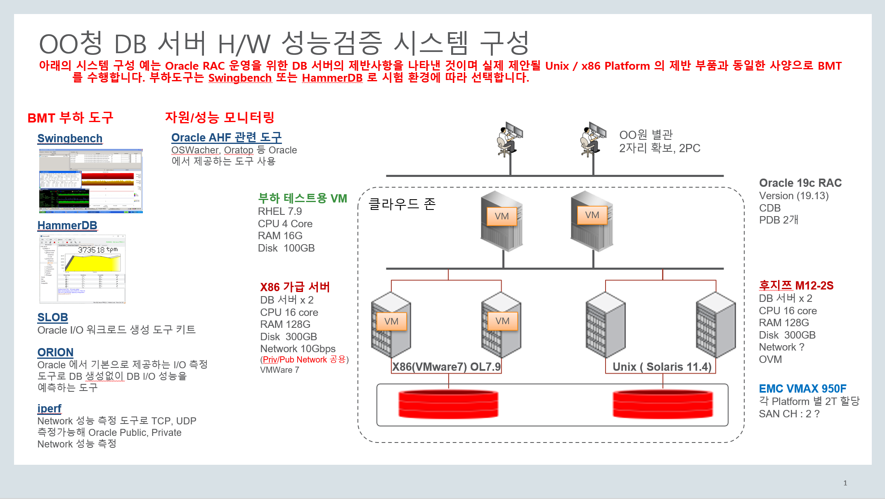

## 1. 장비 및 SW 환경 <a id="ch-1-1"></a>
---------------------------------------------------

### A. 부하용 vm ( RHEL 7.9 또는 OL 7.9 ) ( Report 용도 포함 )
------------------------------------------------------------------------

#### 1) python3 & pip3 설치 

* SW 설치 
```bash
yum install python3 -y
pip3 install --upgrade pip 
```

* 환경변수
```bash
echo "alias python=python3" >> ~/.bash_profile
echo "alias pip=pip3" >> ~/.bash_profile
source ~/.bash_profile
```

#### 2) Swingbench 

* 필수 Software
   + [JDK 1.8 다운로드](https://www.oracle.com/java/technologies/downloads/#java8)

* [Swingbench 2.6](http://www.dominicgiles.com/swingbench.html)
   + [다운로드](https://github.com/domgiles/swingbench-public/releases/download/production/swingbenchlatest.zip)
   + 압축 파일 해제 ( 예: /home/oracle 위치에서 압축해제)
   
   ```bash
   unzip swingbenchlatest.zip
   ```

* 환경변수 설정 (option)
```bash
export SB_HOME=/home/oracle/swingbench
```

* 플랫폼별 수행 위치 (BMT를 위해 임의로 생성한 것임)
   + Unix Home
/home/oracle/swingbench/unix

   + X86 Home
/home/oracle/swingbench/x86

* 대량 부하시 Swingbench launcher 의 Memory 조정 가능
  + swingbench/launcher/launcher.xml
```bash
    <jvmargset id="base.jvm.args">
        <jvmarg line="-Xmx1024m"/>
        <jvmarg line="-Xms512m"/>
        <!--<jvmarg line="-Djava.util.logging.config.file=log.properties"/>-->
   </jvmargset>
```

#### 3) dstat 
* 부하용 VM 에서 DB 서버로의 network 발생량 등 확인용 

* dstat 설치 
```bash
[oracle@racnode1 ~]$ sudo yum install -y dstat
```

* dstat 실행화면 
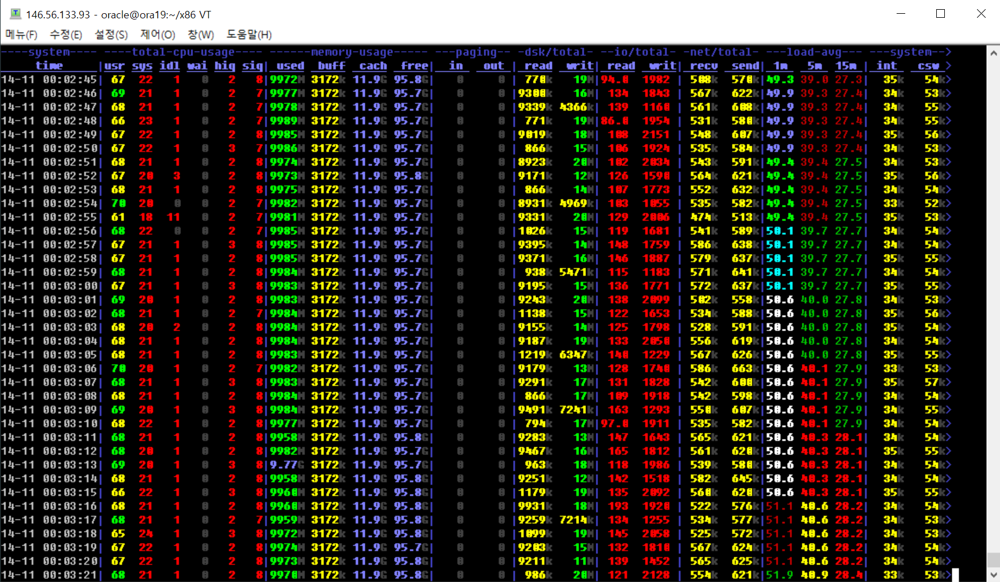


### B. DB 서버  ( Oracle 19.13 RAC ) 
---------------------------------------------

#### 1) 장비별 OS
 * X86 (VMware 7) OL 7.9 (UEK)
 * Unix                Solaris 11.14
     - Unix 의 경우 Bare Metal 과 OVM Server for SPARC 모두 수행 

##### oracle / grid 계정 환경 변수 설정 

* **[사-1 계정별 환경 변수 확인]**

#### 2) Autonomous Health Framework (AHF) Update  
Oracle Autonomous Health Framework(AHF)는 Oracle Database 의 운영, 가용성, 성능영역에서 데이타베이스 및 시스템 관리자가 직면한 운영상의 문제를 AHF 에 적용된 머신러닝 기술을 활용하여 조기 경고하거나 자동으로 해결하는 데 도움이 되는 차세대 운영 도구로 다양한 구성 요소로 제공합니다. 
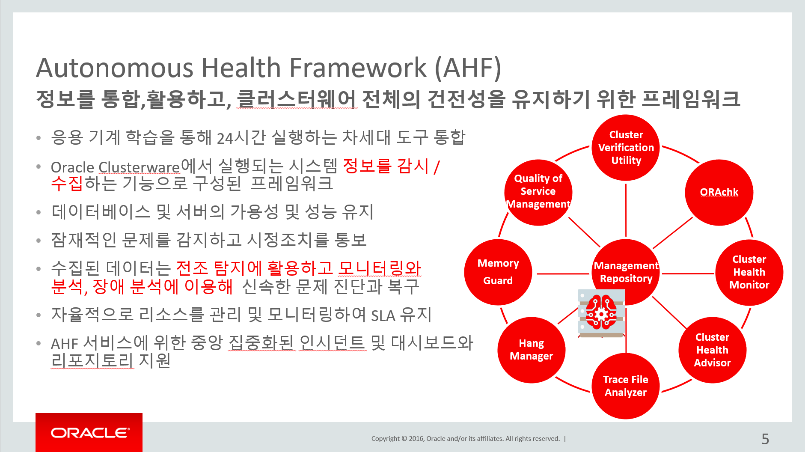


AHF 에는 Oracle Grid Infrastrucutre 설치 전후의 클러스터 상태를 확인할 수 있는 Cluster Verification Utility (CVU) 및 Oracle 진단시 편리한 구성/성능 정보 수집을 위한 Trace File Analyzer (TFA) 를 포함한 다양한 도구가 제공되며 Database 운용 및 BMT 환경에서 필요한 정보를 수집, 분석할 수 있다. 

AHF 는 RAC 의 경우 GI Home 에 설치되어 있으며 새 버젼 설치시 기존 정보 참고함 (root 권한 권장)

* 사전 설치 
```bash
sudo yum install -y perl-Digest-MD5 perl-Data-Dumper
```

* AHF 다운로드 : Oracle Automatic Health Framework (AHF) latest
  Autonomous Health Framework (AHF) - Including TFA and ORAchk/EXAchk (Doc ID 2550798.1)
  + [AHF 21.3 for Linux](https://updates.oracle.com/Orion/Services/download/AHF-LINUX_v21.3.0.zip?aru=24481521&patch_file=AHF-LINUX_v21.3.0.zip)
  + [AHF 21.3 for Solaris SPARC 64](https://updates.oracle.com/Orion/Services/download/AHF-SOLARIS.SPARC64_v21.3.0.zip?aru=24481520&patch_file=AHF-SOLARIS.SPARC64_v21.3.0.zip)

* AHF 설치

```bash
mkdir ora_ahf; cd ora_ahf
unzip ../AHF-LINUX_v21.3.0.zip
./ahf_setup [-ahf_loc install_dir] [-data_dir data_dir]

chmod u+x /opt/oracle.ahf/tfa
```

* 설치 위치  
/opt/oracle.ahf/

#### 3) Oracle Remote Diagnostic Agent (RDA)

Oracle 제품 사용 환경에 대한 자세한 정보를 수집하는 도구로 설치 구성 정보, 성능 정보 수집 그리고 
문제 발생시 진단 관련된 각종 로그 정보를 수집해주는 도구 

##### AHF 내에 포함되어 있음
/opt/oracle.ahf/tfa/ext/darda/da/rda

##### 최신정보 확인 
Remote Diagnostic Agent (RDA) - Getting Started (Doc ID 314422.1)

###### a. Generic Platform 용 Download
p31308935_204201020_RDA_Generic.zip

###### b. 설치

임의의 디렉토리에 압축 파일을 해제 

###### c. 압축해제
```bash
unzip p31308935_204201020_RDA_Generic.zip
cd rda
chmod +x rda.sh rda.pl
```

###### d. rda 유효성 검사

```bash
./rda.sh -cv

./rda.sh -vXRda check -A
Old build 20200928
```

###### d. 설정 

```bash
./rda.sh -S

또는 DB 만 실행 
rda> -SCRPp DB12c

BMT 에서는 아래를 실행 
sudo ./rda.sh -S ACFS ASM CRS DB DBA DBM DBPGA INST LOG ONET OS PLNC PROF RACD REMOTE RPERF  RSRC

```

* Multitenant 인 경우 
Oracle SID 입력시 <scan name>:<port>::<service Name>
예) racnode-scan:1521::orclpdb

###### e. 실행 
```bash
sudo ./rda.sh [-v]
```

###### f. RDA 보고서 확인 및 결과 조회
rda 실행 위치에 RDA_*.zip 
```bash
RDA_*.zip
   <result_set_name>/__RDAstart.htm
   <result_set_name>/RDA__start.htm
```

* 실행화면 예

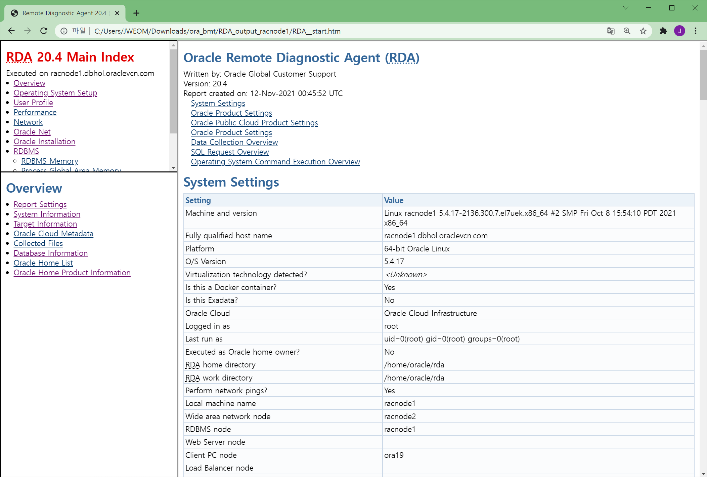

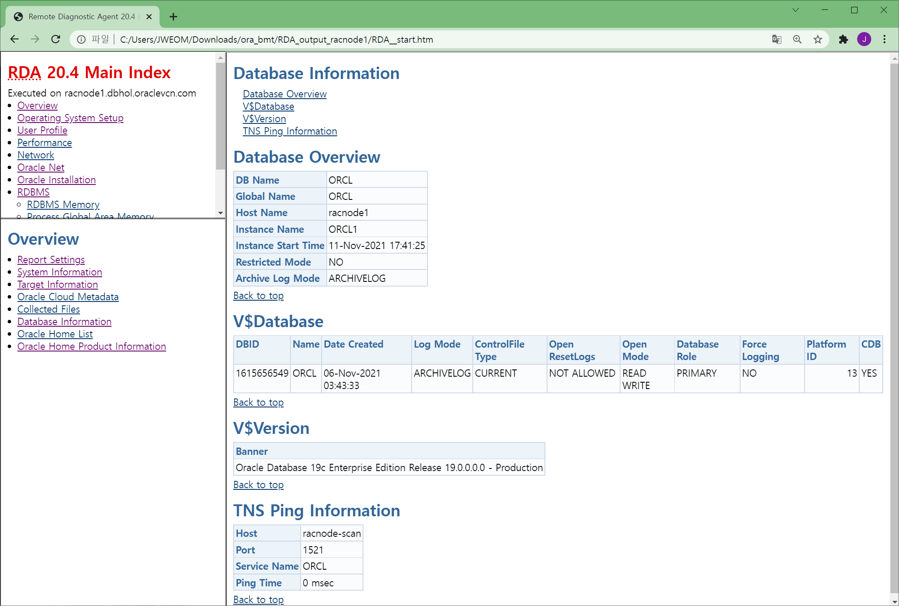

DB 생성후 BMT 수행 전/후 실행 결과 저장 

#### 4) OSWatcher 확인
OSwatcher 는 OS 환경에서의 CPU, Memory, Disk IO, Network, Process 등의 성능 정보를 수집하는 vmstat, iostat, netstat, ps 등의 유틸리티들을 Oracle 사용자들이 성능 진단시 활용하기 쉬운 형태로 제공된 shell script 들의 모음 

###### AHF 내 포함되어 있음 
/opt/oracle.ahf/tfa/ext/oswbb

###### OSWbba : OSWatcher Black Box Analyzer (OSW분석기)

** OSWBBA 대시보드 화면 예 **

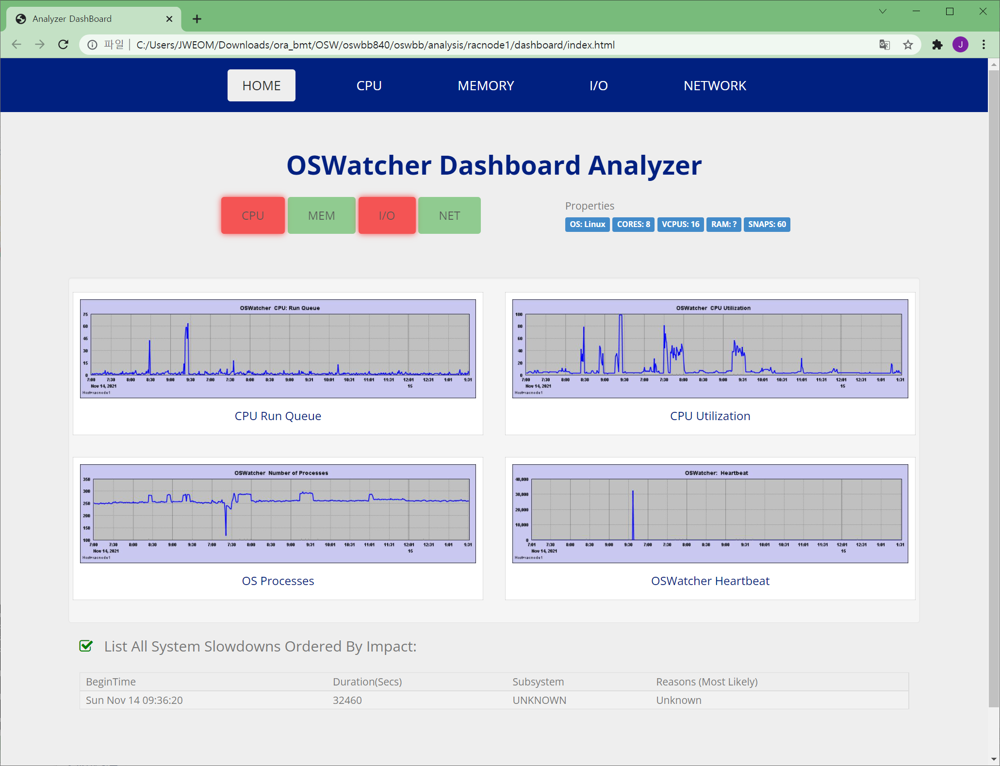


* Java 및 Graphic 환경 필요 

java -jar /oswbba.jar -i /opt/oracle.ahf/tfa/ext/oswbb/archive

* Windows 에서 Parsing Error 발생시 조치 사항 
  + 원인 : Windows OS date format is set to non-English
  + 관련문서 : OSWatcher Analyzer Failed with "Cannot format given Object as a Date" and "Invalid data found" on Windows Platform (Doc ID 2247572.1)
  + 조치방법 : java 실행시 "-Duser.language=en -Duser.country=us" 추가 
    
```bash
C:\Users\JWEOM\Downloads\ora_bmt\OSW\oswbb840\oswbb>java -jar oswbba.jar -i C:\Users\JWEOM\Downloads\ora_bmt\OSW\racnode1-osw\racnode1-osw\archive

Starting OSW Analyzer V8.4.0
OSWatcher Analyzer Written by Oracle Center of Expertise
Copyright (c)  2019 by Oracle Corporation

Parsing Data. Please Wait...

Scanning file headers for version and platform info...

Parsing file racnode1_prvtnet_21.11.14.0700.dat ...
Parsing file racnode1_prvtnet_21.11.14.0700.dat ...
An exception occured in insertVmstatLists on line 0
An exception occured in insertVmstatLists on line 3
An exception occured in insertVmstatLists on line 6

재실행 

C:\Users\JWEOM\Downloads\ora_bmt\OSW\oswbb840\oswbb>java -Duser.language=en -Duser.country=us -jar oswbba.jar -i C:\Users\JWEOM\Downloads\ora_bmt\OSW\racnode1-osw\racnode1-osw\archive

Starting OSW Analyzer V8.4.0
OSWatcher Analyzer Written by Oracle Center of Expertise
Copyright (c)  2019 by Oracle Corporation

Parsing Data. Please Wait...

Scanning file headers for version and platform info...

Parsing file racnode1_prvtnet_21.11.14.0700.dat ...
Parsing file racnode1_prvtnet_21.11.14.0700.dat ...
Parsing file racnode1_prvtnet_21.11.14.0800.dat ...
Parsing file racnode1_prvtnet_21.11.14.0900.dat ...
Parsing file racnode1_prvtnet_21.11.14.1800.dat ...
.
.
Parsing file racnode1_ps_21.11.14.2300.dat ...
Parsing file racnode1_ps_21.11.15.0000.dat ...
Parsing file racnode1_ps_21.11.15.0100.dat ...


Parsing Completed.


Enter 1 to Display CPU Process Queue Graphs
Enter 2 to Display CPU Utilization Graphs
Enter 3 to Display CPU Other Graphs
Enter 4 to Display Memory Graphs
Enter 5 to Display Disk IO Graphs
Enter 61 to Display Individual OS Process I/O RPS Graphs
Enter 62 to Display Individual OS Process I/O WPS Graphs
Enter 63 to Display Individual OS Process Percent User CPU Graphs
Enter 64 to Display Individual OS Process Percent System CPU Graphs
Enter 65 to Display Individual OS Process Percent Total CPU (User + System) Graphs
Enter 66 to Display Individual OS Process Percent Memory Graphs

Enter GP to Generate Individual Process Profile
Enter GC to Generate All CPU Gif Files
Enter GM to Generate All Memory Gif Files
Enter GD to Generate All Disk Gif Files
Enter GN to Generate All Network Gif Files

Enter L to Specify Alternate Location of Gif Directory
Enter Z to Zoom Graph Time Scale (Does not change analysis dataset)
Enter B to Returns to Baseline Graph Time Scale (Does not change analysis dataset)
Enter R to Remove Currently Displayed Graphs

Enter X to Export Parsed Data to Flat File
Enter S to Analyze Subset of Data(Changes analysis dataset including graph time scale)
Enter A to Analyze Data
Enter D to Generate DashBoard

Enter Q to Quit Program

Please Select an Option:
```
간단히 Dashboard 를 생성 

```bash
Please Select an Option:D
Enter a unique analysis/dashboard directory name or enter <CR> to accept default name:racnode1

A new analysis file analysis\racnode1\analysis.txt has been created.

Generating file analysis\racnode1\dashboard\generated_files\OSWg_OS_Run_Queue.jpg
Generating file analysis\racnode1\dashboard\generated_files\OSWg_OS_Run_Adjusted_Queue.jpg
Generating file analysis\racnode1\dashboard\generated_files\OSWg_OS_Block_Queue.jpg
Generating file analysis\racnode1\dashboard\generated_files\OSWg_OS_HB.jpg
.
.
Generating file analysis\racnode1\dashboard\generated_files\OSWg_TcpEstabResets.jpg
Generating file analysis\racnode1\dashboard\generated_files\OSWg_TcpAttemptFails.jpg
Generating file analysis\racnode1\dashboard\generated_files\OSWg_tcp_retran_error_rate.jpg

Files written to the analysis directory.
```


#### 5) oratop 확인
oratop은 OS의 top 명령와 비슷한 기능과 인터페리이스를 가지고 있으며 Oracle RAC 환경을 포함해 Oracle 모니터링 도구

* AHF 내 포함되어 있음 
/opt/oracle.ahf/tfa/ext/oratop

* oratop 디렉토리에 Platform 별로 파일이 있으므로 oratop.RDBMS_12.1_LINUX.X64 바이너리 파일을 복사해 사용
```bash
# cd /opt/oracle.ahf/tfa/ext/oratop; cp oratop.RDBMS_12.1_LINUX.X64 oratop
```

* oratop 실행시 libclntshcore.so.12.1 오류가 발생하므로 libclntsh.so.19.1 를 soft link 생성해 사용
```bash
$ cd $ORACLE_HOME/lib; ln -s  libclntsh.so.19.1  libclntshcore.so.12.1
```

* 실행화면 예

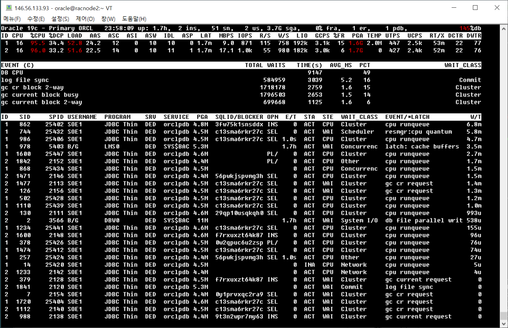

#### 6) orachk 확인 
ORAchk 는 Oracle 소프트웨어 스택 전반에 대한 상태 검사 및 주요 문제를 식별하고 알려진 문제를 사전에 리포팅합니다. 

* 주요 지원 제품 및 기능 
  + Standalone Oracle Database
  + Oracle Grid Infrastructure
  + Oracle Real Application Clusters
  + Maximum Availability Architecture (MAA) Validation
  + Upgrade Readiness Validations
  + Oracle Golden Gate

* AHF 내 포함되어 있음
/opt/oracle.ahf/orachk

* 실행화면 예

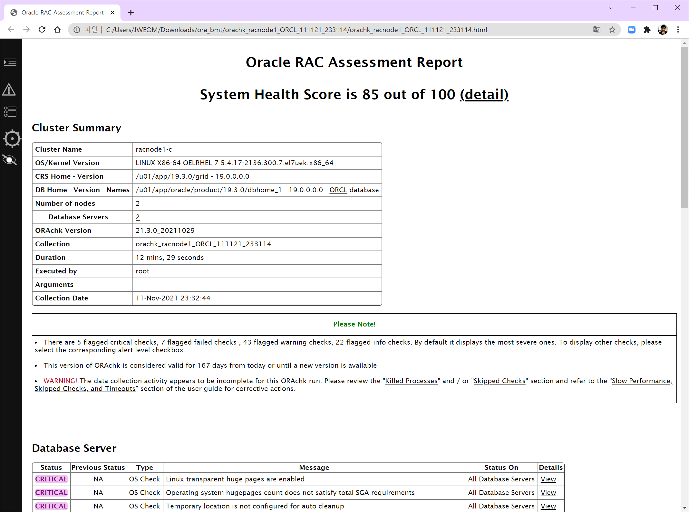

* BMT 수행 전/후 실행 결과 


#### 7) MOATS 및 유사 Oracle 모니터링 도구

[MOATS : The Mother of All Tuning Scripts!](https://tanelpoder.com/2011/03/29/moats-the-mother-of-all-tuning-scripts/) 는 SQLPLUS 에서 실행하는 Oracle DB 성능 모니터링 도구로 세션/시스템 스냅샷, 액티브 세션 히스토리, 대기 이벤트 등에 기반해 Oracle DB 전반의 운영상황을 파악할 수 있다. 

Tanel Poder 와 Adrian Billington 가 만든 도구로 이 소스를 기반의 유사 프로그램도 있다. 

* Adrian Billington & Tanel Poder 의 MOATS(원본):
https://github.com/oracle-developer/moats

* Sidney Chen의 MOATS 2.1(RAC 지원):
https://github.com/dbsid/moats_rac
  +  이 BMT 에서 사용

* Jagjeet Singh의 SQL Dashboard (RAC 지원):
https://jagjeet.wordpress.com/2015/12/08/sql-dashboard-v2-1-beta/
  + Jagjeet Singh 는 Oracle 직원으로 MOATS 의 영감을 받아 SQL Dashboard를 작성했으며 이 유틸리티는 ** Oracle Diagnostics 및 Tuning Pack ** 이 필요한 ASH 및 v$sql_monitor를 사용합니다!
  +  이 BMT 에서 사용 

#### Sidney Chen의 MOATS 2.1(RAC 지원):
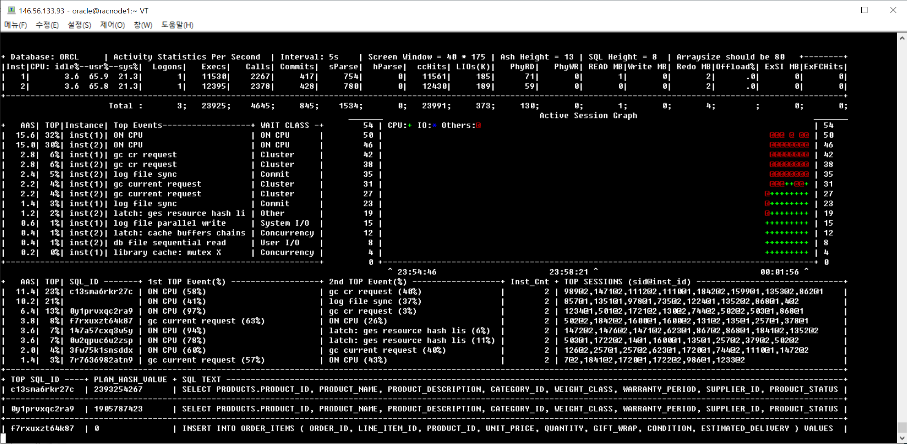

#### Jagjeet Singh의 SQL Dashboard (RAC 지원):
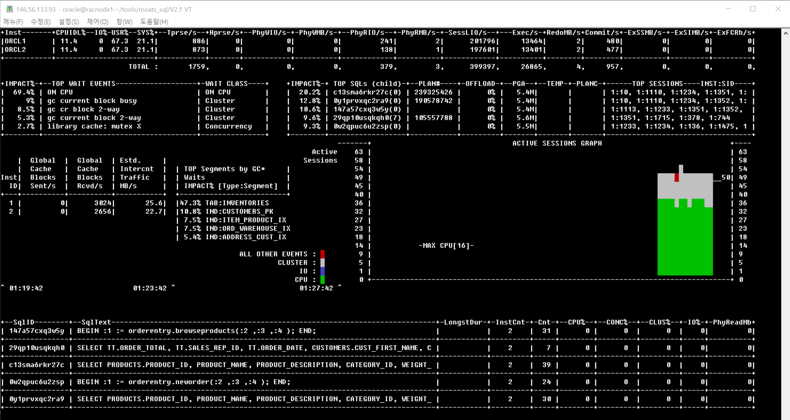


##### a. 다운로드

Jagjeet Singh의 [SQL Dashboard](https://www.dropbox.com/s/094ca8mk0j2rjsh/V2.1.zip?dl=0) 나 Sidney Chen의 [MOATS 2.0](https://github.com/dbsid/moats_rac) 을 다운로드받는다

임의의 디렉토리에 압축 파일을 해제 

##### b. 압축해제

grant connect, resource to tools2 identified by tools2;
```bash
 Step 1 Tool 사용자 생성 
          grant connect, resource to tools2 identified by tools2;

 Step 2 SYS/DBA 사용자로 1_grants.sqll 수행 (Script 는 필요한 권한을 grant 
         SYS@SQL> start 1_grants
                  Enter value for _usr: system
                  old   1: grant create type to                         &&_usr
                  new   1: grant create type to                         system

 Step 3 : Step 1에서 생성한 DB 사용자로 2_createobj.sql 수행 
        SYS@SQL> conn tools2/tools2@orclpdb
              Connected.
        TOOLS2@SQL> @2_createobj.sql

Step 4 : 3_JSS.sql 스크립트로 JSS Package 를 생성 
        TOOLS2@SQL> start 3_JSS.sql
                    Package created.
                    Package body created.
Step 5 : SQL Dashboard 를 실행
         SYSTEM@SQL> start sd.sql
```


#### 8) iperf 네트워크 성능 테스트 
https://iperf.fr/iperf-download.php

iperf 유틸리티는 TCP와 UDP 성능을 모두 측정합니다. 이는 Public 네트워크가 TCP를 사용하고 Cluster Interconnect가 많은 UDP 데이터 전송을 사용하기 때문에 중요합니다.

##### a. 다운로드

```bash
# wget https://iperf.fr/download/fedora/iperf3-3.1.3-1.fc24.x86_64.rpm
# rpm -Uvh iperf3-3.1.3-1.fc24.x86_64.rpm

$ iperf3 -h
Usage: iperf [-s|-c host] [options]
       iperf [-h|--help] [-v|--version]

Server or Client:
  -p, --port      #         server port to listen on/connect to
  -f, --format    [kmgKMG]  format to report: Kbits, Mbits, KBytes, MBytes
  -i, --interval  #         seconds between periodic bandwidth reports
  -F, --file name           xmit/recv the specified file
  -A, --affinity n/n,m      set CPU affinity
  -B, --bind      <host>    bind to a specific interface
  -V, --verbose             more detailed output
  -J, --json                output in JSON format
  --logfile f               send output to a log file
  -d, --debug               emit debugging output
  -v, --version             show version information and quit
  -h, --help                show this message and quit
Server specific:
  -s, --server              run in server mode
  -D, --daemon              run the server as a daemon
  -I, --pidfile file        write PID file
  -1, --one-off             handle one client connection then exit
Client specific:
  -c, --client    <host>    run in client mode, connecting to <host>
  -u, --udp                 use UDP rather than TCP
  -b, --bandwidth #[KMG][/#] target bandwidth in bits/sec (0 for unlimited)
                            (default 1 Mbit/sec for UDP, unlimited for TCP)
                            (optional slash and packet count for burst mode)
  -t, --time      #         time in seconds to transmit for (default 10 secs)
  -n, --bytes     #[KMG]    number of bytes to transmit (instead of -t)
  -k, --blockcount #[KMG]   number of blocks (packets) to transmit (instead of -t or -n)
  -l, --len       #[KMG]    length of buffer to read or write
                            (default 128 KB for TCP, 8 KB for UDP)
  --cport         <port>    bind to a specific client port (TCP and UDP, default: ephemeral port)
  -P, --parallel  #         number of parallel client streams to run
  -R, --reverse             run in reverse mode (server sends, client receives)
  -w, --window    #[KMG]    set window size / socket buffer size
  -C, --congestion <algo>   set TCP congestion control algorithm (Linux and FreeBSD only)
  -M, --set-mss   #         set TCP/SCTP maximum segment size (MTU - 40 bytes)
  -N, --no-delay            set TCP/SCTP no delay, disabling Nagle's Algorithm
  -4, --version4            only use IPv4
  -6, --version6            only use IPv6
  -S, --tos N               set the IP 'type of service'
  -L, --flowlabel N         set the IPv6 flow label (only supported on Linux)
  -Z, --zerocopy            use a 'zero copy' method of sending data
  -O, --omit N              omit the first n seconds
  -T, --title str           prefix every output line with this string
  --get-server-output       get results from server
  --udp-counters-64bit      use 64-bit counters in UDP test packets
  --no-fq-socket-pacing     disable fair-queuing based socket pacing
                            (Linux only)

[KMG] indicates options that support a K/M/G suffix for kilo-, mega-, or giga-

iperf3 homepage at: http://software.es.net/iperf/
Report bugs to:     https://github.com/esnet/iperf

```

-------------------------------------------------------------------------------------------------------------------

## 2. 성능 모니터링 <a id="ch-1-2"></a>
------------------------------------------------------

* 플랫폼별 준비 ( Unix, X86 )

### A. 부하용 vm 성능 모니터링
--------------------------------------

```bash
dstat -t -cmgdrnlyp -N total  --output dstat_$(date +"%Y%m%d").txt 
또는 
nohup dstat -t -cmgdrnlyp -N total  --output dstat_$(date +"%Y%m%d").txt &
```
### B. DB서버용 성능 모니터링
-------------------------------------

* RAC 서버 부하시 작업 화면 예 
  + 화면1 : 왼쪽 상단 : DB 노드의 oratop
  + 화면2 : 오른쪽 상단 : DB 노드의 MOATS V2 또는 SQL Dashboard
  + 화면3 : 왼쪽 하단 : 부하용 VM 에서의 dstat
  + 화면4 : 오른쪽 하단 : 부하용 VM 에서의 Swingbench

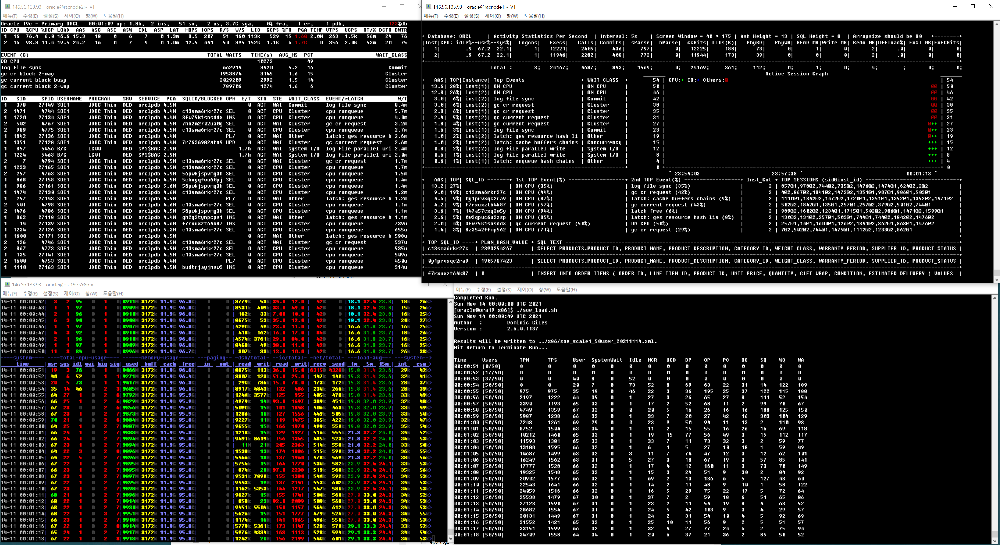

SOE 부하
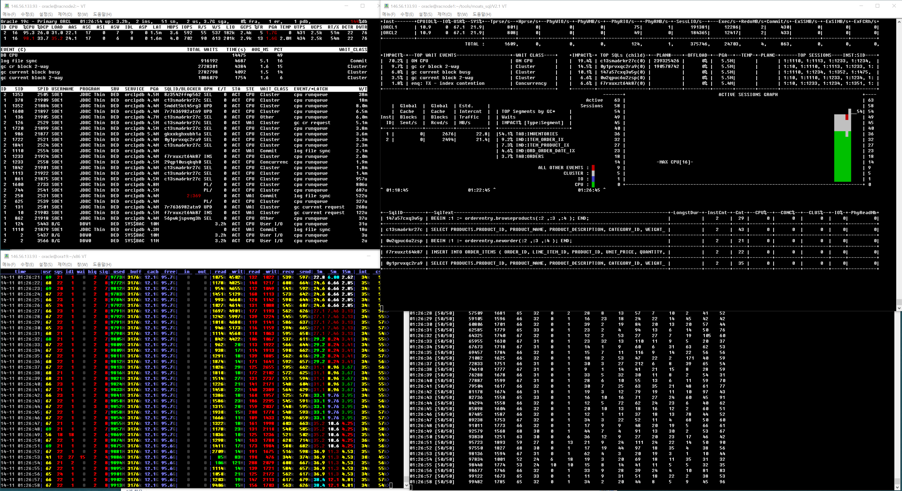

SH 부하
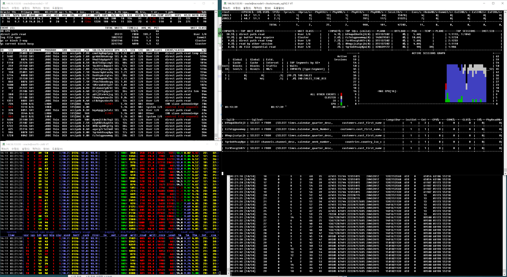

#### 1) OSWatcher
AHF 내에 포함되어 있으며 root 계정으로 실행을 권장
```bash
cd /opt/oracle.ahf/tfa/ext/oswbb
nohup ./startOSWbb.sh 60 10 &
```
>참고 : 
>./startOSWbb.sh <ARG1> <ARG2> <ARG3> <ARG4>
>ARG1 = 스냅샷 간격(초).
>ARG2 = 저장할 아카이브 데이터의 시간.
>ARG3 = (선택 사항) 각 파일이 생성된 후 자동으로 압축하는 압축 유틸리티의 이름 (gzip 등)
>ARG4 = (선택 사항) 아카이브 디렉토리를 저장할 대체(기본값 아님) 위치.

* ./startOSWbb.sh
  : (디폴트) 30초 48시간 동안 데이터를 아카이브 파일에 저장 
* ./stopOSWbb.sh

#### 2) oratop
```bash
$ORACLE_HOME/suptools/oratop/oratop / as sysdba
```

#### 3) MOATS

##### a. Sidney Chen의 MOATS 2.1(RAC 지원):

###### o 실행 
```sql
$ sqlplus /nolog
SQL> @moats
```

###### o 실행화면 


##### b. Jagjeet Singh의 SQL Dashboard (RAC 지원):

###### o 실행 
```sql

$ cat sd.sql
connect tools2/tools2@orclpdb
SET LINESIZE 5000 pagesize 0 Arraysize 51 TAB OFF
select * from table(jss.gtop(51))
/
$ sqlplus /nolog
SQL> @sd
```

###### o 실행화면 


#### 4) AWR info 및 스냅샷 주기 확인 
: AWR 주기를 변경할지 / 부하테스트 수행 전/후 Snapshot 생성할 지 결정 

##### 1. AWR repository 크기 확인 및 계산 
Default : Snapshot 주기 1시간, 보관 8일
```sql
@?/rdbms/admin/awrinfo.sql

AWR Interval (mins), Retention 일수, Num Instances, 평균 Active Sessions, Datafile 수
@?/rdbms/admin/utlsyxsz.sql
```

##### 2. AWR Snapshot 주기 확인 및 변경
```sql
set lines 100 
col snap_interval for a30
col retention for a50
SELECT DBID, SNAP_INTERVAL, RETENTION FROM DBA_HIST_WR_CONTROL;

set lines 100
SELECT SNAP_ID, DBID, INSTANCE_NUMBER, TO_CHAR(BEGIN_INTERVAL_TIME, 'YYYY/MM/DD HH24:MI'),
TO_CHAR(END_INTERVAL_TIME, 'YYYY/MM/DD HH24:MI') FROM DBA_HIST_SNAPSHOT
ORDER BY DBID, INSTANCE_NUMBER, SNAP_ID;
```

##### 3. AWR Snapshot 주기 30분, 보관은 15일로 설정
```sql
EXEC DBMS_WORKLOAD_REPOSITORY.MODIFY_SNAPSHOT_SETTINGS(RETENTION=>60*24*15,INTERVAL=>30);

SELECT DBID, SNAP_INTERVAL, RETENTION FROM DBA_HIST_WR_CONTROL;
```

##############################################################################

# 나. DB 부하 테스트 사전 검증 및 DB 생성
---------------------------------------------------

#### Oracle Database 구성 
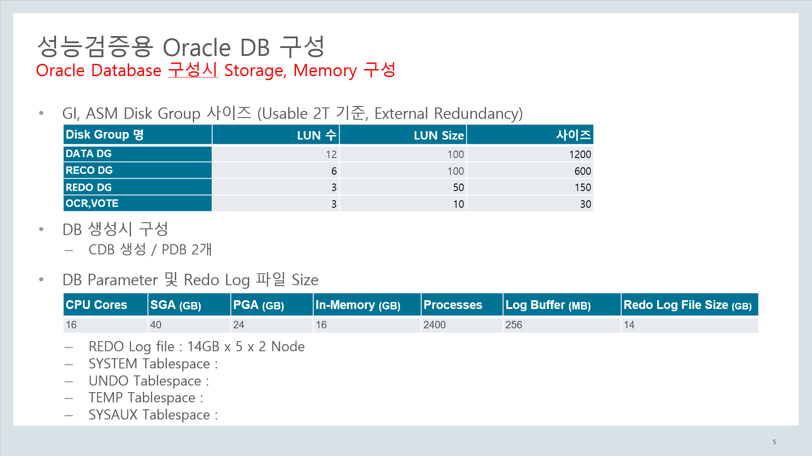


플랫폼 별 준비 ( Unix, X86 )

## 1. 부하테스트 시나리오 <a id="ch-2-1"></a>
-----------------------------------------------------------

### A. 부하테스트 시나리오 1 
-------------------------------------
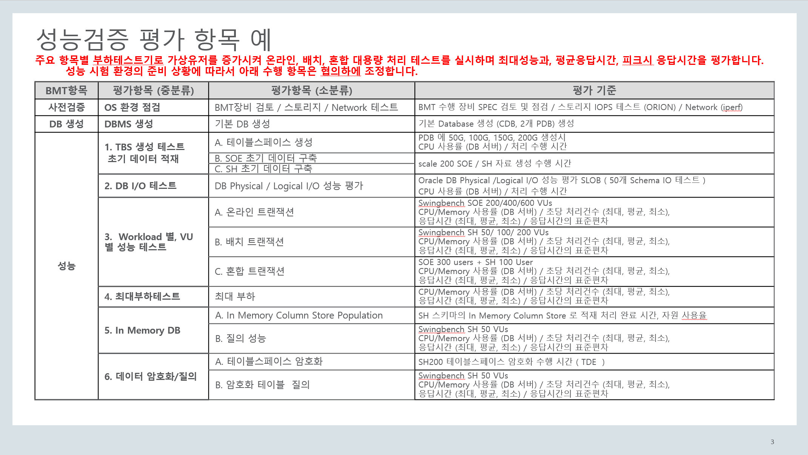

### B. 부하테스트 시나리오 2 
-----------------------------------
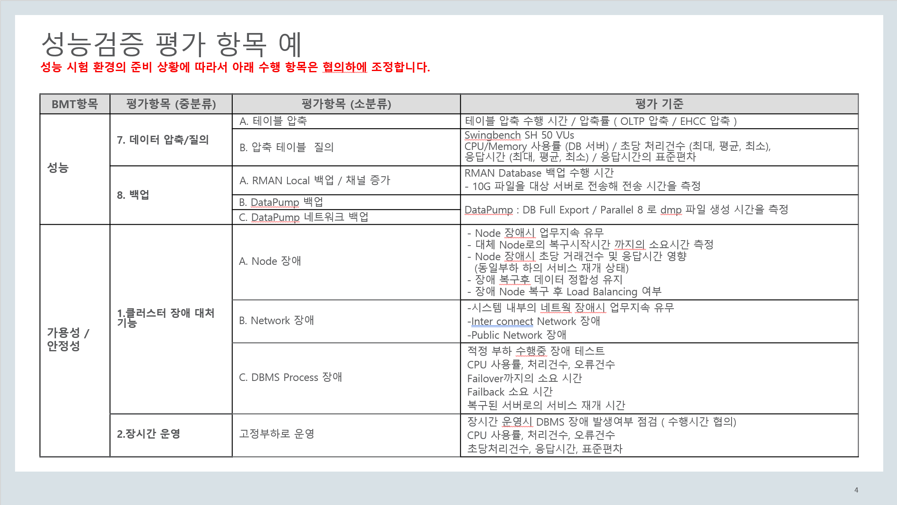

-------------------------------------------------------------------------------------------------------------------

## 2. HW 사전 검증 및 DB 생성 
-------------------------------------

### A. BMT 수행 장비 SPEC 검토 및 점검 
------------------------------------------------

* RDA 수행한 결과물에서도 확인 가능 
* OS 기본 정보 : RDA -> Overview -> Report Settings
  + System Information 

### B. 스토리지 IOPS 테스트 (ORION) / IOPS baseline <a id="ch-2-2-1"></a>
----------------------------------------------------------------

I/O 서브시스템은 Oracle Database에 필수적인 구성요소이며 모든 Oracle Database 는 디스크에서 데이터를 읽거나 쓰기 작업시 Disk I/O 가 발생하므로 데이타베이스 성능에 중요한 요소입니다. 

https://docs.oracle.com/en/database/oracle/oracle-database/19/tgdba/IO-configuration-and-design.html

#### 1). DD로 테스트용 파일 생성 
dd 유틸리티로 Oracle Database 가 생성될 LUN, Disk, CFS 등에 IO를 발생시켜 DB서버와 데이타베이스용 Storage 간의 IO 성능 수치를 참고합니다.

```bash
$ cat 0-1-0.sh
rm -f /u01/oracle/DATA/bmtfile[0-5]
start_time=$(date +%s.%3N)
time dd if=/dev/zero of=/u01/oracle/DATA/bmtfile0 bs=8k  count=262144

for i in {1..5} ; do
    time        dd if=/dev/zero of=/u01/oracle/DATA/bmtfile$i bs=2G  count=1
done
time
end_time=$(date +%s.%3N)

elapsed=$(echo "scale=3; $end_time - $start_time" | bc)
echo execution time was $elapsed sec.

$ ./0-1-0.sh
262144+0 records in
262144+0 records out
2147483648 bytes (2.1 GB) copied, 3.96816 s, 541 MB/s

real    0m3.969s
user    0m0.199s
sys     0m3.753s
0+1 records in
0+1 records out
2147479552 bytes (2.1 GB) copied, 3.22225 s, 666 MB/s


 ..
 
2147479552 bytes (2.1 GB) copied, 3.14259 s, 683 MB/s

real    0m3.282s
user    0m0.001s
sys     0m3.229s

execution time was 20.115 sec.
```

#### 2). ORION 실행


##### a. hugepags 설정 확인
Orion의 기본값은 hugepages 를 사용하는 것입니다. 테스트 시스템이 Linux 이며 hugepages 가 구성되어 있지 않은 경우 Orion은 –hugenotneeded 매개변수 와 함께 hugepages를 사용하지 않도록 지시해야 합니다. 
hugepage 가 구성된 시스템의 경우 기본 설정을 사용하십시오

###### Linux
```bash
grep -i hugepages /etc/sysctl.conf
또는
grep HugePages /proc/meminfo
```

* Doc. 401749.1 에 있는 권장 HugePage 값을 확인

###### Solaris 
ISM(Intimate Shared Memory) 기능을 통해서 HugePage 기능을 적용할 수 있다. Solaris에서는 HugePage 대신 Lage page라는 동일한 의미의 용어를 대신 사용
서버 초기화 파라미터 설정을 통해 활성화 : default Y
_USE_ISM=Y

##### b. test 파일 작성 

```bash
$ cat bmtfile-acfs.lun
/u01/oracle/DATA/bmtfile0
/u01/oracle/DATA/bmtfile1
/u01/oracle/DATA/bmtfile2
/u01/oracle/DATA/bmtfile3
/u01/oracle/DATA/bmtfile4
/u01/oracle/DATA/bmtfile5
```

##### c. ORION 실행 레벨 및 옵션 

###### ORION 실행 Level 

-run level 

* oltp : 소규모(8K) 랜덤 I/O로 부하를 증가시켜 최대 IOPS를 특정하기 위한 테스트
* dss : 대규모(1M) 랜덤 I/O로 부하를 증가시켜 최대 처리량을 특정하기 위한 테스트
* simple : 일정 범위의 부하 레벨에서 소규모 랜덤 I/O 및 대규모 랜덤 I/O 워크로드를 생성
* normal : simple같지만, 일정 범위의 부하 레벨에서의 소규모 랜덤 I/O와 대규모 랜덤 I/O의 조합도 생성
* advanced : 선택적 매개 변수로 지정된 워크로드를 테스트

###### ORION 옵션 

```bash
-cache_size num
–duration num_seconds
–matrix 유형 : basic / detailed / point / col / row / max
-num_disks value : 기본값 testname.lun 의 LUN 수
-num_large value
-num_small 
-num_streamIO num : Default 4
-simulate 유형 : concat / raid0 
-size_large num : default 1024
-size_small num : default 8
-storax 유형 : default skgfr, skgfr / oss / asmlib / odmlib
-testname tname : default orion
-type [rand|seq] : default rand, rand / seq
-verbose 
-write num_write : default 0
```

##### d. simple 테스트 

```bash
$ $ORACLE_HOME/bin/orion -run simple -testname bmtfile-acfs -hugenotneeded
ORION: ORacle IO Numbers -- Version RDBMS_19.3.0.0.0DBRU_LINUX.X64_190417
bmtfile-acfs.lun_20211113_1809
Failure in opening .lun file bmtfile-acfs.lun.lun (rwbase_read_luncfg:SlfFopen)orion_parse_args: rwbase_read_luncfg failed
$ $ORACLE_HOME/bin/orion -run simple -testname bmtfile-acfs -hugenotneeded
ORION: ORacle IO Numbers -- Version RDBMS_19.3.0.0.0DBRU_LINUX.X64_190417
bmtfile-acfs_20211113_1809
Calibration will take approximately 44 minutes.
Using a large value for -cache_size may take longer.

Setting ftype=0
Maximum Large MBPS=1571.33 @ Small=0 and Large=5

Maximum Small IOPS=58778 @ Small=10 and Large=0
Small Read Latency: avg=169.594 us, min=128.415 us, max=1924.721 us, std dev=13.566 us @ Small=10 and Large=0

Minimum Small Latency=97.677 usecs @ Small=2 and Large=0
Small Read Latency: avg=97.677 us, min=63.652 us, max=2133.198 us, std dev=47.348 us @ Small=2 and Large=0
Small Read / Write Latency Histogram @ Small=2 and Large=0
        Latency:                         # of IOs (read)          # of IOs (write)
        0 - 32         us:               0 (  0.00%)              0 (  0.00%)
       32 - 64         us:               1 (  0.00%)              0 (  0.00%)
       64 - 128        us:         1112243 ( 91.12%)              0 (  0.00%)
      128 - 256        us:          102320 ( 99.50%)              0 (  0.00%)
      256 - 512        us:            5434 ( 99.95%)              0 (  0.00%)
      512 - 1024       us:             405 ( 99.98%)              0 (  0.00%)
     1024 - 2048       us:             259 (100.00%)              0 (  0.00%)
     2048 - 4096       us:               2 (100.00%)              0 (  0.00%)
     4096 - 268435456  us:               0 (100.00%)              0 (  0.00%)
```

##### e. OLTP 테스트 

테스트는 작은 랜덤 I/O 워크로드를 시뮬레이트하므로 실행 유형은 "oltp"가 됩니다

```bash
$ $ORACLE_HOME/bin/orion -run oltp -testname bmtfile-acfs -hugenotneeded
```

##### f. DSS 테스트 
데이터 웨어하우스 테스트는 대규모 순차 I/O 작업을 수행하여 Mbps 메트릭을 제공합니다.

```bash
$ $ORACLE_HOME/bin/orion -run dss -testname bmtfile-acfs -hugenotneeded
```

### C. Network 테스트 (iperf) / Network bandwidth <a id="ch-2-2-2"></a>
----------------------------------------------------------------
iperf 유틸리티는 네트워크 성능을 측정하는 도구이며 Oracle RAC 운영시 Public Network는 TCP를, Cluster Interconnect Network는 UDP 데이터 전송에 많이 사용하기 때문에 이런 특성의 네트워크 성능 테스트를 위한 TCP 및 UDP 성능을 모두 측정해야 합니다.

#### 1). Private (Interconnect) Network Test 
Oracle Interconnect Network 는 다음과 같은 용도와 특성을 같는다
* Oracle Clusterware : Cluster 간 Node Health Check 등을 위해 주기적으로 주고받는 작은 메세지로 대역폭이 크지 않지만 응답시간과 부하에 민감
* Oracle RAC : DB 노드간 Cache Fusion 의 크고 작은 메세지 교환에 절대적으로 중요하며 네트워크 구성 결정의 핵심 동인  

##### a. iperf3 Daemon 준비

iperf3 를 호스트 중 하나에서 서버 모드를 시작하며 서버 모드 동작시 iperf는 터미널 창에 output을 기록합니다.

```bash
[root@racnode1 ~]# iperf3 -s
```

iperf3는 -D 파라미터를 사용하여 데몬으로 시작할 수도 있고 output은 파일에 기록합니다.

```bash
[root@racnode1 ~]# iperf3 -s -D > /tmp/iperf.log
```

##### b. DB 서버간 private Network 성능 테스트 
racnode1에서 iperf 서버를 실행하면 racnode2에서 racnode1의 Private 네트워크로 TCP 테스트를 시작할 수 있습니다. 그 반대형태로도 테스트합니다.

```bash
[grid@racnode1 ~]# iperf3 -s -D > /tmp/iperf.log
[oracle@racnode2 iperf]$ iperf3 -c racnode1-priv
Connecting to host racnode1-priv, port 5201
[  4] local 192.168.17.151 port 40474 connected to 192.168.17.150 port 5201
[ ID] Interval           Transfer     Bandwidth       Retr  Cwnd
[  4]   0.00-1.00   sec  2.29 GBytes  19.7 Gbits/sec    0    672 KBytes
[  4]   1.00-2.00   sec  2.40 GBytes  20.6 Gbits/sec    0    744 KBytes
[  4]   2.00-3.00   sec  2.29 GBytes  19.7 Gbits/sec    0    865 KBytes
[  4]   3.00-4.00   sec  2.26 GBytes  19.4 Gbits/sec    0    865 KBytes
[  4]   4.00-5.00   sec  2.29 GBytes  19.6 Gbits/sec    0    966 KBytes
[  4]   5.00-6.00   sec  2.26 GBytes  19.4 Gbits/sec    0    966 KBytes
[  4]   6.00-7.00   sec  2.36 GBytes  20.3 Gbits/sec    0   1017 KBytes
[  4]   7.00-8.00   sec  2.35 GBytes  20.2 Gbits/sec    0   1.04 MBytes
[  4]   8.00-9.00   sec  2.25 GBytes  19.3 Gbits/sec    0   1.10 MBytes
[  4]   9.00-10.00  sec  2.38 GBytes  20.5 Gbits/sec    0   1.15 MBytes
- - - - - - - - - - - - - - - - - - - - - - - - -
[ ID] Interval           Transfer     Bandwidth       Retr
[  4]   0.00-10.00  sec  23.1 GBytes  19.9 Gbits/sec    0             sender
[  4]   0.00-10.00  sec  23.1 GBytes  19.9 Gbits/sec                  receiver

iperf Done.
```

##### c. TCP Window 변경후 테스트 

```bash
[root@racnode1 ~]# iperf3 -s -w 256k
[root@racnode2 ~]# iperf3 -c racnode1-priv -w 256k
```

앞서 이 절에서 언급한 것처럼 iperf는 UDP 성능도 테스트할 수 있습니다. 서버는 UDP의 경우 -u로 시작해야 합니다. 표시 간격은 10초입니다.

##### d. UDP 테스트  

```bash
[root@racnode1 ~]# iperf3 -s -u -i 10

[root@racnode2 ~]# iperf3 -c racnode1-priv -u
```

#### 2). Public Network Test 


-------------------------------------------------------------------------------------------------------------------

## 3. 기본 DB 생성  <a id="ch-2-3"></a>
-------------------------------------------------


* CDB
* 2개 PDB 생성

### A. CPU 단일 스레드 성능 테스트 <a id="ch-2-3-1"></a>
----------------------------------------------------------------

* 문서 참조 : https://www.hammerdb.com/blog/uncategorized/hammerdb-best-practice-for-oracle-performance-and-scalability/

```sql
SET SERVEROUTPUT ON
SET TIMING ON
DECLARE
n NUMBER := 0;
BEGIN
FOR f IN 1..10000000
LOOP
n := MOD (n,999999) + SQRT (f);
END LOOP;
DBMS_OUTPUT.PUT_LINE ('Res = '||TO_CHAR (n,'999999.99'));
END;
/

Res = 873729.72
PL/SQL procedure successfully completed.
Elapsed: 00:00:07.88
```


#### 동시 다중 스레드 성능

#### 참고  
* How to Maximise CPU Performance for the Oracle Database on Linux
https://itpeernetwork.intel.com/how-to-maximise-cpu-performance-for-the-oracle-database-on-linux/

##### CPU 모델 참조 
```bash
# cat /proc/cpuinfo | grep "model name"
```

### B. DBMS_RESOURCE_MANAGER. CALIBRATE_IO 프로시저 사용 <a id="ch-2-3-2"></a>
----------------------------------------------------------------
Oracle Database의 I/O 측정 기능을 사용하면 스토리지 서브시스템의 성능을 평가하여 I/O 성능 문제가 데이터베이스와 스토리지 서브시스템을 유발하는지 판별할 수 있습니다. I/O를 연속적으로 발행하는 외부 I/O 측정 도구와 달리 Oracle Database의 I/O 측정 기능은 Oracle 데이터 파일을 사용하여 I/O를 무작위로 게시하여 스토리지 미디어에 액세스하기 때문에 데이터베이스의 실제 성능에 가까운 결과를 얻을 수 있습니다.

이 프로시저는 데이터베이스 파일에 I/O 중앙 집중식 읽기 전용 워크로드 (1MB 랜덤 I/O로 구성된 워크로드)를 발행하고 스토리지 서브 시스템을 견딜 수 있는 최대 IOPS (초당 I/O 요청)과 MBPS(초당 I/O MB)를 결정합니다.

#### 1). 프로시저 설명 
입력 파라미터 : num_physical_disks를 지정
  : (데이터베이스 스토리지 시스템에 있는 실제 디스크의 대략적인 수를 지정) 보다 효율적으로 측정

##### a. I/O 측정의 첫 번째 단계 (OLTP 관련)

출력 파라미터 :   
max_iops : OLTP 데이터베이스에 중요한 메트릭
actual_latency는 이 워크로드의 평균 대기 시간을 표시
max_latency를 사용하여 목표 대기 시간을 지정

##### b. I/O 측정의 두번째 단계 (Data Warehouse 관련)

출력 파라미터 :   
max_mbps : 데이터베이스가 유지할 수 있는 최대 I/O MBPS

#### 2). 실행 방법 

```sql
SET SERVEROUTPUT ON
DECLARE
  lat INTEGER;
  iops INTEGER;
  mbps INTEGER;
BEGIN
-- DBMS_RESOURCE_MANAGER.CALIBRATE_IO (<DISKS>, <MAX_LATENCY>, iops, mbps, lat);
   DBMS_RESOURCE_MANAGER.CALIBRATE_IO (2, 10, iops, mbps, lat);
 
  DBMS_OUTPUT.PUT_LINE ('max_iops = ' || iops);
  DBMS_OUTPUT.PUT_LINE ('latency = ' || lat);
  dbms_output.put_line('max_mbps = ' || mbps);
end;
/

SYSTEM@orcl> @disk
max_iops = 24002
latency  = 10.868
max_mbps = 175

Note: The high I/O latencies from the calibration run indicate that the calibration I/Os are being serviced mostly from
disk. If your storage has a cache, you may achieve better results by rerunning.  Rerunning will warm or populate the
storage cache.


max_iops = 24002
latency = 11
max_mbps = 175

PL/SQL procedure successfully completed.

SYSTEM@orcl>

```

#### 3). 모니터링
   V$IO_CALIBRATION_STATUS View에서 측정 상태를 쿼리

#### 4). 결과 
   DBA_RSRC_IO_CALIBRATE 테이블

```sql
SYSTEM@orcl> SELECT max_iops
  2  ,      max_mbps
  3  ,      max_pmbps
  4  ,      latency
  5  ,      num_physical_disks
  6  FROM   dba_rsrc_io_calibrate;

  MAX_IOPS   MAX_MBPS  MAX_PMBPS    LATENCY NUM_PHYSICAL_DISKS
---------- ---------- ---------- ---------- ------------------
     24002        175        186     10.868                  1
```     


##############################################################################

# 다. DB 부하 테스트 - 성능
------------------------------------

## 1. 테이블스페이스 생성 & 초기 데이터 적재 <a id="ch-3-1"></a>
-------------------------------------------------

### A. 테이블스페이스 생성
----------------------------------

```sql
set timing on
CREATE BIGFILE TABLESPACE BMT_DATA_100G DATAFILE '+DATA'  SIZE 100G AUTOEXTEND ON EXTENT MANAGEMENT LOCAL AUTOALLOCATE  SEGMENT SPACE MANAGEMENT AUTO;
CREATE BIGFILE TABLESPACE BMT_DATA_150G DATAFILE '+DATA'  SIZE 150G AUTOEXTEND ON EXTENT MANAGEMENT LOCAL AUTOALLOCATE  SEGMENT SPACE MANAGEMENT AUTO;
CREATE BIGFILE TABLESPACE BMT_DATA_200G DATAFILE '+DATA'  SIZE 200G AUTOEXTEND ON EXTENT MANAGEMENT LOCAL AUTOALLOCATE  SEGMENT SPACE MANAGEMENT AUTO;
```

### B. SOE 초기 데이터 구축  
-----------------------------------

```bash
# sample
date; $SB_HOME/bin/oewizard -cl -scale   10 -ts SOE10   -u soe10   -p soe10  -tc 16  -nopart -df +DATA  -cs //racnode-scan/orclpdb -dbap oracle -create -c oewizard.xml ; date

# date; $SB_HOME/bin/oewizard -cl -u soe200  -p soe200   -ts soe200 -cs //racnode-scan/orclpdb -dbap oracle -drop   -c oewizard.xml ; date
date; $SB_HOME/bin/oewizard -cl -scale   200 -ts SOE200   -u soe200   -p soe200  -tc 32  -part -df +DATA  -cs //racnode-scan/orclpdb -dbap oracle -create -c oewizard.xml ; date
```

### C. SH 초기 데이터 구축
----------------------------------

```bash
# sample
date; $SB_HOME/bin/shwizard -cl -scale  10 -ts SH10    -u sh10    -p sh10                    -df +DATA   -cs //racnode-scan/orclpdb -dbap oracle -create -c shwizard.xml ; date
# date; $SB_HOME/bin/shwizard -cl -u sh200    -p sh200   -ts sh200  -cs //racnode-scan/orclpdb -dbap oracle -drop   -c shwizard.xml ; date
date; $SB_HOME/bin/shwizard -cl -scale  200 -ts SH200    -u sh200    -p sh200                    -df +DATA   -cs //racnode-scan/orclpdb -dbap oracle -create -c shwizard.xml ; date
```
>
>Option : 
>1. -scale, -tc, 
>2. -nopart / -part,  
>3. -create / -drop 
>4. -async_on / -async_off
>5. -bigfile / -normalfile
>6. -allindexes / -noindexes
>7. -rangepart , -hashpart, -compositepart
>8. -compress / -nocompress, -oltpcompress / -hcccompress
>9. -ts tablespace 
>ETC. -constraints, -debug, -generate, -idf, -its, -ro, -sp

### D. sbutil 사용법 로 invalid object / table 통계 확인
-----------------------------------------------------------------

#### 1) Invalid Object 확인 
```bash
$SB_HOME/bin/sbutil -soe -u soe10 -p soe10 -cs //racnode-scan/orclpdb -val
$SB_HOME/bin/sbutil -sh  -u sh10  -p sh10  -cs //racnode-scan/orclpdb -val
```
#### 2) Table 통계정보 확인 
```bash
$SB_HOME/bin/sbutil -soe -u soe10 -p soe10 -cs //racnode-scan/orclpdb -tables
$SB_HOME/bin/sbutil -sh  -u sh10  -p sh10  -cs //racnode-scan/orclpdb -tables
```
#### 3) 통계정보 재생성 
```bash
$SB_HOME/bin/sbutil -soe -u soe10 -p soe10 -cs //racnode-scan/orclpdb -stats
$SB_HOME/bin/sbutil -sh -u sh10 -p sh10 -cs //racnode-scan/orclpdb -stats
```

-------------------------------------------------------------------------------------------------------------------

## 2. DB I/O 테스트 <a id="ch-3-2"></a>
--------------------------------------------

SLOB 또는 dominicgiles 의 Data Generator 를 이용

### A. SLOB 로 DB 테스트 
---------------------------------

#### 1). 다운로드
https://kevinclosson.net/slob/

#### 2). slob.conf 설정 파일 

```bash
[oracle@ora19 SLOB]$ cat slob.conf
#### SLOB 2.5.4.0 slob.conf

UPDATE_PCT=20
SCAN_PCT=0
RUN_TIME=120
WORK_LOOP=0
SCALE=10000
SCAN_TABLE_SZ=1M
WORK_UNIT=64
REDO_STRESS=LITE
LOAD_PARALLEL_DEGREE=2

THREADS_PER_SCHEMA=1

DATABASE_STATISTICS_TYPE=awr   # Permitted values: [statspack|awr]

<생략>

#### Settings for SQL*Net connectivity:
#### Uncomment the following if needed:
ADMIN_SQLNET_SERVICE="ORCLPDB"
SQLNET_SERVICE_BASE="ORCLPDB"
#SQLNET_SERVICE_MAX="if needed, replace with a non-zero integer"
#

DBA_PRIV_USER="system"
SYSDBA_PASSWD="oracle"

#### The EXTERNAL_SCRIPT parameter is used by the external script calling feature of runit.sh.
#### Please see SLOB Documentation at https://kevinclosson.net/slob for more information

EXTERNAL_SCRIPT="/home/oracle/SLOB/misc/cdb_external_script.sh"

<생략)

#### The following controls operations on Hot Schema
#### Default Value: 0. Default setting disables Hot Schema

HOT_SCHEMA_FREQUENCY=0

#### The following parameters control think time between SLOB
#### operations (SQL Executions).
#### Setting the frequency to 0 disables think time.

THINK_TM_FREQUENCY=0
THINK_TM_MIN=.1
THINK_TM_MAX=.5

[oracle@ora19 SLOB]$

```

#### 3). SLOB 용 테이블스페이스 생성

sqlplus system/oracle@orclpdb
SQL > @./misc/ts

#### 4). setup.sh 실행

setup.sh IOPS 5

#### 5). 사용자의 스키마 확인

##### 1. setup.sh 실행전

* slob.conf 수정 
```bash
ADMIN_SQLNET_SERVICE="ORCLPDB"
SQLNET_SERVICE_BASE="ORCLPDB"
DBA_PRIV_USER="system"
SYSDBA_PASSWD="oracle"
```

#### 6). runit.sh 실행

```bash
[oracle@269a158eeda0 SLOB]$ ./runit.sh 2
NOTIFY  : 2021.11.07-13:58:15 : For security purposes all file and directory creation and deletions
NOTIFY  : 2021.11.07-13:58:15 : performed by ./runit.sh are logged in: /home/oracle/SLOB/.file_operations_audit_trail.out.
NOTIFY  : 2021.11.07-13:58:15 : SLOB TEMPDIR is /tmp/.SLOB.2021.11.07.135815. SLOB will delete this directory at the end of this execution.
NOTIFY  : 2021.11.07-13:58:15 : Sourcing in slob.conf
NOTIFY  : 2021.11.07-13:58:15 : Performing initial slob.conf sanity check...
NOTIFY  : 2021.11.07-13:58:15 :
NOTIFY  : 2021.11.07-13:58:15 : All SLOB sessions will connect to ORCLPDB via SQL*Net.
NOTIFY  : 2021.11.07-13:58:15 : Connecting to the instance to validate slob.conf->SCALE setting.

UPDATE_PCT: 20
SCAN_PCT: 0
RUN_TIME: 120
WORK_LOOP: 0
SCALE: 10000 (10000 blocks)
WORK_UNIT: 64
REDO_STRESS: LITE
HOT_SCHEMA_FREQUENCY: 0
HOTSPOT_MB: 8
HOTSPOT_OFFSET_MB: 16
HOTSPOT_FREQUENCY: 3
THINK_TM_FREQUENCY: 0
THINK_TM_MIN: .1
THINK_TM_MAX: .5
DATABASE_STATISTICS_TYPE: awr
SYSDBA_PASSWD: "oracle"
DBA_PRIV_USER: "system"
ADMIN_SQLNET_SERVICE: "ORCLPDB"
SQLNET_SERVICE_BASE: "ORCLPDB"
SQLNET_SERVICE_MAX: ""

..

NOTIFY  : 2021.11.07-14:00:36 : Run time 121 seconds.
NOTIFY  : 2021.11.07-14:00:36 : Executing external script defined in slob.conf (/home/oracle/SLOB/misc/cdb_external_script.sh). Invocation is: "sh /home/oracle/SLOB/misc/cdb_external_script.sh post"
NOTIFY  : 2021.11.07-14:00:36 : Executing awr "after snap" procedure. Command: "sqlplus -S -L system/oracle@ORCLPDB".
NOTIFY  : 2021.11.07-14:00:48 : After awr snap ID is 27
NOTIFY  : 2021.11.07-14:00:48 : Terminating background data collectors.
./runit.sh: line 119: 12902 Killed                  ( iostat -t -xm 3 > iostat.out 2>&1 )
./runit.sh: line 119: 12904 Killed                  ( mpstat -P ALL 3 > mpstat.out 2>&1 )
./runit.sh: line 1547: 12903 Killed                  ( vmstat -t 3 > vmstat.out 2>&1 )
NOTIFY  : 2021.11.07-14:01:15 :
NOTIFY  : 2021.11.07-14:01:15 : SLOB test is complete.
NOTIFY  : 2021.11.07-14:01:15 : Executing external script defined in slob.conf (/home/oracle/SLOB/misc/cdb_external_script.sh). Invocation is: "sh /home/oracle/SLOB/misc/cdb_external_script.sh end"
NOTIFY  : 2021.11.07-14:01:15 : Cleaning up SLOB temporary directory (/tmp/.SLOB.2021.11.07.135815).
[oracle@269a158eeda0 SLOB]$ ls -l awr
awr/         awr.html.gz  awr.txt      awr_rac.txt
```

#### 7). SLOB 실행시 오류 처리 

##### tnsping 에러 처리

##### Multitenant 에러 
http://tobinotes.blogspot.com/2019/08/running-slob-on-oracle-pluggable.html

##### AWR Snapshot 문제 

```bash
external_script.sh

[oracle@269a158eeda0 SLOB]$ cat misc/cdb_external_script.sh
#!/bin/bash

case "$1" in
        pre) :
sqlplus system/oracle@orcl <<EOF
spool cdb_external_script.log
SET TIME ON
EXEC DBMS_WORKLOAD_REPOSITORY.CREATE_SNAPSHOT;

EXIT

EOF
;;
        post) :
sqlplus system/oracle@orcl <<EOF
spool cdb_external_script.log
SET TIME ON
EXEC DBMS_WORKLOAD_REPOSITORY.CREATE_SNAPSHOT;

EXIT

EOF
;;
        end) : ;;
esac

exit 0
```

##### WAIT_KIT Compile 

### B. dominicgiles.com 의 Data Generator 
--------------------------------------------------------

데이터 생성에는 Data Generator 도구 (http://www.dominicgiles.com/datageneratorinstall.html) 사용 

#### 테이블스페이스 및 데이터베이스 사용자 작성 
```sql
SQL> create bigfile tablespace test datafile size 1g autoextend on;
SQL> create user test identified by "test" default tablespace test;
SQL> grant connect, resource to test;
SQL> exit
```

#### Data Generator 다운로드
[Data Generator 다운로드](http://www.dominicgiles.com/swingbench/datageneratorlatest.zip)

#### Data Generator 설치  
```bash
$ mkdir ~/datagen 
$ cp datagenerator040300.zip ~/datagen 
$ cd ~/datagen 
$ unzip datagenerator040300.zip
```

##### Data Generator 설정 파일

```bash
<?xml version="1.0" encoding="UTF-8"?> 
<TableDataGenerator xmlns="http://www.domincgiles.com/datagen">  <DatabaseConnectionInformation> 
 <Username>test</Username> 
 <Password>test</Password> 
 <ConnectString>//racnode-scan:1521/orclpdb</ConnectString> 
 <DriverType>Oracle11g Type IV jdbc driver (thin)</DriverType>  </DatabaseConnectionInformation> 
 <Table RowCount="1096478196"> 
 <TableName>TABLE1</TableName> 
 <Columns> 
 <Column> 
 <ColumnName>COLUMN1</ColumnName> 
 <DataType>NUMBER</DataType> 
 <PrimaryKey>true</PrimaryKey> 
 <NullsAllowed>false</NullsAllowed> 
 <Size>32</Size> 
 <PopulateWith> 
 <DataGenerator> 
 <NumberGenerator> 
 <id>DG2</id> 
 <Start>1</Start> 
 <End>2000000000</End> 
 <OrderedSequence>true</OrderedSequence> 
 <SequenceName>SEQUENCE1</SequenceName> 
 <PercentageNull>0</PercentageNull> 
 <LocalSequence>false</LocalSequence> 
 </NumberGenerator> 
 </DataGenerator> 
 </PopulateWith> 
 </Column> 
 <Column> 
 <ColumnName>COLUMN2</ColumnName> 
 <DataType>NUMBER</DataType> 
 <PrimaryKey>false</PrimaryKey> 
 <NullsAllowed>false</NullsAllowed> 
 <Size>32</Size> 
 <PopulateWith> 
 <DataGenerator> 
 <NumberGenerator> 
 <id>DG3</id> 
 <Start>1</Start> 
 <End>2000000000</End> 
 <OrderedSequence>false</OrderedSequence> 
 <PercentageNull>0</PercentageNull> 
 <LocalSequence>false</LocalSequence> 
 </NumberGenerator> 
 </DataGenerator> 
 </PopulateWith> 
 </Column>
<Column> 
 <ColumnName>COLUMN3</ColumnName> 
 <DataType>CHAR</DataType> 
 <PrimaryKey>false</PrimaryKey> 
 <NullsAllowed>false</NullsAllowed> 
 <Size>200</Size> 
 <PopulateWith> 
 <DataGenerator> 
 <CharacterGenerator> 
 <id>DG1</id> 
 <CharacterClass>Alpha Numeric</CharacterClass>  <MinimumSize>1</MinimumSize> 
 <MaximumSize>200</MaximumSize> 
 <PercentageNull>0</PercentageNull> 
 </CharacterGenerator> 
 </DataGenerator> 
 </PopulateWith> 
 </Column> 
 <Column> 
 <ColumnName>COLUMN4</ColumnName> 
 <DataType>DATE</DataType> 
 <PrimaryKey>false</PrimaryKey> 
 <NullsAllowed>false</NullsAllowed> 
 <Size>200</Size> 
 <PopulateWith> 
 <DataGenerator> 
 <DateGenerator> 
 <id>DG2</id> 
 <Start>2013-06-01T04:30:33.734Z</Start>  <End>2015-06-06T04:30:33.734Z</End> 
 <RoundUpDay>false</RoundUpDay> 
 <RoundUpHour>false</RoundUpHour> 
 <AddToResult>0</AddToResult> 
 <PercentageNull>0</PercentageNull> 
 </DateGenerator> 
 </DataGenerator> 
 </PopulateWith> 
 </Column> 
 </Columns> 
 <Scaleable>true</Scaleable> 
 </Table> 
 <Sequence> 
 <SequenceName>SEQUENCE1</SequenceName> 
 <StartWith>1</StartWith> 
 <IncrementBy>1</IncrementBy> 
 <CacheSize>1000</CacheSize> 
 <Ordered>false</Ordered> 
 </Sequence> 
 <PreGenerationScript/> 
 <PostGenerationScript> 
 <DatabaseConnectionInformation> 
 <Username/> 
 <Password/> 
 <ConnectString/> 
 <DriverType>Oracle10g Type IV jdbc driver (thin)</DriverType>  </DatabaseConnectionInformation> 
 </PostGenerationScript> 
</TableDataGenerator>
```

##### Data Generator 실행 옵션
```bash
[oracle@ora19 bin]$ ./datagenerator -h
usage: parameters:

 -mf <fileSize>          Max file output size. Overides -sp and chunk size
 -11gplus                enables some 11g/12c and later database  optimisations
 -async                  perform async commits
 -bs <batchSize>         batch size of inserts (defaults to 50)
 -c <filename>           specify config file
 -cf <file>              the location of a credentials file for Oracle ATP/ADW
 -ch                     Include csv headers in output when writing files
 -cl                     use command line interface
 -commit <commitSize>    number of inserts between commits
 -cs                     connect string for database insertion
 -d <directory>          output directory (defaults to "generateddata")
 -db                     write data direct to database
 -ddl                    just generate the ddl to be used
 -debug                  turn on debug information
 -debugf                 turn on debug information, write to file (debug.log)
 -debugg                 turn on debug information, write to debug window
 -df <dateformat>        date format to be used when writing to files
 -dt                     driver type (oci|thin)
 -f                      write data to file
 -g                      use graphical user interface
 -h,--help               print this message
 -i                      use insert append (Oracle specific)
 -nc                     don't create any constraints after data creation
 -ni                     don't create any indexes after data creation
 -noddl                  don't run any ddl (overides all ddl settings)
 -nodg                   don't generate and data just do everything else
 -nodrop                 don't drop tables if they exist
 -o <file>               outputfile for character mode (instead of stdout)
 -p                      password for database connection
 -r <algorithm>          random generator algorithm (native|mersenne|simple)
 -ro                     reverse the order in which table data is created (smallest first)
 -s                      run silent
 -sc                     run scripts if they exist in config file
 -scale <scale>          mulitiplier for default config
 -scpost                 only run the post generation scripts
 -scpre                  only run the pre generation scripts
 -sd                     Surround strings with " when writing to files (defaults to none)
 -sp <soft partitions>   the number of softparitions used. Defaults to cpu count
 -tc                     number of generation threads (defaults to 2)
 -trunc                  don't drop tables but truncate them
 -u                      username for database connection
 -v                      turn on verbose output in command line mode
 -z                      compress the results file
[oracle@ora19 bin]$
```

##### sh.xml 수정 
```bash
$ cd datagenerator/bin
$ cp -p sh.xml sh.xml.org
         <Column>
            <ColumnName>CUST_EMAIL</ColumnName>
            <DataType>VARCHAR2</DataType>
            <PrimaryKey>false</PrimaryKey>
            <NullsAllowed>true</NullsAllowed>
            <Size>30</Size> ★ Size 를 30에서 50으로 변경
```

```bash
$ perl -F, -lane 'print $F[16] if(length($F[16])>30)' CUSTOMERS_124998.csv|head -3
fletcher.stonebraker@googlemail.com ★ 컬럼 길이가 30를 초과하는 이메일 주소 확인
fredrick.trowbridge@hotmail.com
clayton.candelaria@googlemail.com
```

##### 데이터 생성 
```bash
./datagenerator -cl -db -c sh.xml -debug -cs //racnode-scan:1521/orclpdb -u sh10 -p sh10
```

-------------------------------------------------------------------------------------------------------------------

## 3.  Workload 별, VU 별 성능 테스트 <a id="ch-3-3"></a>
---------------------------------------------

#### 1) Platform 별 결과 저장 디렉토리

Unix, X86 결과 파일은 따로 저장

* Unix Home
```bash
/home/oracle/swingbench/unix
```
* X86 Home
```bash
/home/oracle/swingbench/x86
```

### A. 온라인 트랜잭션	
-----------------------------

#### 1) SOE 부하 수행 

##### charbench 수행

실행시간은 조절 -rt 00:30

* VU 200 / 400 / 600

```bash
cd /home/oracle/swingbench/x86

date; $SB_HOME/bin/charbench -uc   50  -rt  00:05 -bs 00:01 -be 00:04 -ld  50  -min   0  -max   0 -stats full   -u soe1    -p soe1   -r ../x86/soe_scale1_50user_$(date +"%Y%m%d").xml    -c ../configs/SOE_Server_Side_V2.xml -f -dbap oracle -dbau "sys as sysdba" -cs //racnode-scan/orclpdb -cpuuser oracle -cpupass oracle -cpuloc racnode1 -v  users,tpm,tps,cpu ; date


date; $SB_HOME/bin/charbench -uc   50  -rt  00:05 -bs 00:01 -be 00:04 -ld  50  -min   0  -max   0 -stats full   -u soe200    -p soe200   -r ../x86/soe_scale200_50user_$(date +"%Y%m%d").xml    -c ../configs/SOE_Server_Side_V2.xml -f -dbap oracle -dbau "sys as sysdba" -cs //racnode-scan/orclpdb -cpuuser oracle -cpupass oracle -cpuloc racnode1 -v  users,tpm,tps,cpu ; date

date; $SB_HOME/bin/charbench -uc  200  -rt  00:05 -bs 00:01 -be 00:04 -ld  50  -min   0  -max   0 -stats full   -u soe200    -p soe200   -r ../x86/soe_scale200_200user_$(date +"%Y%m%d").xml    -c ../configs/SOE_Server_Side_V2.xml -f -dbap oracle -dbau "sys as sysdba" -cs //racnode-scan/orclpdb -cpuuser oracle -cpupass oracle -cpuloc racnode1 -v  users,tpm,tps,cpu ; date

date; $SB_HOME/bin/charbench -uc  400  -rt  00:05 -bs 00:01 -be 00:04 -ld  50  -min   0  -max   0 -stats full   -u soe200    -p soe200   -r ../x86/soe_scale200_400user_$(date +"%Y%m%d").xml    -c ../configs/SOE_Server_Side_V2.xml -f -dbap oracle -dbau "sys as sysdba" -cs //racnode-scan/orclpdb -cpuuser oracle -cpupass oracle -cpuloc racnode1 -v  users,tpm,tps,cpu ; date

date; $SB_HOME/bin/charbench -uc  600  -rt  00:05 -bs 00:01 -be 00:04 -ld  50  -min   0  -max   0 -stats full   -u soe200    -p soe200   -r ../x86/soe_scale200_600user_$(date +"%Y%m%d").xml    -c ../configs/SOE_Server_Side_V2.xml -f -dbap oracle -dbau "sys as sysdba" -cs //racnode-scan/orclpdb -cpuuser oracle -cpupass oracle -cpuloc racnode1 -v  users,tpm,tps,cpu ; date


```

### B. 배치 트랜잭션	
----------------------------

#### 1) SH 부하 수행 

실행시간은 조절 -rt 00:30

##### 1) charbench 수행 
```bash
cd /home/oracle/swingbench/x86

# sample
date; $SB_HOME/bin/charbench -uc   50  -rt  00:05 -bs 00:01 -be 00:04 -ld  50  -min   0  -max   0 -stats full   -u sh1    -p sh1     -r ../x86/sh_scale001_050user_$(date +"%Y%m%d").xml   -c ../configs/Sales_History.xml -f -dbap oracle -dbau "sys as sysdba" -cs //racnode-scan/orclpdb -cpuuser oracle -cpupass oracle -cpuloc racnode1 -v  users,tpm,tps,cpu,vresp ; date

date; $SB_HOME/bin/charbench -uc   50  -rt  00:05 -bs 00:01 -be 00:04 -ld  50  -min   0  -max   0 -stats full   -u sh200    -p sh200     -r ../x86/sh_scale200_050user_$(date +"%Y%m%d").xml   -c ../configs/Sales_History.xml -f -dbap oracle -dbau "sys as sysdba" -cs //racnode-scan/orclpdb -cpuuser oracle -cpupass oracle -cpuloc racnode1 -v  users,tpm,tps,cpu ; date

date; $SB_HOME/bin/charbench -uc  100  -rt  00:05 -bs 00:01 -be 00:04 -ld  50  -min   0  -max   0 -stats full   -u sh200    -p sh200     -r ../x86/sh_scale200_100user_$(date +"%Y%m%d").xml   -c ../configs/Sales_History.xml -f -dbap oracle -dbau "sys as sysdba" -cs //racnode-scan/orclpdb -cpuuser oracle -cpupass oracle -cpuloc racnode1 -v  users,tpm,tps,cpu ; date

date; $SB_HOME/bin/charbench -uc  200  -rt  00:05 -bs 00:01 -be 00:04 -ld  50  -min   0  -max   0 -stats full   -u sh200    -p sh200     -r ../x86/sh_scale200_200user_$(date +"%Y%m%d").xml   -c ../configs/Sales_History.xml -f -dbap oracle -dbau "sys as sysdba" -cs //racnode-scan/orclpdb -cpuuser oracle -cpupass oracle -cpuloc racnode1 -v  users,tpm,tps,cpu ; date

```
>Option : 
>1. -be / -bs 
>2. -co 
>3. -nr 
>4. -stats full / simple
>5. -v  trans|cpu|disk|dml|errs|tpm|tps|users|resp|vresp|tottx|trem
>6. -wc 

### C. 혼합 트랜잭션
------------------------------

#### 1) SOE / SH 혼합 수행 

##### a. charbench 수행 

이전 테스트 확인해서 VU 수 조절해서 두개의 terminal 을 열어 각각 실행

실행시간은 조절 -rt 00:30

* Terminal 1
```bash
cd /home/oracle/swingbench/x86
date; $SB_HOME/bin/charbench -uc  300  -rt  00:05 -bs 00:01 -be 00:04 -ld  50  -min   0  -max   0 -stats full   -u soe200    -p soe200   -r ../x86/soe_scale200_300user_$(date +"%Y%m%d").xml    -c ../configs/SOE_Server_Side_V2.xml -f -dbap oracle -dbau "sys as sysdba" -cs //racnode-scan/orclpdb -cpuuser oracle -cpupass oracle -cpuloc racnode1 -v  users,tpm,tps,cpu ; date
```
* Terminal 2
```bash
cd /home/oracle/swingbench/x86
date; $SB_HOME/bin/charbench -uc  100  -rt  00:05 -bs 00:01 -be 00:04 -ld  50  -min   0  -max   0 -stats full   -u sh200    -p sh200     -r ../x86/sh_scale200_100user_$(date +"%Y%m%d").xml   -c ../configs/Sales_History.xml -f -dbap oracle -dbau "sys as sysdba" -cs //racnode-scan/orclpdb -cpuuser oracle -cpupass oracle -cpuloc racnode1 -v  users,tpm,tps,cpu ; date
```

-------------------------------------------------------------------------------------------------------------------

## 4. 최대부하테스트 <a id="ch-3-4"></a>
--------------------------
이전 테스트 확인해서 VU 수 조절해서 실행

-------------------------------------------------------------------------------------------------------------------

## 5. In Memory DB  <a id="ch-3-5"></a>
-------------------------

#### Oracle In Memory Base Level 활성화 

Oracle In Memory Base Level 설정으로 Instance 당 16GB 무료로 사용가능 

My Oracle Support 에서 제공하는 In-Memory Advisor 를 활용해 데이타베이스 운영 정보인 AWR, ASH 등을 이용해 
현재 운영중인 최적의 In Memory 적용의 성능 효과를 예상할 수 있다.  

Oracle Database In-Memory Advisor (Doc ID 1965343.1)

#### 1). In Memory Advisor 설치 

* imadvisor.zip 압축 파일 해제

```bash
[oracle@racnode1 imadvisor]$ unzip /tmp/imadvisor.zip
Archive:  /tmp/imadvisor.zip
  inflating: instimadv.sql
  inflating: imadvisor_commoncode.sql
.
  inflating: prvtimadv_noncdbroot.plb
  inflating: prvtimadv_cdbroot.plb
  inflating: prvsimadvprvt11.plb
  inflating: prvsimadvprvt12.plb
[oracle@racnode1 imadvisor]$
```
```sql
[oracle@racnode1 imadvisor]$ sqlplus / as sysdba

SQL> @instimadv.sql
Welcome to the Oracle Database In-Memory Advisor (DBMS_INMEMORY_ADVISOR)
installation.

Enter value for permanent_tablespace: **SYSTEM**

Enter value for temporary_tablespace: **TEMP**

DBMS_INMEMORY_ADVISOR installation and setup complete.

To uninstall:

SQL>
```

#### 2). In Memory Advisor 실행 

```sql
SQL> @imadvisor_recommendations.sql

This script creates and runs an In-Memory Advisor task that analyzes
your workload to determine an optimal In-Memory configuration.


Enter value for task_name: **my_task1**

Enter value for pdb_name: **orclpdb**

Enter value for instance_number: 1

Default begin time: -60
Enter value for begin_time:

Enter value for duration:

Enter value for consider_objects_like: **SH1.%**

The Advisor estimates the following performance benefits:


________________________________________________________________________
|                                                                      |
|                                    ESTIMATED      ESTIMATED          |
|                                    ANALYTICS      ANALYTICS          |
|                                    PROCESSING    PROCESSING          |
|                    PERCENTAGE         TIME       PERFORMANCE         |
|         IN-MEMORY  OF MAXIMUM      REDUCTION     IMPROVEMENT         |
|           SIZE      SGA SIZE       (SECONDS)*      FACTOR*           |
|         ---------  ----------  ----------------  -----------         |
|           286.4MB       8            1127          4.8X              |
|           272.0MB       7            847           2.5X              |
|           257.7MB       7            847           2.5X              |
|           243.4MB       6            847           2.5X              |
|           229.1MB       6            847           2.5X              |
|           214.8MB       6            847           2.5X              |
|           200.4MB       5            847           2.5X              |
|           186.1MB       5            847           2.5X              |
|           171.8MB       5            847           2.5X              |
|           157.5MB       4            847           2.5X              |
|           143.2MB       4            847           2.5X              |
|           128.9MB       3            847           2.5X              |
|           114.5MB       3            847           2.5X              |
|           100.2MB       3            847           2.5X              |
|           85.91MB       2            847           2.5X              |
|           71.59MB       2             12           1.0X              |
|           57.27MB       2             12           1.0X              |
|           42.95MB       1             12           1.0X              |
|           28.64MB       1             12           1.0X              |
|           14.32MB       0             12           1.0X              |
|                                                                      |
| *Estimates: The In-Memory Advisor's estimates are useful for making  |
|  In-Memory decisions.  But they are not precise.  Due to performance |
|  variations caused by workload diversity, the Advisor's performance  |
|  estimates are conservatively limited to no more than 10.0X          |
|  faster.                                                             |
|                                                                      |
|______________________________________________________________________|

Choose the In-Memory size you wish for optimization (default=286.4MB):
300MB

Fetched file: imadvisor_my_task1.html
Purpose:      recommendation report primary html page

Fetched file: imadvisor_my_task1.sql
Purpose:      recommendation DDL sqlplus script

You can re-run this task with this script and specify a different an In-Memory
size.  Re-running a task to optimize for a different In-Memory size is faster
than creatng and running a new task from scratch.
```

#### 3). In Memory 설정  

##### Inmemor_size 설정 
```sql
SQL> alter system set inmemory_size=300M scope=spfile sid='*';
```
##### DB 재시작 
```bash
[oracle@racnode1 imadvisor]$ srvctl stop db -d orcl
[oracle@racnode1 imadvisor]$ srvctl start db -d orcl
```
##### In Memory 설정 확인 
```sql
SQL> show parameter inmem

NAME                                 TYPE        VALUE
------------------------------------ ----------- ------------------------------
inmemory_adg_enabled                 boolean     TRUE
inmemory_automatic_level             string      OFF
inmemory_clause_default              string
inmemory_expressions_usage           string      ENABLE
inmemory_force                       string      DEFAULT
inmemory_max_populate_servers        integer     7
inmemory_optimized_arithmetic        string      DISABLE
inmemory_prefer_xmem_memcompress     string
inmemory_prefer_xmem_priority        string
inmemory_query                       string      ENABLE
inmemory_size                        big integer 512M
inmemory_trickle_repopulate_servers_ integer     1
percent
inmemory_virtual_columns             string      MANUAL
inmemory_xmem_size                   big integer 0
optimizer_inmemory_aware             boolean     TRUE

SQL> select * from v$inmemory_area;
```

### A. In Memory Column Store Population 		
-------------------------------------------------------

#### in memory advisor script 활용 
In Memory Advisor 에서 추천한 Object 확인후 population

```bash
[oracle@racnode1 imadvisor]$ cat imadvisor_my_task1.sql
Rem Copyright (c) 2014, 2016, Oracle and/or its affiliates.  All rights reserved.
ALTER TABLE "SH1"."CUSTOMERS" INMEMORY MEMCOMPRESS FOR QUERY LOW;
ALTER TABLE "SH1"."SALES" INMEMORY MEMCOMPRESS FOR QUERY LOW;
ALTER TABLE "SH1"."TIMES" INMEMORY MEMCOMPRESS FOR QUERY LOW;
```

```sql
SQL> @imadvisor_my_task1.sql

SQL> select segment_name, inmemory, inmemory_compression from dba_segments where owner ='SH1' and segment_type='TABLE';

SEGMENT_NAME                             INMEMORY INMEMORY_COMPRESS
---------------------------------------- -------- -----------------
PRODUCTS                                 DISABLED
SUPPLEMENTARY_DEMOGRAPHICS               DISABLED
SALES                                    ENABLED  FOR QUERY LOW
CHANNELS                                 DISABLED
COUNTRIES                                DISABLED
CUSTOMERS                                ENABLED  FOR QUERY LOW
PROMOTIONS                               DISABLED
TIMES                                    ENABLED  FOR QUERY LOW

8 rows selected.

SQL> select table_name, inmemory, inmemory_priority, inmemory_compression, inmemory_distribute, inmemory_duplicate from dba_tables where owner = 'SH1';
TABLE_NAME                     INMEMORY INMEMORY INMEMORY_COMPRESS INMEMORY_DISTRI INMEMORY_DUPL
------------------------------ -------- -------- ----------------- --------------- -------------
CHANNELS                       DISABLED
COUNTRIES                      DISABLED
CUSTOMERS                      ENABLED  NONE     FOR QUERY LOW     AUTO            NO DUPLICATE
PROMOTIONS                     DISABLED
PRODUCTS                       DISABLED
SUPPLEMENTARY_DEMOGRAPHICS     DISABLED
SALES                          ENABLED  NONE     FOR QUERY LOW     AUTO            NO DUPLICATE
TIMES                          ENABLED  NONE     FOR QUERY LOW     AUTO            NO DUPLICATE

8 rows selected.

SQL> select segment_name, bytes, inmemory_size, populate_status, bytes_not_populated from v$im_segments where owner='SH1';

no rows selected
```

#### 수동 population

```sql
SQL> execute dbms_inmemory.populate('SH1','CUSTOMERS');
SQL> execute dbms_inmemory.populate('SH1','SALES');
SQL> execute dbms_inmemory.populate('SH1','TIMES');

SQL> select segment_name, bytes, inmemory_size, populate_status, bytes_not_populated from v$im_segments where owner='SH1';

SEGMENT_NAME                                  BYTES INMEMORY_SIZE POPULATE_STAT BYTES_NOT_POPULATED
---------------------------------------- ---------- ------------- ------------- -------------------
CUSTOMERS                                 354320384      22282240 COMPLETED               240836608
SALES                                     938180608     167641088 COMPLETED               438968320

SQL> select round(sum(inmemory_size)/1024/1024/1024,3) as gb from v$im_segments where owner = 'SH1';

        GB
----------
      .177
```

#### 통계정보 갱신
```sql
SQL> exec dbms_stats.gather_schema_stats(ownname=>'SH1',estimate_percent=>100,degree=>4);
```

### B. 질의 성능		
-------------------------

#### DB 부하테스트 전 shared pool 초기화 
```sql
SQL> alter system flush shared_pool;
```

#### Swingbench 수행 

```bash
cd /home/oracle/swingbench/x86
date; $SB_HOME/bin/charbench -uc   50  -rt  00:05 -bs 00:01 -be 00:04 -ld  50  -min   0  -max   0 -stats full   -u sh1    -p sh1     -r ../x86/sh_scale001_050user_$(date +"%Y%m%d").xml   -c ../configs/Sales_History.xml -f -dbap oracle -dbau "sys as sysdba" -cs //racnode-scan/orclpdb -cpuuser oracle -cpupass oracle -cpuloc racnode1 -v  users,tpm,tps,cpu ; date
```

-------------------------------------------------------------------------------------------------------------------

## 6. 데이터 암호화/질의   <a id="ch-3-6"></a>
-------------------------------

#### 테이블스페이스 암호화 절차 선택

** 새로 TDE 테이블스페이스 생성/Schema 를 추가할지 아니면 기존 Schema 가 생성된 테이블스페이스를 TDE 테이블스페이지로 전환할지 선택 **

SH10 테이블스페이스를 암호화테이블스페이스로 전환 


### A. 테이블스페이스 암호화  
------------------------------------

#### 1) TDE 적용 절차

1. Wallet Root 구성
  	- INIT.ORA / SQLNET.ORA
  	- Keystore Type
2. keystore 생성
3. keystore 오픈
  	- CDB
  	- PDBs
4. Master key 생성
  	- CDB
  	- PDBs 
5. Autologin keystore 생성
6. 컬럼, 테이블스페이스, 데이타베이스 암호화 

#### 2) Wallet Root 구성

1. 운영 체제에 키 저장소 디렉터리를 만듭니다
2. 데이터베이스 매개변수를 사용하여 TDE를 관리하십시오. 매개변수 중 하나를 적용하려면 데이터베이스를 다시 시작
3. 컨테이너 데이터베이스에 대한 소프트웨어 키 저장소 ( Oracle Wallet )를 생성

```bash
mkdir -p ${ORACLE_BASE}/admin/${ORACLE_UNQNAME}/wallet/tde
ssh racnode2 "mkdir -p /u01/app/oracle/admin/orcl/wallet/tde"
sqlplus / as sysdba << EOF1
alter system set WALLET_ROOT="${ORACLE_BASE}/admin/${ORACLE_UNQNAME}/wallet" scope=spfile;
exit
EOF1
srvctl stop database -d orcl
srvctl start database -d orcl
sqlplus / as sysdba << EOF2
show parameter wallet
alter system set TDE_CONFIGURATION="KEYSTORE_CONFIGURATION=FILE" scope=both sid='*';
show parameter tde
exit
EOF2
```

#### 3) Keystore 생성 

운영 체제에 키 저장소 디렉터리를 생성 

```bash
sqlplus / as sysdba << EOF
administer key management
create keystore '${ORACLE_BASE}/admin/${ORACLE_UNQNAME}/wallet/tde' identified by welcome1;
set lines 300
column WRL_PARAMETER format a40
select WRL_TYPE, WRL_PARAMETER, STATUS, CON_ID from v\$encryption_wallet;
EOF
ll ${ORACLE_BASE}/admin/${ORACLE_UNQNAME}/wallet/tde
```

#### 4) CDB & PDB Keystore 를 Open
```bash
sqlplus / as sysdba << EOF
alter pluggable database all open;
administer key management set keystore open force keystore identified by welcome1 container = all;
set lines 300
column WRL_PARAMETER format a40
select WRL_TYPE, WRL_PARAMETER, STATUS, CON_ID from v\$encryption_wallet;
EOF
```

#### 5-1). CDB 용 Master Key 를 생성 
```bash
sqlplus / as sysdba << EOF
administer key management set key identified by welcome1 with backup;
set lines 300
column WRL_PARAMETER format a40
column NAME format a10
select WRL_TYPE, WRL_PARAMETER, STATUS, NAME
from v\$encryption_wallet a, v\$pdbs b
where a.con_id = b.con_id (+);
EOF
```

#### 5-2). PDB 용 Master Key 를 생성 
```bash
sqlplus / as sysdba << EOF
alter session set container = ORCLPDB;
administer key management set key identified by welcome1 with backup;
set lines 300
column WRL_PARAMETER format a40
column NAME format a10
select WRL_TYPE, WRL_PARAMETER, STATUS, NAME
from v\$encryption_wallet a, v\$pdbs b
where a.con_id = b.con_id (+);
EOF
```
#### 6). CDB 용 Autologin Keystore 생성
```bash
sqlplus / as sysdba << EOF
administer key management create auto_login keystore
from keystore '${ORACLE_BASE}/admin/${ORACLE_UNQNAME}/wallet/tde'
identified by welcome1;
EOF
ll ${ORACLE_BASE}/admin/${ORACLE_UNQNAME}/wallet/tde
```

#### 7). 새로운 암호화된 테이블스페이스를 생성 
```sql
sqlplus sys/oracle@orclpdb as sysdba
create tablespace TDE_SOE10 datafile '+DATA' size 100m autoextend on maxsize unlimited encryption using 'AES256' encrypt;
```

##### 암호화된 테이블스페이스에 soe 데이타생성 
```bash
date; $SB_HOME/bin/oewizard -cl -scale   10    -u tdesoe10   -p tdesoe10  -tc 16  -nopart  -cs //racnode-scan/orclpdb -dbap oracle -create -c oewizard.xml ; date
```

#### 참고) 기존 테이블스페이스의 ONLINE 암호화
암호화 되지 않은 SOE10 테이블스페이스를 암호화 테이블스페이스로 변경
```sql
sqlplus / as sysdba << EOF
set lines 110 pages 9999
col algorithm       format a10
col encrypted       format a10
col file_name       format a45
col pdb_name        format a20
col online_status   format a15
col tablespace_name format a30

alter session set container = orclpdb;
select TABLESPACE_NAME, STATUS, ENCRYPTED from DBA_TABLESPACES where tablespace_name = 'SOE10';
alter tablespace SOE10 encryption online using 'AES256'  encrypt;
prompt 암호화 확인
select TABLESPACE_NAME, STATUS, ENCRYPTED from DBA_TABLESPACES where tablespace_name = 'SOE10';
prompt
prompt . Display all the encrypted tablespaces in the DB
select a.name pdb_name, b.name tablespace_name, c.ENCRYPTIONALG algorithm
  from v\$pdbs a, v\$tablespace b, v\$encrypted_tablespaces c
  where a.con_id = b.con_id
    and b.con_id = c.con_id
    and b.ts# = c.ts#;
exit;
EOF
```

### B. 암호화 테이블  질의  
----------------------------------

A-7 또는 A-8 로 암호화 테이블스페이스에 있는 테이블 질의 

```bash
cd /home/oracle/swingbench/x86
date; $SB_HOME/bin/charbench -uc   50  -rt  00:05 -bs 00:01 -be 00:04 -ld  50  -min   0  -max   0 -stats full   -u tdesoe10    -p tdesoe10   -r soe_scale10_50user_tdesoe_$(date +"%Y%m%d").xml    -c ../configs/SOE_Server_Side_V2.xml -f -dbap oracle -dbau "sys as sysdba" -cs //racnode-scan/orclpdb -cpuuser oracle -cpupass oracle -cpuloc racnode1 -v  users,tpm,tps,cpu ; date

또는 

date; $SB_HOME/bin/charbench -uc   50  -rt  00:05 -bs 00:01 -be 00:04 -ld  50  -min   0  -max   0 -stats full   -u soe10    -p soe10   -r soe_scale10_50user_tde_$(date +"%Y%m%d").xml    -c ../configs/SOE_Server_Side_V2.xml -f -dbap oracle -dbau "sys as sysdba" -cs //racnode-scan/orclpdb -cpuuser oracle -cpupass oracle -cpuloc racnode1 -v  users,tpm,tps,cpu ; date
```

### 참고) 비암호화/암호화 데이타 파일 확인 
------------------------------------------------

#### 1). 일반 및 암호화된 테이블스페이스 생성
```sql
SQL> create tablespace SOE10_NOR_TS datafile '+DATA' size 1000m autoextend on maxsize unlimited;
Tablespace created.
SQL> create tablespace SOE10_TDE_TS datafile '+DATA' size 1000m autoextend on maxsize unlimited encryption using 'AES256' encrypt;
Tablespace created.
SQL> 
```

#### 2). 두 테이블스페이스에 데이터 삽입
```sql
ALTER USER SOE10 QUOTA UNLIMITED ON SOE10_NOR_TS;
ALTER USER SOE10 QUOTA UNLIMITED ON SOE10_TDE_TS;
SQL> conn soe10/soe10@orclpdb
Connected.
SQL> create table CUSTOMERS_NOR tablespace SOE10_NOR_TS parallel (degree 4) as select * from CUSTOMERS;
Table created.
```

#### 3). CTAS 로 테이블 생성 
```sql
SQL> create table CUSTOMERS_TDE tablespace SOE10_TDE_TS parallel (degree 4) as select * from CUSTOMERS;
Table created.

SQL> commit;
```
#### 4). 콘텐츠 비교

##### 데이타베이스 중지 및 ASM 파일 복사
두 데이터 파일을 비교하기 전에 안전하게 데이터베이스를 중지 

* RAC DB 중지

```bash
[oracle@racnode1 tde]$ srvctl stop database -d orcl
```

* ASM에서 두 데이터 파일 복사

```bash
[grid@racnode1 ~]$ asmcmd cp "+DATA/ORCL/D017CDD505CF0D71E053960110AC9A3A/DATAFILE/SOE10_NOR_TS.298.1088302007" ~/SOE10_NOR_TS.dbf
copying +DATA/ORCL/D017CDD505CF0D71E053960110AC9A3A/DATAFILE/SOE10_NOR_TS.298.1088302007 -> /home/grid/SOE10_NOR_TS.dbf
[grid@racnode1 ~]$ asmcmd cp "+DATA/ORCL/D017CDD505CF0D71E053960110AC9A3A/DATAFILE/SOE10_TDE_TS.299.1088302019" ~/SOE10_TDE_TS.dbf
copying +DATA/ORCL/D017CDD505CF0D71E053960110AC9A3A/DATAFILE/SOE10_TDE_TS.299.1088302019 -> /home/grid/SOE10_TDE_TS.dbf
```

##### 콘텐츠 비교

* SOE10 사용자의 CUSTOMERS 테이블에서 데이타 조회

```sql
SQL> select cust_first_name, cust_last_name from customers where cust_last_name='simpson' and rownum < 10;

CUST_FIRST_NAME                          CUST_LAST_NAME
---------------------------------------- ----------------------------------------
francisco                                simpson
francisco                                simpson
francisco                                simpson
francisco                                simpson
francisco                                simpson
francisco                                simpson
francisco                                simpson
francisco                                simpson
francisco                                simpson

9 rows selected.

SQL>
```

* 두 데이터 파일에서 문자열을 추출합니다.

```bash
[grid@racnode1 ~]$ strings SOE10_NOR_TS.pdf |grep 'simpson' |more
simpson
francisco.simpson@gmail.com
simpson
francisco.simpson@virgin.com
simpson
francisco.simpson@comcast.com

[grid@racnode1 ~]$ echo $?
0
[grid@racnode1 ~]$ strings SOE10_TDE_TS.pdf |grep 'simpson'
[grid@racnode1 ~]$ echo $?
1
```

** 일반 데이터 파일에서 표시되는 Plain Text 들이 암호화된 데이타 파일에서는 표시되지 않음 **

-------------------------------------------------------------------------------------------------------------------

## 7. 데이터 압축/질의 <a id="ch-3-7"></a>
-----------------------------

### A. 테이블 압축 	
--------------------------

#### 1) 압축전 테이블 정보 확인
```bash
[oracle@ora19 ~]$ $SB_HOME/bin/sbutil -soe  -u soe10  -p soe10  -cs //racnode-scan/orclpdb -tables
Order Entry Schemas Tables
----------------------------------------------------------------------------------------------------------------------
|Table Name                  |                Rows|              Blocks|           Size|   Compressed?|  Partitioned?|
----------------------------------------------------------------------------------------------------------------------
|ORDER_ITEMS                 |          72,788,240|             603,719|          4.6GB|      Disabled|            No|
```

#### 2) 테이블 압축
```sql
$ sqlplus soe10/soe10@orclpdb

SQL> create table COMP_ORDER_ITEMS ROW STORE COMPRESS ADVANCED 
          as select * from ORDER_ITEMS;
```

#### 3) 압축후 테이블 정보 확인

```bash
$ $SB_HOME/bin/sbutil -soe  -u soe10  -p soe10  -cs //racnode-scan/orclpdb -tables
Order Entry Schemas Tables
----------------------------------------------------------------------------------------------------------------------
|Table Name                  |                Rows|              Blocks|           Size|   Compressed?|  Partitioned?|
----------------------------------------------------------------------------------------------------------------------
|ORDER_ITEMS                 |          72,788,240|             603,719|          4.6GB|      Disabled|            No|
|COMP_ORDER_ITEMS            |          72,788,240|             376,909|          2.9GB|    Compressed|            No|
```
```sql
SQL> select (round((1 - B.COM_SIZE/A.NOR_SIZE) * 100, 2)) || '%' as "Compression Ratio"
  2              from (select bytes/1024/1024 as NOR_SIZE from user_segments
  3                         where segment_name = 'ORDER_ITEMS') A,
  4                        (select bytes/1024/1024 as COM_SIZE from user_segments
  5                         where segment_name = 'COMP_ORDER_ITEMS') B;

Compression Ratio
-----------------------------------------
37.67%
```

### B. 압축 테이블  질의	
----------------------------------

```bash
cd /home/oracle/swingbench/x86
date; $SB_HOME/bin/charbench -uc   50  -rt  00:05 -bs 00:01 -be 00:04 -ld  50  -min   0  -max   0 -stats full   -u soe10    -p soe10   -r soe_scale10_50user_compress_$(date +"%Y%m%d").xml    -c ../configs/SOE_Server_Side_V2.xml -f -dbap oracle -dbau "sys as sysdba" -cs //racnode-scan/orclpdb -cpuuser oracle -cpupass oracle -cpuloc racnode1 -v  users,tpm,tps,cpu ; date
```

-------------------------------------------------------------------------------------------------------------------

## 8. 백업  테스트  <a id="ch-3-4"></a>
----------------------
백업 테스트만 진행하고 DataPump Import / RMAN Recovery 는 생략하되 고객 요청이 있으면 진행

### A. RMAN 백업 성능 테스트 
----------------------------------------

#### 1). RMAN Online 백업 사전 요구사항 
Archive log 모드에서만 RMAN Online 백업이 가능

* archive 모드 확인

```sql
SQL> archive log list ;
Database log mode              No Archive Mode
Automatic archival             Disabled
Archive destination            +DATA
Oldest online log sequence     458
Current log sequence           460
```

##### 아카이브 로그 모드로 변경 

* 데이타베이스가 마운트 상태에서 변경가능

```bash
$ srvctl status database -d orcl
$ srvctl stop database -d orcl
$ srvctl status database -d orcl
$ srvctl start database -d orcl -o mount
```

* 모든 인스턴스의 Open 상태 확인 

```sql
$ sqlplus / as sysdba
SQL> select instance_name,status from gv$instance ;
```

* Archive Mode 변경

```sql
SQL> alter database archivelog ;

Database altered.

SQL> archive log list ;
Database log mode              Archive Mode
Automatic archival             Enabled
Archive destination            /u01/app/oracle/product/19.3.0/dbhome_1/dbs/arch
Oldest online log sequence     458
Next log sequence to archive   460
Current log sequence           460
SQL>

SQL> alter system set log_archive_dest_1='LOCATION=+DATA/' scope=both sid='*';

System altered.

SQL> exit
```

* 데이타베이스 재시작 

```bash
[oracle@racnode1 backup]$ srvctl stop database -d ORCL
[oracle@racnode1 backup]$ srvctl start database -d ORCL
```

* 아카이브 모드 확인 및 테스트 

```sql
[oracle@racnode1 backup]$ sqlplus / as sysdba

SQL> archive log list;
Database log mode              Archive Mode
Automatic archival             Enabled
Archive destination            +DATA
Oldest online log sequence     458
Next log sequence to archive   460
Current log sequence           460
SQL> alter system switch logfile;

System altered.

SQL>
```

#### 2). RMAN 채널 수 1, 비 멀티 섹션 백업 테스트

##### a. RMAN 명령 파일 작성
```bash
$ vi bkset_cmd1.txt
connect target sys/oracle@orcl 
run { 
 allocate channel ch1 type disk format '/u01/backup/ORCL_bkset_%U_%T' connect 'sys/oracle@orcl'; 
 backup as BACKUPSET tag '%TAG' database; 
 backup as BACKUPSET tag '%TAG' archivelog all not backed up; 
 release channel ch1;
}
```
##### b. RMAN 실행 
$ script rman1.log 
$ date; rman cmdfile bkset_cmd1.txt; date

#### 3). RMAN 채널 수 4, 비 다중 섹션 백업 테스트

##### a. RMAN 명령 파일 작성 
백업 mount point 가 4개 가 있다고 가정
```bash
$ vi bkset_cmd4.txt
connect target sys/oracle@orcl 
run { 
 allocate channel ch1 type disk format '/mnt/backup1/ORCL_bkset_%U_%T' connect 'sys/oracle@orcl'; 
 allocate channel ch2 type disk format '/mnt/backup2/ORCL_bkset_%U_%T' connect 'sys/oracle@orcl'; 
 allocate channel ch3 type disk format '/mnt/backup3/ORCL_bkset_%U_%T' connect 'sys/oracle@orcl'; 
 allocate channel ch4 type disk format '/mnt/backup4/ORCL_bkset_%U_%T' connect 'sys/oracle@orcl'; 
 backup as BACKUPSET tag '%TAG' database; 
 backup as BACKUPSET tag '%TAG' archivelog all not backed up; 
 release channel ch1; 
 release channel ch2; 
 release channel ch3; 
 release channel ch4; 
}
```

##### b. RMAN 실행 
```bash
$ script rman1.log 
$ date; rman cmdfile bkset_cmd4.txt; date
```

#### 4). RMAN 명령어 

##### a. RMAN 백업 파일 삭제 
```bash
$ rman target sys/oracle@orcl 
RMAN> delete backup; 
RMAN> list backup;
```
##### b. RMAN 백업 작업 모니터링
* RMAN 수행중인 클라이언트 확인하기 

```bash
SQL> select b.sid, b.serial#, a.spid, b.client_info
from v$process a, v$session b
where a.addr=b.paddr and client_info like 'rman%';
```

* RMAN 수행중인 클라이언트 확인하기 

```bash
SQL> SELECT SID, SERIAL#, CONTEXT, SOFAR, TOTALWORK,
ROUND (SOFAR/TOTALWORK*100, 2) "% COMPLETE"
FROM V$SESSION_LONGOPS
WHERE OPNAME LIKE 'RMAN%' AND OPNAME NOT LIKE '%aggregate%'
AND TOTALWORK! = 0 AND SOFAR <> TOTALWORK;
```

##### c. ASM 에 RMAN 백업
```bash
RMAN> backup as compressed backupset database format '+DATA';
```

##### d. 여러 채널로 백업
```bash
run{
allocate channel ch1 format '+FRA/ORCL_Backup_%u';
allocate channel ch2 format '+FRA/ORCL_Backup_%u';
backup database plus archivelog;
release channle ch1;
release channel ch2;
}
```

##### e. 압축 백업셋 
```bash
run{
allocate channel ch1 format '+FRA/ORCL_Backup_%u';
allocate channel ch2 format '+FRA/ORCL_Backup_%u';
backup as compressed backupset database;
release channle ch1;
release channel ch2;
}
```

### B. DataPump 백업
-----------------------------

#### 1) DataPump 백업관리를 위한 디렉토리 생성

```sql
mkdir -p /u01/app/oracle/expdir

sqlplus system/oracle@orclpdb

set linesize 120 pages 100
col owner format a20
col directory_name format a35
col directory_path format a60
select * from dba_directories ;
create or replace directory EXPDIR as '/u01/app/oracle/expdir' ;
grant read,write on directory EXPDIR to soe10, sh10 ;
-- drop directory EXPDIR ;
```

#### 2) expdp 사용한 논리적 백업 수행
* full export mode
* schema mode(default 모드)
* table mode 
```bash
# full export mode
$ expdp system@orclpdb directory=EXPDIR full=yes               dumpfile=full-orclpdb.dmp logfile=full-orclpdb.log
# schema mode(default 모드)
$ expdp system@orclpdb directory=EXPDIR schemas=sh10      dumpfile=schema-sh10.dmp logfile=schema-sh10.log 
# table mode 
expdp sh10/sh10@orclpdb DIRECTORY=EXPDIR tables=SALES  dumpfile=tables-sh10.dmp logfile=tables-sh10.log 
```

##### 참고) parameter 파일 사용예
```bash
$ cat schema.par
directory=EXPDIR
dumpfile=schema-%U.dmp
filesize=10G
logfile=schema-sh10.log
schemas=sh10
cluster=no
$ expdp system@orclpdb parfile=schema.par
```

### C. DataPump 네트워크 백업
---------------------------------------

#### 1). 일반 사용자에게 권한 부여 

원격 데이타베이스 백업을 받기 위한 NETWORK_LINK 사용시 FULL_EXP_DATBASE / FULL_IMP_DATABASE ROLE 이 있어야 함

grant exp_full_database to sh10 ; 

#### 2). NETWORK_LINK 를 사용한 Datapump 백업 
일반 사용자에게 권한 부여 DB LINK(Source Database)로 부터 엑스포트
expdp sh10@orclpdb directory=EXPDIR network_link=DB_LINK_SALES dumpfile=network_export.dmp NOLOGFILE=yes

##############################################################################

# 라. 가용성 / 안정성
--------------------------
		
## 1. 클러스터 장애 대처 기능	<a id="ch-4-1"></a>
-----------------------------------

### A. Node 장애
----------------------

### B. Network 장애
---------------------------

### C. DBMS Process 장애
----------------------------------

-------------------------------------------------------------------------------------------------------------------

## 2. 장시간 운영   <a id="ch-4-1"></a>
-----------------------

고정부하로 운영	

##############################################################################

# 마. 부하테스트 결과 수집  
----------------------------------

## 1. 부하용 VM (리포트 겸용)<a id="ch-5-1"></a>
-----------------------------------

### A. 플랫폼 별 결과 디렉토리 준비 ( Unix, X86 )
---------------------------------------------------------

### B. Swingbench 수행 결과 자료 
------------------------------

```bash
$SWINGBENCH_HOME/x86
$SWINGBENCH_HOME/unix
```

* * soe_scale10_50user.xml
* sh_scale010_050user.xml

파일들에서 결과 값만 추출해 표로 작성 
```bash
python ../utils/parse_results.py -r scale10_50user.xml soe_scale10_50user00001.xml -o soe10.csv
python ../utils/parse_results.py -r sh_scale010_010user.xml sh_scale010_010user00001.xml -o sh10.csv
```

### C. OSWatcher 자료 
각 DB Node 들 oswbb 의 archive 디렉토리내 모든 파일 복사 (일부 필요없지만... )
```bash
/opt/oracle.ahf/tfa/ext/oswbb/archive/* 
```
DB 노드별로 리포트 서버로 복사해옴
```bash
/home/oracle/visual-awr/input/
$ scp -r root@racnode1:/opt/oracle.ahf/tfa/ext/oswbb/archive racnode1-osw
$ scp -r root@racnode2:/opt/oracle.ahf/tfa/ext/oswbb/archive racnode2-osw
```

-------------------------------------------------------------------------------------------------------------------

## 2. DB 노드의 AWR 자료 수집 <a id="ch-5-2"></a>
---------------------------------------

각 DB Node 들에서 취합됨 

### A. AWR 정보 취득
-----------------------------

AWR 정보 활용해 Excel 로 챠트 구성  

#### 1) AWR snapshot 정보 취득
DBA 권한으로 CDB 에 접속

#### 2) AWR Report 취득

#### 3) AWR Report 전송 
:  AWR Report 는 Report 서버로 전송

##############################################################################

# 바. 부하테스트 결과 보고 및 분석

## 1.  부하용 VM <a id="ch-6-1"></a>

### OS 자원/성능 (네트워크 포함) 정보 
: dstat output file ( dstat_$(date +"%Y%m%d").txt )

-------------------------------------------------------------------------------------------------------------------

## 2. DB 노드 <a id="ch-6-2"></a>


##############################################################################

# 사. Appendix 
------------------------

## 1. 환경변수 <a id="ch-7-1"></a>
-------------------

### A. DB 노드용 .bash_profile
-------------------------------------

#### 1) oracle 계정 .bash_profile 일부
```bash
# User specific aliases and functions
export ORACLE_HOSTNAME=racnode1.example.com
export ORACLE_UNQNAME=orcl
export ORACLE_BASE=/u01/app/oracle
export GRID_BASE=/u01/app/grid
export GRID_HOME=/u01/app/19.3.0/grid
export DB_HOME=$ORACLE_BASE/product/19.3.0/dbhome_1
export ORACLE_HOME=$DB_HOME
export TNS_ADMIN=$ORACLE_HOME/network/admin
export ORACLE_SID=ORCL1
export ORACLE_TERM=xterm
export ASM_SID=+ASM1

export LD_LIBRARY_PATH=$ORACLE_HOME/lib:/lib:/usr/lib
export CLASSPATH=$ORACLE_HOME/JRE:$ORACLE_HOME/jlib:$ORACLE_HOME/rdbms/jlib
export BASE_PATH=/bin:/usr/sbin:$PATH
export PATH=$ORACLE_HOME/bin:$BASE_PATH
export DISPLAY=rac01:2

stty erase ^H
PS1='[$ORACLE_SID:$PWD]$ '

alias grid_env='. /home/oracle/grid_env'
alias db_env='. /home/oracle/db_env'
alias sa='sqlplus / as sysasm'
alias sp='sqlplus / as sysdba'
alias oratop='$ORACLE_HOME/suptools/oratop/oratop / as sysdba'

alias adump='cd $GRID_BASE/diag/asm/+asm/$ASM_SID/trace'
alias bdump='cd $ORACLE_BASE/diag/rdbms/$ORACLE_UNQNAME/$ORACLE_SID/trace'
alias t_asmlog='tail -f $GRID_BASE/diag/asm/+asm/$ASM_SID/trace/alert_$ASM_SID.log'
alias t_crsdlog='tail -f $GRID_BASE/diag/crs/$HOSTNAME/crs/trace/alert.log'
alias t_asmcmdlog='tail -f $GRID_BASE/diag/asmcmd/user_grid/$HOSTNAME/alert/alert.log'
alias t_dblog='tail -f $ORACLE_BASE/diag/rdbms/$ORACLE_UNQNAME/$ORACLE_SID/trace/alert_$ORACLE_SID.log'

alias v_asmlog='vi $GRID_BASE/diag/asm/+asm/$ASM_SID/trace/alert_$ASM_SID.log'
alias v_crsdlog='vi $GRID_BASE/diag/crs/$HOSTNAME/crs/trace/alert.log'
alias v_asmcmdlog='vi $GRID_BASE/diag/asmcmd/user_grid/$HOSTNAME/alert/alert.log'
alias v_dblog='vi $ORACLE_BASE/diag/rdbms/$ORACLE_UNQNAME/$ORACLE_SID/trace/alert_$ORACLE_SID.log'

alias python=python3
alias pip=pip3
```

#### 2) grid 계정 .bash_profile 일부
```bash
# Oracle specific aliases and functions
export ORACLE_HOSTNAME=racnode1.example.com
export ORACLE_UNQNAME=orcl
export ORACLE_BASE=/u01/app/oracle
export GRID_BASE=/u01/app/grid
export GRID_HOME=/u01/app/19.3.0/grid
export DB_HOME=$ORACLE_BASE/product/19.3.0/dbhome_1
export ORACLE_HOME=$GRID_HOME
export ORACLE_SID=+ASM1
export ORACLE_TERM=xterm
export ASM_SID=$ORACLE_SID

export LD_LIBRARY_PATH=$ORACLE_HOME/lib:/lib:/usr/lib
export CLASSPATH=$ORACLE_HOME/JRE:$ORACLE_HOME/jlib:$ORACLE_HOME/rdbms/jlib
export BASE_PATH=/usr/sbin:$PATH
export PATH=$ORACLE_HOME/bin:$BASE_PATH

alias grid_env='. /home/oracle/grid_env'
alias db_env='. /home/oracle/db_env'
alias sa='sqlplus / as sysasm'
alias sp='sqlplus / as sysdba'

stty erase ^H
PS1='[$ORACLE_SID:$PWD]> '

alias adump='cd $GRID_BASE/diag/asm/+asm/$ASM_SID/trace'
alias bdump='cd $ORACLE_BASE/diag/rdbms/$ORACLE_UNQNAME/$ORACLE_SID/trace'
alias t_asmlog='tail -f $GRID_BASE/diag/asm/+asm/$ASM_SID/trace/alert_$ASM_SID.log'
alias t_crsdlog='tail -f $GRID_BASE/diag/crs/$HOSTNAME/crs/trace/alert.log'
alias t_asmcmdlog='tail -f $GRID_BASE/diag/asmcmd/user_grid/$HOSTNAME/alert/alert.log'
alias t_dblog='tail -f $ORACLE_BASE/diag/rdbms/$ORACLE_UNQNAME/$ORACLE_SID/trace/alert_$ORACLE_SID.log'

alias v_asmlog='vi $GRID_BASE/diag/asm/+asm/$ASM_SID/trace/alert_$ASM_SID.log'
alias v_crsdlog='vi $GRID_BASE/diag/crs/$HOSTNAME/crs/trace/alert.log'
alias v_asmcmdlog='vi $GRID_BASE/diag/asmcmd/user_grid/$HOSTNAME/alert/alert.log'
alias v_dblog='vi $ORACLE_BASE/diag/rdbms/$ORACLE_UNQNAME/$ORACLE_SID/trace/alert_$ORACLE_SID.log'
```

#### 3) grid_env
```bash
export ORACLE_SID=+ASM1
export ORACLE_HOME=$GRID_HOME
export PATH=$ORACLE_HOME/bin:$BASE_PATH

export LD_LIBRARY_PATH=$ORACLE_HOME/lib:/lib:/usr/lib
export CLASSPATH=$ORACLE_HOME/JRE:$ORACLE_HOME/jlib:$ORACLE_HOME/rdbms/jlib
```

#### 4) db_env
```bash
export ORACLE_SID=ORCL1
export ORACLE_HOME=$DB_HOME
export PATH=$ORACLE_HOME/bin:$BASE_PATH

export LD_LIBRARY_PATH=$ORACLE_HOME/lib:/lib:/usr/lib
export CLASSPATH=$ORACLE_HOME/JRE:$ORACLE_HOME/jlib:$ORACLE_HOME/rdbms/jlib
```

### B. 부하용VM  .bash_profile
----------------------------------------

```bash
# User specific aliases and functions
export ORACLE_BASE=/u01/app/oracle
export ORACLE_HOME=$ORACLE_BASE/product/19.3.0/client_1
export TNS_ADMIN=$ORACLE_HOME/network/admin
export ORACLE_TERM=xterm

export NLS_LANG=AMERICAN_AMERICA.AL32UTF8
export LANG=en_US.utf8

export LD_LIBRARY_PATH=$ORACLE_HOME/lib:/lib:/usr/lib
export CLASSPATH=$ORACLE_HOME/JRE:$ORACLE_HOME/jlib:$ORACLE_HOME/rdbms/jlib
export BASE_PATH=/usr/sbin:$PATH
export PATH=$ORACLE_HOME/bin:/home/oracle/sqlcl/bin:$ORACLE_HOME/perl/bin:$BASE_PATH
export SB_HOME=/home/oracle/swingbench
```

-------------------------------------------------------------------------------------------------------------------

## 2. SSH User Equivalence Configuration <a id="ch-7-2"></a>
--------------------------------------------------

### A. Manual Key-Based Authentication 
--------------------------------------------------

#### 1) Node1번 / 2번 ssh key 생성
```bash
su - oracle
mkdir ~/.ssh
chmod 700 ~/.ssh
/usr/bin/ssh-keygen -t rsa # Accept the default settings.
```

#### 2) Public  Key 복사 

##### Node 1번
```bash
cd ~/.ssh
cat id_rsa.pub >> authorized_keys
scp authorized_keys racnode2:/home/oracle/.ssh/
```

##### Node 2번
```bash
cd ~/.ssh
cat id_rsa.pub >> authorized_keys
scp authorized_keys racnode1:/home/oracle/.ssh/
```
```bash
ssh racnode1 date
ssh racnode2 date
```

### B. sshUserSetup.sh (Oracle Method)

```bash
./app/19.3.0/grid/deinstall/sshUserSetup.sh
./app/19.3.0/grid/oui/prov/resources/scripts/sshUserSetup.sh
./app/oracle/product/19.3.0/dbhome_1/deinstall/sshUserSetup.sh
./app/oracle/product/19.3.0/dbhome_1/oui/prov/resources/scripts/sshUserSetup.sh
$ ./sshUserSetup.sh 
```

-------------------------------------------------------------------------------------------------------------------

## 3. 일반 사용자로 sudo 사용 ( 패스워드없이 )<a id="ch-7-3"></a>
-------------------------------------------------------

```bash
vi /etc/sudoers

root 		ALL=(ALL)  ALL
oracle       ALL=(ALL)       NOPASSWD: ALL
```

-------------------------------------------------------------------------------------------------------------------

## 4. Oracle Linux 7에서 로컬 yum repository 설정<a id="ch-7-4"></a>
----------------------------------------------------------
* 관리원은 DB 서버에서 outbound network 차단

#### 1) DVD 또는 ISO 를 마운트 

#### 2) 미디어 내용 전체를 localrepo 디렉토리에 복사
```bash
# mkdir -p /localrepo
# cp -rv /run/media/root/OL-7.9\ Server.x86_64/Packages/ /localrepo/
```

#### 3) 기존 repo 파일명 변경
```bash
# cd /etc/yum.repos.d/
# mv public-yum-ol7.repo public-yum-ol7.repobak 
```

#### 4) local repository 용 파일 생성 
```bash
# vi /etc/yum.repos.d/local.repo

# OL 7용
[local]
name=localrepository
baseurl=file:///localrepo/
enabled=1
gpgcheck=0
```

#### 5) Local Repository 업데이트
```bash
# createrepo /localrepo/
```

#### 6)  확인 및 테스트 
```bash
# yum clean all
# yum repolist
# yum install python3
```

-------------------------------------------------------------------------------------------------------------------

## 5. HammerDB 부하테스트<a id="ch-7-5"></a>
----------------------------------

* Swingbench 또는 HammerDB 로 Oracle DB 부하 테스트

### A. HammerDB 사전 준비 
----------------------------------

#### 1). oracle.xml 설정 파일 준비 
```bash
/home/oracle/HammerDB-4.2/config/oracle.xml
    <connection>
        <system_user>system</system_user>
        <system_password>oracle</system_password>
        <instance>orclpdb</instance>
        <rac>1</rac>
    </connection>
```

#### 2). TPCC / TPCH 용 Tablespace 생성 

```sql
create tablespace TPCCTAB datafile '+DATA' size 5G;
create tablespace TPCHTAB datafile '+DATA' size 5G;
```

#### 3) TPCC 용 Schema Script 예

```bash
$ cat ora_tpcc_schemabuild.tcl

#!/bin/tclsh
puts "SETTING CONFIGURATION"
global complete
proc wait_to_complete {} {
global complete
set complete [vucomplete]
if {!$complete} {after 5000 wait_to_complete} else { exit }
}
dbset db ora
diset connection system_password "oracle"
diset connection instance orclpdb
diset tpcc count_ware 3
diset tpcc num_vu 3
diset tpcc tpcc_def_tab tpcctab
print dict
buildschema
wait_to_complete
```

#### 4) TPCC 용 Schema 생성
```bash
$ ./hammerdbcli
HammerDB CLI v3.1
Copyright (C) 2003-2018 Steve Shaw
Type "help" for a list of commands
The xml is well-formed, applying configuration
hammerdb>source ora_tpcc_schemabuild.tcl
```

### B. HammerDB TPROC-C 부하 테스트 수행 
-----------------------------------------------------------

#### 1) TPROC-C 용 부하테스트 Script 예

```bash
$ cat ora_tpcc_run.tcl
#!/bin/tclsh
proc runtimer { seconds } {
set x 0
set timerstop 0
while {!$timerstop} {
incr x
after 1000
  if { ![ expr {$x % 60} ] } {
          set y [ expr $x / 60 ]
          puts "Timer: $y minutes elapsed"
  }
update
if {  [ vucomplete ] || $x eq $seconds } { set timerstop 1 }
    }
return
}
puts "SETTING CONFIGURATION"
dbset db ora
diset connection system_password "oracle"
diset connection instance orclpdb
diset tpcc ora_driver timed
diset tpcc rampup 0
diset tpcc duration 3
vuset logtotemp 1
tcset logtotemp 1
tcset timestamps 1
loadscript
puts "SEQUENCE STARTED"
foreach z { 4 8 } {
puts "$z VU TEST"
vuset vu $z
vucreate
tcstart
tcstatus
vurun
runtimer 200
vudestroy
tcstop
after 5000
}
puts "TEST SEQUENCE COMPLETE"
```

#### 2) TPROC-C 부하테스트

```bash
$ ./hammerdbcli
HammerDB CLI v4.2
Copyright (C) 2003-2021 Steve Shaw
Type "help" for a list of commands
The xml is well-formed, applying configuration
hammerdb>source ora_tpcc_run.tcl
SETTING CONFIGURATION
Database set to Oracle
Value oracle for connection:system_password is the same as existing value oracle, no change made
Value orclpdb for connection:instance is the same as existing value orclpdb, no change made
Clearing Script, reload script to activate new setting
Script cleared
Changed tpcc:ora_driver from test to timed for Oracle
Changed tpcc:rampup from 2 to 0 for Oracle
Changed tpcc:duration from 5 to 3 for Oracle
Transaction Counter log to temp set to 1
Transaction Counter timestamps set to 1
Script loaded, Type "print script" to view
SEQUENCE STARTED
4 VU TEST
Vuser 1 created MONITOR - WAIT IDLE
Vuser 2 created - WAIT IDLE
Vuser 3 created - WAIT IDLE
Vuser 4 created - WAIT IDLE
Vuser 5 created - WAIT IDLE
Logging activated
to /tmp/hammerdb.log
5 Virtual Users Created with Monitor VU
Transaction Counter logging activated to /tmp/hdbtcount.log
Transaction Counter Started
Transaction Counter thread running with threadid:tid0x7fd9da7fc700
Vuser 1:RUNNING
Vuser 1:Beginning rampup time of 0 minutes
Vuser 1:Rampup complete, Taking start AWR snapshot.
0 Oracle tpm
Vuser 2:RUNNING
Vuser 2:Processing 10000000 transactions with output suppressed...
Vuser 3:RUNNING
Vuser 3:Processing 10000000 transactions with output suppressed...
Vuser 4:RUNNING
Vuser 4:Processing 10000000 transactions with output suppressed...
Vuser 5:RUNNING
Vuser 5:Processing 10000000 transactions with output suppressed...
Vuser 1:Start Snapshot 12 taken at 11 NOV 2021 06:22 of instance ORCL1 (1) of database ORCL (1406109087)
Vuser 1:Timing test period of 3 in minutes
34452 Oracle tpm

Vuser 5:FINISHED SUCCESS
Vuser 3:FINISHED SUCCESS
Vuser 8:FINISHED SUCCESS
Vuser 7:FINISHED SUCCESS
Vuser 9:FINISHED SUCCESS
Vuser 2:FINISHED SUCCESS
Vuser 4:FINISHED SUCCESS
Vuser 1:FINISHED SUCCESS
ALL VIRTUAL USERS COMPLETE
vudestroy success
TEST SEQUENCE COMPLETE

hammerdb>
```

-------------------------------------------------------------------------------------------------------------------

## 6. ODA X8-2 HA 의 Database Shape 별 성능 수치 자료<a id="ch-7-6"></a>
-------------------------------------------------------------------
이 자료를 ODA X8-2 HA 장비의 BMT 성능 결과로 활용하면 안되며 ( **BMT 결과 아님** )  ODA X8-2 HA 장비에서 제공하는 
Database Template 의 Shape 에 따른 Swingbench 결과 값 비교 와 Shape 확장에 따른 성능 확장성을 참고하는 자료입니다.
[ODA X82HA 의 Database Shape 별 성능 수치 자료](https://www.oracle.com/a/ocom/docs/engineered-systems/database-appliance/oda-x82ha-perf-wp-5972834.pdf)

-------------------------------------------------------------------------------------------------------------------

## 7. SQLPLUS Tips
-------------------------

### A. glogin.sql

```bash
$ cat $ORACLE_HOME/sqlplus/admin/glogin.sql
define _editor=vi
set timing on
set serveroutput on
set sqlprompt "_user'@'_connect_identifier>"
```


