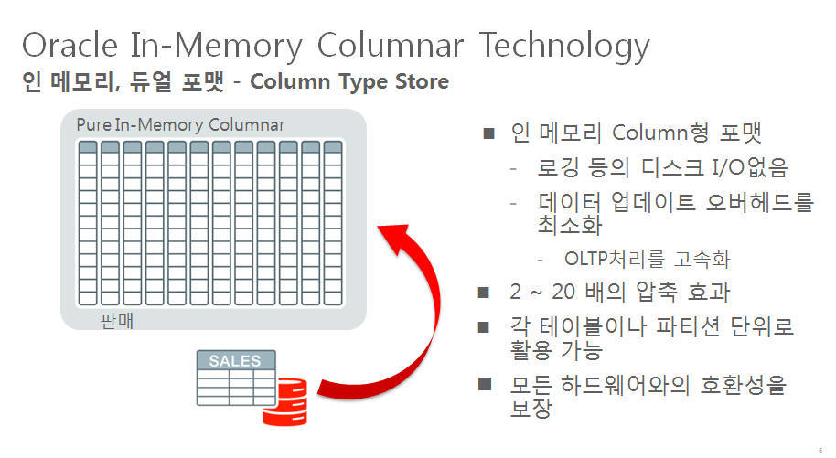
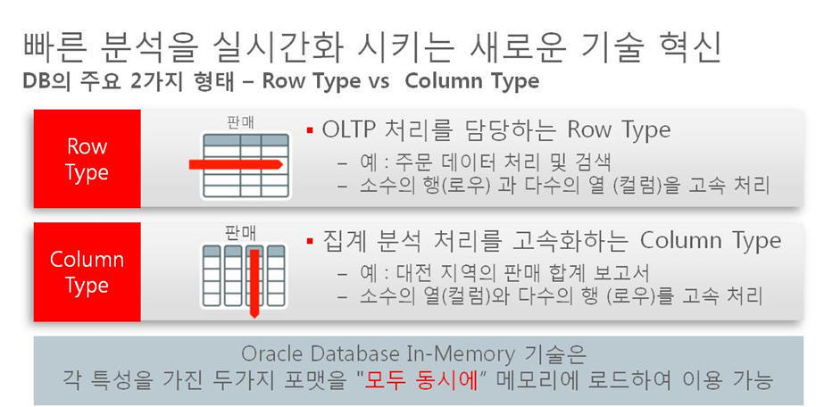

Oracle 12c In Memory Option 소개 및 테스트
=========================================

Oracle 12c In Memory Option 소개
------------------------------- 

업무 / 데이타 특성에 따른 DBMS 메모리 포맷 지원
------------------------------------------- 

Oracle 12c In Memory Option 테스트 
---------------------------------- 
Oracle 12c Patchset 1 ( 12.1.0.2 ) 에서 제공하는 Oracle In Memory Option 의  기능테스트를 수행합니다. 이 문서에서 테스트로 사용하는 데이타는 In Memory Option Training 에서도 소개되었던 Pat O'Neil의 [Star Schema Benchmark (이하-SSB)](http://www.cs.umb.edu/~poneil/StarSchemaB.pdf) 를 사용합니다. 

### Oracle 12c 테스트 환경
* VirtualBox 4.3.12
* Oracle Linux 6.5 x86_64 (vCPU : 2, Memory : 4GB ) 
* Oracle 12.1.0.2
* SSB Oracle Schema 생성 및 Query Script : [Star Schema Benchmark (SSB)](https://github.com/minimaxa/oracle/blob/master/ssb.tgz)

Star Schema Benchmark 소개
-------------------------

매사츄세츠공과대학의 Pat O’Neil 이 기존 [TPC-H](http://www.tpc.org) Benchmark 용 Schema 를 수정해 [Star Schema Benchmark (이하-SSB)](http://www.cs.umb.edu/~poneil/StarSchemaB.pdf) 를 만든 것으로 불필요한 Table 제거와 LINEITEM / ORDER 테이블의 Denomalization 을 통해 좀 더 DW 스럽게 설계한 Star Schema Sample로 이후 Betty O'Neil, Xuedong Chen 과 함께 개선된 Schema를 발표.  

### SSB 자료 및 코드 참조  ###

1. http://www.cs.umb.edu/~poneil/StarSchemaB.pdf
2. https://github.com/electrum/ssb-dbgen
3. http://code.google.com/p/bcb/source/browse/branches/fdb/data/SSBM

### SSB 를 이용한 DW 용 Sample Data 생성 ###

 [Star Schema Benchmark (이하-SSB)](http://www.cs.umb.edu/~poneil/StarSchemaB.pdf) 문서와 Github 에 공개된 ssb용 dbgen, 그리고 Oracle Database 테스트를 위한 code 를 참조해 Sample Data 생성. [Star Schema Benchmark (SSB) 용 Oracle Sample Code Download](https://github.com/minimaxa/oracle/blob/master/ssb.tgz)

 [SSB 설치 및 Sample Data 생성 문서 보기](./Star%20Schema%20Benchmark.md)

### SSB 를 이용한 DW Query 수행  ###

> 1.SSB 쿼리 수행 ( In memory option 사용안함 )  

<pre>

[oracle@dbvm1 queries]$ sqlplus ssb/ssb @queries

SQL*Plus: Release 11.2.0.4.0 Production on 수 8월 6 02:14:57 2014

Copyright (c) 1982, 2013, Oracle.  All rights reserved.

다음에 접속됨:
Oracle Database 11g Enterprise Edition Release 11.2.0.4.0 - 64bit Production
With the Partitioning, OLAP, Data Mining and Real Application Testing options

Q1.1
1.3433E+12
경   과: 00:00:04.59
Q1.2
2.9315E+11
경   과: 00:00:04.44
Q1.3
7.6773E+10
경   과: 00:00:04.34
Q2.1
     2233142072       1992 MFGR#121
     2067760143       1992 MFGR#1210
     2081425439       1992 MFGR#1211
     2021540586       1992 MFGR#1212

-- 생략 

Q4.3

-- 생략 

      1998 UNITED ST9 MFGR#146    19386990
      1998 UNITED ST9 MFGR#147    28414405
      1998 UNITED ST9 MFGR#148    26375056
      1998 UNITED ST9 MFGR#149     2153467
경   과: 00:00:05.53
SQL> exit

</pre>

> 2.Oracle 12c In Memory Option 설정 
<pre>

</pre>

> 3.SSB 관련 테이블을 In Memory 로 데이타 적재 ( Population )

<pre>
SQL> alter table LINEORDER inmemory;
SQL> alter table PART inmemory;
SQL> alter table CUSTOMER inmemory;
SQL> alter table SUPPLIER inmemory;
SQL> alter table DATES inmemory;
</pre>

> 4.SSB 관련 테이블의 압축율 확인 
<pre>
SQL> Select v.segment_name           name,
  2         v.bytes                  orig_size,
  3         v.inmemory_size          in_mem_size ,
  4         v.bytes/v.inmemory_size  comp_ratio
  5  From   v$im_segments v
  6  Order by 4;

NAME                                      ORIG_SIZE IN_MEM_SIZE COMP_RATIO
---------------------------------------- ---------- ----------- ----------
SUPPLIER                                     327680     1179648 .277777778
DATES                                        393216     1179648 .333333333
CUSTOMER                                    4194304     3276800       1.28
LINEORDER                                 687865856   269942784 2.54819131
PART                                       22020096     4325376 5.09090909
</pre>

> 5.In Memory 적재여부 확인 
<pre>
SQL> SELECT v.owner, v.segment_name name, v.populate_status status, v.bytes_not_populated
  2  FROM   v$im_segments v;

OWNER                NAME                           STATUS    BYTES_NOT_POPULATED
-------------------- ------------------------------ --------- -------------------
SSB2                 CUSTOMER                       COMPLETED                   0
SSB2                 LINEORDER                      COMPLETED                   0
SSB2                 SUPPLIER                       COMPLETED                   0
SSB2                 DATES                          COMPLETED                   0
SSB2                 PART                           COMPLETED                   0
</pre>

> 6.SSB 관련 테이블의 In memory 적재후 SSB Query 재수행  

## SSB 수행 결과 정리

### 각 2회씩 수행 

<pre>
쿼리|1차IMO-X|2차IMO-X|IMO-X평균|1차IMO-O|2차IMO-O|IMO-O평균|성능향상
----|--------|--------|---------|--------|--------|---------|---------
Q1.1|00:00.69|00:00.67|00:00.68	|00:00.13|00:00.13|00:00.13 | 5.2  
Q1.2|00:00.48|00:00.43|00:00.46	|00:00.09|00:00.09|00:00.09 | 5.1  
Q1.3|00:00.42|00:00.42|00:00.42	|00:00.10|00:00.10|00:00.10 | 4.2  
Q2.1|00:00.92|00:00.78|00:00.85	|00:00.15|00:00.16|00:00.16 | 5.5  
Q2.2|00:00.78|00:00.65|00:00.72	|00:00.07|00:00.07|00:00.07 |10.2 
Q2.3|00:00.64|00:00.58|00:00.61	|00:00.05|00:00.05|00:00.05 |12.2 
Q3.1|00:01.23|00:01.18|00:01.21	|00:00.35|00:00.35|00:00.35 | 3.4  
Q3.2|00:00.75|00:00.75|00:00.75	|00:00.12|00:00.13|00:00.13 | 6.0  
Q3.3|00:00.66|00:00.65|00:00.66	|00:00.08|00:00.10|00:00.09 | 7.3  
Q3.4|00:00.65|00:00.60|00:00.63	|00:00.03|00:00.03|00:00.03 |20.8 
Q4.1|00:01.46|00:01.28|00:01.37	|00:00.64|00:00.64|00:00.64 | 2.1  
Q4.2|00:01.25|00:01.15|00:01.20	|00:00.51|00:00.53|00:00.52 | 2.3  
Q4.3|00:00.82|00:00.75|00:00.79	|00:00.11|00:00.12|00:00.12 | 6.8  
</pre>

