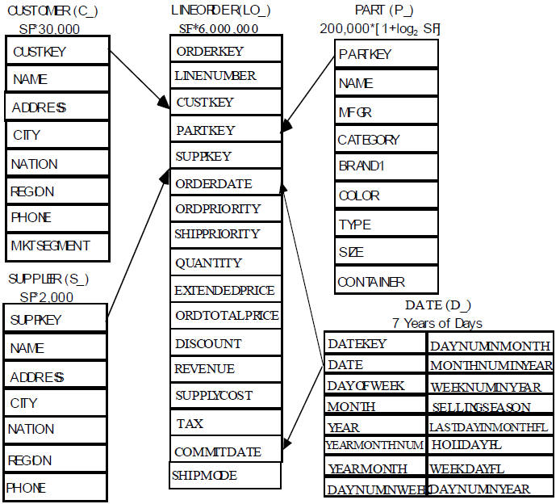
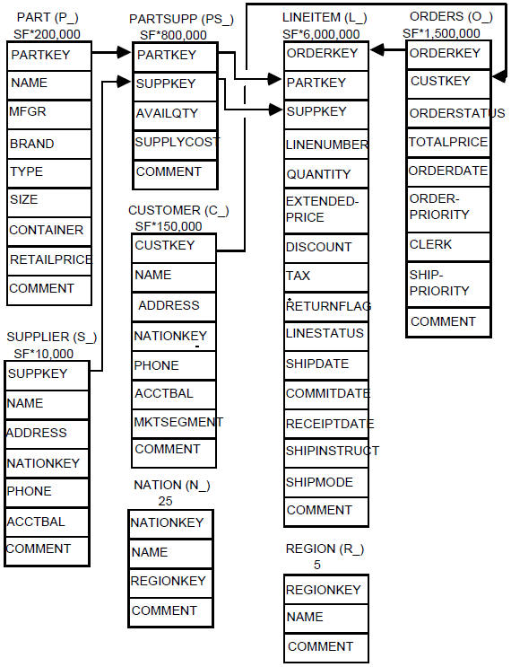

## Star Schema Benchmark 소개 ##

매사츄세츠공과대학의 Pat O’Neil 이 기존 [TPC-H](http://www.tpc.org) Benchmark 용 Schema 를 수정해 [Star Schema Benchmark (이하-SSB)](http://www.cs.umb.edu/~poneil/StarSchemaB.pdf) 를 만든 것으로 불필요한 Table 제거와 LINEITEM / ORDER 테이블의 Denomalization 을 통해 좀 더 DW 스럽게 설계한 Star Schema Sample로 이후 Betty O'Neil, Xuedong Chen 과 함께 개선된 Schema를 발표. 

### Star Schema 모델 ###

### TPC-H Schema 모델 ###

### SSB 자료 및 코드 참조  ###

1. http://www.cs.umb.edu/~poneil/StarSchemaB.pdf
2. https://github.com/electrum/ssb-dbgen
3. http://code.google.com/p/bcb/source/browse/branches/fdb/data/SSBM

## SSB 용 DBGen을 이용한 DW 용 Sample Data 생성 ##

* [Star Schema Benchmark (SSB) Oracle 용 DBGen 및 Schema 생성 Script](https://github.com/minimaxa/oracle/blob/master/ssb.tgz) Download 후 실습환경으로 Upload
* 개인용 Notebook PC 또는 VM 환경에서 "1"에서 download 받은 파일의 압축 해제

<pre>
$ tar xvfz ssb.tgz
$ ls -l 
</pre>  

> 1.DBGen Source 를 실습환경에 맞게 Compile 하기 위해 1.dbgen directory 에서 makefile 편집
<pre>
DATABASE=ORACLE
MACHINE =LINUX
WORKLOAD =SSBM
</pre>

> 2.dbgen 실행파일 compile
<pre>
make clean 
make all
</pre>

> 3.qgen 은 오류가 발생 ( TPC-H 원본은 문제없음 )  
> 4.Sample Data 생성 ( DSS_PATH로 flat file 이 생성될 디렉토리 지정 ). 실습에서는 SSB 관련 5개 테이블을 한번에 생성하며 실습환경에 맞게 Scale Factor 를 사용 ( 여기서의 Scale Factor 는 1 ) 
<pre>
[oracle@dbvm1 1.dbgen]$ export DSS_PATH=../2.data

[oracle@dbvm1 1.dbgen]$ time ./dbgen -s 1 -T a
SSBM (Star Schema Benchmark) Population Generator (Version 1.0.0)
Copyright Transaction Processing Performance Council 1994 - 2000
done.
Generating data for customers table [pid: 4589]done.
Generating data for date table [pid: 4589]done.
Generating data for lineorder table [pid: 4589]done.

real    1m8.779s
user    0m11.526s
sys     0m54.528s

[oracle@dbvm1 1.dbgen]$ ls -l ../2.data/
total 600276
-rw-r--r-- 1 oracle oinstall   2837046  8월  6 00:41 customer.tbl
-rw-r--r-- 1 oracle oinstall    229965  8월  6 00:41 date.tbl
-rw-r--r-- 1 oracle oinstall 594296771  8월  6 00:41 lineorder.tbl
-rw-r--r-- 1 oracle oinstall  17139259  8월  6 00:41 part.tbl
-rw-r--r-- 1 oracle oinstall    166676  8월  6 00:41 supplier.tbl

[oracle@dbvm1 1.dbgen]$ ./dbgen -s 3 -T a
SSBM (Star Schema Benchmark) Population Generator (Version 1.0.0)
Copyright Transaction Processing Performance Council 1994 - 2000
done.
Generating data for customers table [pid: 4657]done.
Generating data for date table [pid: 4657]done.
Generating data for lineorder table [pid: 4657]done.

[oracle@dbvm1 1.dbgen]$ ls -l ../2.data/
합계 1810696
-rw-r--r-- 1 oracle oinstall    8531723  8월  6 01:53 customer.tbl
-rw-r--r-- 1 oracle oinstall     229965  8월  6 01:53 date.tbl
-rwxr-xr-x 1 oracle oinstall      59954  8월  6 01:48 dbgen
-rw-r--r-- 1 oracle oinstall      11439  8월  6 01:51 dists.dss
-rw-r--r-- 1 oracle oinstall 1808572594  8월  6 01:53 lineorder.tbl
-rw-r--r-- 1 oracle oinstall   34388396  8월  6 01:53 part.tbl
-rw-r--r-- 1 oracle oinstall     502156  8월  6 01:53 supplier.tbl

</pre>

* 필요시 상황에 맞게 별도로 생성 가능
customer.tbl   | dbgen -s 1 -T c
part.tbl       | dbgen -s 1 -T p
supplier.tbl   | dbgen -s 1 -T s
date.tbl       | dbgen -s 1 -T d
lineorder.tbl  | dbgen -s 1 -T l

> 5.SSB용 Tablespace 생성 ( cr_tbs.sql )
<pre>
[oracle@dbvm1 1.dbgen]$ cd ../3.oracle
[oracle@dbvm1 3.oracle]$ sqlplus system/oracle @cr_tbs.sql

SQL*Plus: Release 11.2.0.4.0 Production on 수 8월 6 01:54:37 2014

Copyright (c) 1982, 2013, Oracle.  All rights reserved.

다음에 접속됨:
Oracle Database 11g Enterprise Edition Release 11.2.0.4.0 - 64bit Production
With the Partitioning, OLAP, Data Mining and Real Application Testing options

테이블스페이스가 삭제되었습니다.

테이블스페이스가 삭제되었습니다.

테이블스페이스가 생성되었습니다.

테이블스페이스가 생성되었습니다.

SQL> exit

</pre>

> 6.SSB용 Oracle User 생성 ( cr_user.sql )
<pre>
[oracle@dbvm1 3.oracle]$ sqlplus system/oracle @cr_user.sql

SQL*Plus: Release 12.1.0.2.0 Beta on Wed Aug 6 03:28:04 2014

Copyright (c) 1982, 2014, Oracle.  All rights reserved.

Enter password:
Last Successful login time: Wed Aug 06 2014 03:26:54 -07:00

Connected to:
Oracle Database 12c Enterprise Edition Release 12.1.0.2.0 - 64bit Beta
With the Partitioning, OLAP, Advanced Analytics and Real Application Testing options

username : ssb2
old   1: drop user &v_user cascade
new   1: drop user ssb2 cascade
drop user ssb2 cascade
          *
ERROR at line 1:
ORA-01918: user 'SSB2' does not exist

old   1: create user &v_user identified by &v_user default tablespace ssbm1 temporary tablespace temp
new   1: create user ssb2 identified by ssb2 default tablespace ssbm1 temporary tablespace temp

User created.

old   1: grant connect, resource, create view, create any index  to &v_user
new   1: grant connect, resource, create view, create any index  to ssb2

Grant succeeded.

SQL> exit

</pre>

> 7.SSB Flat file 을 DB에 Load 
<pre>
[oracle@dbvm1 3.oracle]$ time ./loadSSBM ssb2

SQL*Plus: Release 11.2.0.4.0 Production on 수 8월 6 01:55:51 2014

Copyright (c) 1982, 2013, Oracle.  All rights reserved.

다음에 접속됨:
Oracle Database 11g Enterprise Edition Release 11.2.0.4.0 - 64bit Production
With the Partitioning, OLAP, Data Mining and Real Application Testing options

SQL>SQL>SQL>SQL>drop table lineorder purge
           *
1행에 오류:
ORA-00942: 테이블 또는 뷰가 존재하지 않습니다

SQL>drop table part purge
           *
1행에 오류:
ORA-00942: 테이블 또는 뷰가 존재하지 않습니다

SQL>drop table supplier purge
           *
1행에 오류:
ORA-00942: 테이블 또는 뷰가 존재하지 않습니다

SQL>drop table dates purge
           *
1행에 오류:
ORA-00942: 테이블 또는 뷰가 존재하지 않습니다

SQL>drop table customer purge
           *
1행에 오류:
ORA-00942: 테이블 또는 뷰가 존재하지 않습니다

SQL>SQL>SQL>SQL>  2    3    4    5    6    7    8    9   10   11  
테이블이 생성되었습니다.

SQL>SQL>  2    3    4    5    6    7    8    9  
테이블이 생성되었습니다.

SQL>SQL>  2    3    4    5    6    7    8    9   10  
테이블이 생성되었습니다.

SQL>SQL>SQL>SQL>SQL>SQL>  2    3    4    5    6    7    8    9   10   11   12   13   14   15   16   17   18   19  
테이블이 생성되었습니다.

SQL>SQL>SQL>  2    3    4    5    6    7    8    9   10   11   12   13   14   15   16   17   18   19  
테이블이 생성되었습니다.

SQL>SQL>SQL>SQL>SQL>SQL>SQL>SQL>Oracle Database 11g Enterprise Edition Release 11.2.0.4.0 - 64bit Production
With the Partitioning, OLAP, Data Mining and Real Application Testing options에서 분리되었습니다.
----------loading the part table------------

SQL*Loader: Release 11.2.0.4.0 - Production on 수 8월 6 01:55:51 2014

Copyright (c) 1982, 2011, Oracle and/or its affiliates.  All rights reserved.

----------loading the supplier table------------

SQL*Loader: Release 11.2.0.4.0 - Production on 수 8월 6 01:55:52 2014

Copyright (c) 1982, 2011, Oracle and/or its affiliates.  All rights reserved.

----------loading the customer table------------

SQL*Loader: Release 11.2.0.4.0 - Production on 수 8월 6 01:55:52 2014

Copyright (c) 1982, 2011, Oracle and/or its affiliates.  All rights reserved.

----------loading the date table------------

SQL*Loader: Release 11.2.0.4.0 - Production on 수 8월 6 01:55:53 2014

Copyright (c) 1982, 2011, Oracle and/or its affiliates.  All rights reserved.

----------loading the lineorder table------------

SQL*Loader: Release 11.2.0.4.0 - Production on 수 8월 6 01:55:54 2014

Copyright (c) 1982, 2011, Oracle and/or its affiliates.  All rights reserved.

SQL*Plus: Release 11.2.0.4.0 Production on 수 8월 6 02:03:33 2014

Copyright (c) 1982, 2013, Oracle.  All rights reserved.

다음에 접속됨:
Oracle Database 11g Enterprise Edition Release 11.2.0.4.0 - 64bit Production
With the Partitioning, OLAP, Data Mining and Real Application Testing options

SQL>SQL>SQL>  2  
테이블이 변경되었습니다.

SQL>SQL>  2  
테이블이 변경되었습니다.

SQL>SQL>  2  
테이블이 변경되었습니다.

SQL>SQL>  2  
테이블이 변경되었습니다.

SQL>SQL>  2  
테이블이 변경되었습니다.

SQL>  2  
테이블이 변경되었습니다.

SQL>  2  
테이블이 변경되었습니다.

SQL>  2  
테이블이 변경되었습니다.

SQL>  2  
테이블이 변경되었습니다.

SQL>SQL>SQL>SQL>SQL>SQL>Oracle Database 11g Enterprise Edition Release 11.2.0.4.0 - 64bit Production
With the Partitioning, OLAP, Data Mining and Real Application Testing options에서 분리되었습니다.

real    8m55.880s
user    0m13.134s
sys     1m18.834s
[oracle@dbvm1 oracle]$ 

</pre>